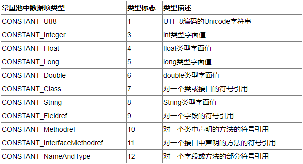

# 1. 类文件结构

我们尝试编译这个`HelloWorld.java`文件：
```
public class HelloWorld {
    public static void main(String[] args) {
        System.out.println("hello world");
    }
}
```
使用到的命令：
```
javac -parameters -d . HelloWorld.java
```
* -parameters： 保留方法参数的名称信息，比如：`main(args)`中的`args`

最终得到 `HelloWorld.class`字节码文件：
* windows用cmder执行以下命令打开：
    ```
    vim HelloWorld.class
    :%!xxd
    ```
* Linus/MacOS也可以执行以下命令打开：
    ```
    od -t xC HelloWorld.class
    ```

```
00000000: cafe babe 0000 0034 001f 0a00 0600 1109  .......4........
00000010: 0012 0013 0800 140a 0015 0016 0700 1707  ................
00000020: 0018 0100 063c 696e 6974 3e01 0003 2829  .....<init>...()
00000030: 5601 0004 436f 6465 0100 0f4c 696e 654e  V...Code...LineN
00000000: cafe babe 0000 0034 001f 0a00 0600 1109  .......4........
00000010: 0012 0013 0800 140a 0015 0016 0700 1707  ................
00000020: 0018 0100 063c 696e 6974 3e01 0003 2829  .....<init>...()
00000030: 5601 0004 436f 6465 0100 0f4c 696e 654e  V...Code...LineN
00000040: 756d 6265 7254 6162 6c65 0100 046d 6169  umberTable...mai
00000050: 6e01 0016 285b 4c6a 6176 612f 6c61 6e67  n...([Ljava/lang
00000060: 2f53 7472 696e 673b 2956 0100 104d 6574  /String;)V...Met
00000070: 686f 6450 6172 616d 6574 6572 7301 0004  hodParameters...
00000080: 6172 6773 0100 0a53 6f75 7263 6546 696c  args...SourceFil
00000090: 6501 000f 4865 6c6c 6f57 6f72 6c64 2e6a  e...HelloWorld.j
000000a0: 6176 610c 0007 0008 0700 190c 001a 001b  ava.............
000000b0: 0100 0b68 656c 6c6f 2077 6f72 6c64 0700  ...hello world..
000000c0: 1c0c 001d 001e 0100 2c63 6f6d 2f65 7861  ........,com/exa
000000d0: 6d70 6c65 2f73 7072 696e 6762 6f6f 7473  mple/springboots
000000e0: 7461 7274 6572 6465 6d6f 2f48 656c 6c6f  tarterdemo/Hello
000000f0: 576f 726c 6401 0010 6a61 7661 2f6c 616e  World...java/lan
00000100: 672f 4f62 6a65 6374 0100 106a 6176 612f  g/Object...java/
00000110: 6c61 6e67 2f53 7973 7465 6d01 0003 6f75  lang/System...ou
00000120: 7401 0015 4c6a 6176 612f 696f 2f50 7269  t...Ljava/io/Pri
00000130: 6e74 5374 7265 616d 3b01 0013 6a61 7661  ntStream;...java
00000140: 2f69 6f2f 5072 696e 7453 7472 6561 6d01  /io/PrintStream.
00000150: 0007 7072 696e 746c 6e01 0015 284c 6a61  ..println...(Lja
00000160: 7661 2f6c 616e 672f 5374 7269 6e67 3b29  va/lang/String;)
00000170: 5600 2100 0500 0600 0000 0000 0200 0100  V.!.............
00000180: 0700 0800 0100 0900 0000 1d00 0100 0100  ................
00000190: 0000 052a b700 01b1 0000 0001 000a 0000  ...*............
000001a0: 0006 0001 0000 0007 0009 000b 000c 0002  ................
000001b0: 0009 0000 0025 0002 0001 0000 0009 b200  .....%..........
```


根据JVM规范，类文件结构如下：
```
ClassFile {
    u4       magic;           // 第0~3个字节：魔数（表示是否是class类型的文件）
    u2       minor_version;   // 2个字节： 小版本号
    u2       major_version;   // 主版本号
    u2       constant_pool_count; // 常量池信息
    cp_info  constant_pool[constant_pool_count-1];
    u2       access_flags;   // 访问修饰（类到底是public还是）
    u2       this_class;     // 本类信息
    u2       super_class;    // 父类信息
    u2       interfaces_count;  // 有多少个接口
    u2       interfaces[interfaces_count]; // 接口信息
    u2       fields_count;
    field_info  fields[fields_count]; // 类变量、成员变量、类静态变量信息
    u2       vmethods_count;
    method_info  methods[methods_count]; // 方法信息
    u2       attributes_count;
    attribute_info  attribute[attributes_count]; //  方法属性信息
}
```

## 1.1 魔数
第0~3个字节：魔数（表示是否是class类型的文件）

好， 我们看到HelloWorld字节码文件第一行：
```
00000000: cafe babe 0000 0034 001f 0a00 0600 1109  .......4........
```
有个这么熟悉的词组，`cafe babe`，意思是什么？ 没错，这就表示的确是 class类型文件

## 1.2 版本
4~7 字节：表示类的版本 

上面的`0000 0034`（52） 表示Java 8


## 1.3 常量池
8~9 字节，表示常量池长度

上面 `001f`（31） 表示常量池有 #1~#30 项， 注意 #0 项 不计入，也没有值。

再往后面看：

`0a00 0600 1109`，其中：
* 第#1项 0a 表示一个 Method 信息；【查下图可以得知】
* `00 06` 和 `00 11(17)`表示它引用了常量池中 #6 和 #17 项来获得这个方法的【所属类】和【方法名】




## 1.4 访问标识与继承信息

好，我们可以看到，常量池所占位置，是一直到上图所示的 `29 56`，那么， 之后，就到了 access_flags，我们一起看看后面的两个字节：`00 21`，对比一下相关的解释表：


可以发现，`00 21` 表示 是一个public 的 类：


## 1.5 Field 信息


## 1.6 Method 信息 -- init（构造器）


## 1.7 Method 信息 -- main方法


## 1.8 附加属性


# 2. 字节码指令
可以参考此官方文档查看指令集： https://docs.oracle.com/javase/specs/jvms/se8/html/jvms-6.html#jvms-6.5

比如我们对照官方文档逐字解读`2a b7 00 01 b1`：
```
aload_0 = 42 (0x2a)        // 加载 slot 0 的局部变量，即 this，作为下面 invokespecial 构造方法调用的参数
invokespecial = 183 (0xb7) // 预备调用构造方法，哪个方法呢？
00 01 引用常量池#1 项， 即【Method java/lang/Object."<init>":()V】
b1 表示返回
```

再解读一下 `public static void main(java.lang.String[]);` 主方法的字节码指令：
```
b2 00 02 12 03 b6 00 04 b1
```
1. b2 -> getstatic: 用于加载静态变量，哪个静态变量呢？
2. 00 02 引用常量池中 #2 项，即【Field java/lang/System.out:Ljava/io/PrintStream;】
3. 0x12 -> ldc 加载参数，哪个参数？
4. 03 引用常量池中 #3 项，即【String hello world】
5. b6 -> invokevirtual 预备调用成员方法，哪个方法呢？
6. 00 04 引用常量池中 #4 项，即【Method java/io/PrintStream.println:(Ljava/lang/String;)V】
7. b1 表示返回

于是，就有了这样一个解释：
```
b2 00 02    12 03          b6  00 04       b1
PrintStream "hello world"  .   println()   return
```

## 2.2 javap 工具
Oracle提供了javap工具来反编译class文件

作用：帮你读字节码文件，并解释给你看。

```
javap -v HelloWorld.class
// -v 表示 输出class文件的字节码信息、常量池等详细信息
```

好，看回我们这个HelloWorld.java例子：
```
public class HelloWorld {
    public static void main(String[] args) {
        System.out.println("hello world");
    }
}
```
以上这个很简单的代码，在经过了:
1. `javac HelloWorld.java`
2. `javap -v HelloWorld.class >> ./output.txt`

> 如果想要看到 LocalVariableTable “局部变量表”，则可以尝试以下命令：
> ```
> javac -g HelloWorld.java // -g 生成所有调试信息
> javap -c -l HelloWorld.class 或 javap -v HelloWorld.class
> ```
> 关于 `javac -g`
> ```
> -g                         生成所有调试信息
> -g:none                    不生成任何调试信息
> -g:{lines,vars,source}     只生成某些调试信息
> ```
> 其中：
> * source 源文件调试信息
> * lines 行号调试信息
> * vars 本地变量调试信息
> 
> 如果不使用-g来编译,只保留源文件和行号信息.个人理解相当于-g:source,lines
>
> 如果只使用-g来编译.个人理解相当于-g:source,lines,vars


之后 我们可以从这个output文件中得到：
```
Classfile /E:/Projects/IdeaProjects/spring-boot-starter-demo/src/main/java/com/example/springbootstarterdemo/com/example/springbootstarterdemo/HelloWorld.class
  Last modified 2019-12-24; size 496 bytes
  MD5 checksum 6f8be43a5db5ff80c7a2255c885f8315
  Compiled from "HelloWorld.java"
public class com.example.springbootstarterdemo.HelloWorld
  minor version: 0
  major version: 52
  flags: ACC_PUBLIC, ACC_SUPER
Constant pool:
   #1 = Methodref          #6.#17         // java/lang/Object."<init>":()V
   #2 = Fieldref           #18.#19        // java/lang/System.out:Ljava/io/PrintStream;
   #3 = String             #20            // hello world
   #4 = Methodref          #21.#22        // java/io/PrintStream.println:(Ljava/lang/String;)V
   #5 = Class              #23            // com/example/springbootstarterdemo/HelloWorld
   #6 = Class              #24            // java/lang/Object
   #7 = Utf8               <init>
   #8 = Utf8               ()V
   #9 = Utf8               Code
  #10 = Utf8               LineNumberTable
  #11 = Utf8               main
  #12 = Utf8               ([Ljava/lang/String;)V
  #13 = Utf8               MethodParameters
  #14 = Utf8               args
  #15 = Utf8               SourceFile
  #16 = Utf8               HelloWorld.java
  #17 = NameAndType        #7:#8          // "<init>":()V
  #18 = Class              #25            // java/lang/System
  #19 = NameAndType        #26:#27        // out:Ljava/io/PrintStream;
  #20 = Utf8               hello world
  #21 = Class              #28            // java/io/PrintStream
  #22 = NameAndType        #29:#30        // println:(Ljava/lang/String;)V
  #23 = Utf8               com/example/springbootstarterdemo/HelloWorld
  #24 = Utf8               java/lang/Object
  #25 = Utf8               java/lang/System
  #26 = Utf8               out
  #27 = Utf8               Ljava/io/PrintStream;
  #28 = Utf8               java/io/PrintStream
  #29 = Utf8               println
  #30 = Utf8               (Ljava/lang/String;)V
{
  public com.example.springbootstarterdemo.HelloWorld(); // init方法
    descriptor: ()V
    flags: ACC_PUBLIC
    Code:
      stack=1, locals=1, args_size=1     // 操作数栈深度为1， 成员变量数为1，形参有1个
         0: aload_0
         1: invokespecial #1                  // Method java/lang/Object."<init>":()V
         4: return
      LineNumberTable:
        line 7: 0           // 源码中的第7行 对应了这里的第0行

  public static void main(java.lang.String[]); // main() 方法
    descriptor: ([Ljava/lang/String;)V  // 方法参数是一个String[]
    flags: ACC_PUBLIC, ACC_STATIC       // 方法时 public static 的
    Code:
      stack=2, locals=1, args_size=1   // 方法栈有2层，。。。。
         0: getstatic     #2                  // 获取静态对象 Field java/lang/System.out:Ljava/io/PrintStream;
         3: ldc           #3                  // 获取字符串 String hello world
         5: invokevirtual #4                  // 调用方法  Method java/io/PrintStream.println:(Ljava/lang/String;)V
         8: return
      LineNumberTable:
        line 9: 0
        line 10: 8
    MethodParameters:
      Name                           Flags
      args
}
SourceFile: "HelloWorld.java"
```

## 2.3 图解运行流程
给你一段code：
```
public class Jvm02 {
    public static void main(String[] args) {
        int a = 10;
        int b = Short.MAX_VALUE + 1;
        int c = a + b;
        System.out.println(c);
    }
}
```
我们经过两步得到了解释后的字节码流程：
```
javac Jvm02.java
javap -v Jvm02.class
```

那么， 在去执行.class文件的过程中，到底有哪些操作呢？


### 1）常量池载入运行时常量池
将.class文件中涉及到的常量，加载到运行时常量池这一个内存区域中（虽然运行时常量池属于方法区的组成部分）


像这个例子，像 `10`，实际上是加载在方法区中、跟随着方法存储的，但是，如果是`Short.MAX_VALUE + 1 = 32768`这个值，则会被定义为常量池所属，于是会被加载到运行时常量池当中。

### 2）方法字节码载入方法区


### 3）main线程开始运行，分配栈帧内存


### 4）执行引擎开始执行字节码

**bipush 10**
* 作用：将一个大小为 1 byte的数字，压入操作数栈中，所以这个数字大小区间是：[-128,127]
* 操作数栈的宽度是4 byte，但是当前操作数只有 1 byte，所以，bipush等指令在压栈过程中会自动补齐 4 byte。
* 类似指令有：
  * sipush：将一个short压入操作数栈
  * ldc：将一个int 压入操作数栈
  * ldc2_w：将一个long 压入操作数栈（分两次压入，因为long 类型 8 byte）

**这里小的数字都是和字节码指令存在一起的，超过了 short 范围的数字存入了常量池。**

**istore 1**
* 作用：将操作数栈顶数据弹出，存入局部变量表的slot 1 (存入1号槽)


最终得到：


**ldc #3**
* 作用：加载常量池中 #3 数据，到 操作数栈
* 注意：`Short.MAX_VALUE = 32767`，所以`Short.MAX_VALUE + 1 = 32768` 是在编译期间计算好的


**istore 2**


**iload 1 和 iload 2**


**iadd**


**getstatic #4**
* 作用：到运行时常量池中，找到FieldRef成员变量，然后发现它实际引用指向的是 堆中的 System.out对象；找到之后，只是获取这个System.out 对象的引用而已，并不是将整个对象压入操作数栈。


**invokevirtual #5**

整个过程如下：
1. 找到常量池 #5 项
2. 定位到方法区 `java/io/PrintStream.println:(I)V`
3. 生成新的栈帧（分配 locals、stack等）
4. 传递参数，指向新栈帧中的字节码
5. 执行完毕，弹出栈帧
6. 清除 main 操作数栈内容


最终：
1. 完成main方法调用，弹出 main 栈帧
2. 程序结束


## 2.4 练习-- 分析 a++
看到这么一个例子：
```
public static void main(String[] args) {
    int a = 10;
    int b = a++ + ++a + a--;
    System.out.println(a);
    System.out.println(b);
}
```
反编译后得到这样的一个部分执行流程：
```
public static void main(java.lang.String[]);
    descriptor: ([Ljava/lang/String;)V
    flags: ACC_PUBLIC, ACC_STATIC
    Code:
      stack=2, locals=3, args_size=1
         0: bipush        10
         2: istore_1
         3: iload_1
         4: iinc          1, 1
         7: iinc          1, 1
        10: iload_1
        11: iadd
        12: iload_1
        13: iinc          1, -1
        16: iadd
        17: istore_2
        18: getstatic     #2                  // Field java/lang/System.out:Ljava/io/PrintStream;
        21: iload_1
        22: invokevirtual #3                  // Method java/io/PrintStream.println:(I)V
        25: getstatic     #2                  // Field java/lang/System.out:Ljava/io/PrintStream;
        28: iload_2
        29: invokevirtual #3                  // Method java/io/PrintStream.println:(I)V
        32: return
```
首先搞清楚两点：
* `iinc`：表示直接在局部变量slot 上进行运算；
* `a++` 是先执行 `iload`，后执行 `iinc`；而`++a`则相反；
* `iload`是将第i个slot区内存中的值，放入 操作数栈中；

可以自己捋一捋，整个过程，最终得到的值是： `a = 11; b = 34;`


## 2.5 条件判断指令
以下是条件判断相关指令和解释：

特别说明：
* byte, short, char 都按照 int 来比较，因为 操作数栈都是 4 字节；
* goto 用来进行跳转到指定行号的字节码；

来看一个例子：
```
public static void main(String[] args) {
    int a = -1;
    int b = -2;
    int c = 0;
    int d = 3;
    int e = 5;
    int f = 6;
}
```
反编译后得到的指令字节码：
```
Code:
  stack=2, locals=8, args_size=1
      0: iconst_m1              // 获取常量池中的 -1
      1: istore_1               // 将其放入slot[1] 中
      2: bipush        -2       // 将 -2 压入操作数栈
      4: istore_2               // 将操作数栈中的 -2 放到 slot[2] 中
      5: iconst_0               // 获取常量池中的 0
      6: istore_3
      7: iconst_3               // 获取常量池中的 3
      8: istore        4
    10: iconst_5                // 获取常量池中的 5
    11: istore        5
    13: bipush        6         // 将 6 压入操作数栈
    15: istore        6
    16: return
```
**注意**：-1~5 的数字，会用 `iconst_N`来表示，表示直接从常量池中拿到。而其他的值，则通过`bipush`压入slot区。


好，上面只是小插曲，我们看下面这个条件语句的例子：
```
public static void main(String[] args) {
    int a = 0;
    if (a == 0) {
        a = 10;
    } else if (a == 2) {
       a = 15;
    }
     else {
        a = 20;
    }
}
```
反编译得到：
```
Code:
  stack=1, locals=2, args_size=1
      0: iconst_0              // 获取常量池中的 0
      1: istore_1              // 将其放入slot[1] 中
      2: iload_1               // 将slot[1] 中 的 值 拿出，放入操作数栈中
      3: ifne          12      // 比较值是否 != 0，如果值 !=0， 则跳转到 12行
      6: bipush        10
      8: istore_1
      9: goto          26
    12: iload_1                // 将slot[1]的值压入操作数栈
    13: iconst_2               // 获取常量池中的 2 压入操作数栈
    14: if_icmpne     23       // 比较两者是否不等，是，则跳转，否则 ，继续往下走
    17: bipush        15
    19: istore_1
    20: goto          26      // 直接跳转到 15行，return
    23: bipush        20
    25: istore_1
    26: return
```

## 2.6 循环语句分析
### (1) while
```
public static void main(String[] args) {
    int a = 0;
    while (a < 10) {
        a++;
    }
}
```
反编译得到指令字节码：
```
 Code:
  stack=2, locals=2, args_size=1
      0: iconst_0             // 获取常量池中的 0
      1: istore_1             // 放入 slot[1] 中
      2: iload_1              // 加载 slot[1] 到 操作数栈中
      3: bipush        10     // 将 10 放入操作数栈中
      5: if_icmpge     14     // 如果 slot[1]值 >= 10，则直接return
      8: iinc          1, 1   // 否则，slot[1]值直接进行加1
    11: goto          2       // 然后，继续回到指令 #2
    14: return
```

### (2) do-while
```
public static void main(String[] args) {
    int a = 0;
    do {
        a++;
    } while (a < 10);
}
```
反编译得到指令字节码：
```
Code:
  stack=2, locals=2, args_size=1
      0: iconst_0             // 获取常量池中的 0
      1: istore_1             // 放入 slot[1] 中
      2: iinc          1, 1   // 让slot[1] 自增 1
      5: iload_1              // 加载 slot[1] 到 操作数栈中
      6: bipush        10     // 将 10 放入操作数栈中
      8: if_icmplt     2      // 如果 slot[1]值 < 10，回到 #2 继续执行
    11: return
```

### (3) for
```
public static void main(String[] args) {
    int a = 0;
    for(int i = 0; i < 10; i++) {
      a++;
    }
}
```
其实反编译后的字节码是几乎一致的。
```
 Code:
  stack=2, locals=3, args_size=1
      0: iconst_0
      1: istore_1
      2: iconst_0
      3: istore_2
      4: iload_2
      5: bipush        10
      7: if_icmpge     19
    10: iinc          1, 1
    13: iinc          2, 1
    16: goto          4
    19: return
```

## 2.7 练习-- 为什么 x 最终 = 0
```
public static void main(String[] args) {
    int i = 0;
    int x = 0;
    while (i < 10) {
        x = x++;
        i++;
    }
    System.out.println(x);
}
```
为什么这个最终结果是：`0` 呢？

原因：在每一轮for循环里，实际上执行的是这样一个过程：
```
iload_1      // 将 x=0 加载到 操作数栈
iinc x,1     // slot['x'] + 1 = 1
istore 1     // slot['x'] = 操作数栈中的 x = 0
```

## 2.8 构造方法
### (1) `<cinit>()V`：静态代码块与静态变量赋值的整合方法
```
public class Demo3_8_1 {
    static int i = 10;
    static {
        i = 20;
    }
    static {
        i = 30;
    }
}
```
编译器会按从上到下 的顺序， 收集所有 static 代码块 和 静态成员赋值 的 代码，合并成一个特殊的方法 `<cinit>()V`:
```
  static {};
    descriptor: ()V
    flags: ACC_STATIC
    Code:
      stack=1, locals=0, args_size=0
         0: bipush        10
         2: putstatic     #2                  // Field i:I --- 去常量池里找到一个叫做 'i' 的变量，并将这个 10 放入 常量池中
         5: bipush        20
         7: putstatic     #2                  // Field i:I --- 去常量池里找到一个叫做 'i' 的变量，并将这个 20 放入 常量池中
        10: bipush        30
        12: putstatic     #2                  // Field i:I --- 去常量池里找到一个叫做 'i' 的变量，并将这个 30 放入 常量池中
        15: return
```
`<cinit>()V` 会在类加载的初始化阶段被调用。

那么， 我们调换一下代码顺序：
```
public class Demo3_8_1 {
    static {
        i = 20;
    }
    static {
        i = 30;
    }
    static int i = 10;
}
```
反编译后，得到的结果的确符合我们预期：
```
Code:
      stack=1, locals=0, args_size=0
         0: bipush        20
         2: putstatic     #2                  // Field i:I  --- 加载 20
         5: bipush        30
         7: putstatic     #2                  // Field i:I  --- 加载 30
        10: bipush        10
        12: putstatic     #2                  // Field i:I  --- 加载 10
        15: return
```

### (2) `<init>()V`：类实例初始化时的实例代码块与实例成员初始化的整合方法

```
public class Demo3_8_2 {
    private String a = "s1";
    {
        b = 20;
    }

    private int b = 10;

    {
        a = "s2";
    }

    public Demo3_8_2() {
    }

    public Demo3_8_2(String a, int b) {
        this.a = a;
        this.b = b;
    }
}
```
编译后的指令字节码：
```
 public com.example.springbootstarterdemo.Demo3_8_2();
    descriptor: ()V
    flags: ACC_PUBLIC
    Code:
      stack=2, locals=1, args_size=1
         0: aload_0
         1: invokespecial #1                  // Method java/lang/Object."<init>":()V
         4: aload_0
         5: ldc           #2                  // String s1                   将 "s1"
         7: putfield      #3                  // Field a:Ljava/lang/String;  赋值给 this.a
        10: aload_0
        11: bipush        20                                                 将 20
        13: putfield      #4                  // Field b:I                   赋值给 this.b
        16: aload_0
        17: bipush        10
        19: putfield      #4                  // Field b:I
        22: aload_0
        23: ldc           #5                  // String s2
        25: putfield      #3                  // Field a:Ljava/lang/String;
        28: return

  public com.example.springbootstarterdemo.Demo3_8_2(java.lang.String, int);
    descriptor: (Ljava/lang/String;I)V
    flags: ACC_PUBLIC
    Code:
      stack=2, locals=3, args_size=3
         0: aload_0
         1: invokespecial #1                  // Method java/lang/Object."<init>":()V
         4: aload_0
         5: ldc           #2                  // String s1
         7: putfield      #3                  // Field a:Ljava/lang/String;
        10: aload_0
        11: bipush        20
        13: putfield      #4                  // Field b:I
        16: aload_0
        17: bipush        10
        19: putfield      #4                  // Field b:I
        22: aload_0
        23: ldc           #5                  // String s2
        25: putfield      #3                  // Field a:Ljava/lang/String;
        28: aload_0
        29: aload_1                           //  获取第一个String入参
        30: putfield      #3                  // Field a:Ljava/lang/String;
        33: aload_0
        34: iload_2                           //  获取第二个int入参
        35: putfield      #4                  // Field b:I
        38: return

```
可以看到，实际上，无论是无参构造器，还是有参构造器，都会在编译时和成员代码块整合到一起，生成不同入参的构造方法 `<init>()V`，并且，构造器中的logic，一定在成员代码块的后面才执行。


## 2.9 方法调用
```
public class Demo3_9 {
    public Demo3_9() {}

    private void test1() {}
    private final void test2() {}
    public void test3() {}
    public static void test4() {}

    public static void main(String[] args) {
        Demo3_9 d = new Demo3_9();
        d.test1();
        d.test2();
        d.test3();
        d.test4();
        Demo3_9.test4();
    }
}
```
编译后得到指令：
```
0: new           #2                  // class com/example/springbootstarterdemo/Demo3_9
    3: dup
    4: invokespecial #3                  // Method "<init>":()V
    7: astore_1
    8: aload_1
    9: invokespecial #4                  // Method test1:()V
    12: aload_1
    13: invokespecial #5                  // Method test2:()V
    16: aload_1
    17: invokevirtual #6                  // Method test3:()V
    20: aload_1                           // 这里，准备要调用静态方法，先load到操作数栈
    21: pop                               // 然后发现其实这个实例并没有什么用，就又出栈了
    22: invokestatic  #7                  // Method test4:()V
    25: invokestatic  #7                  // Method test4:()V
    28: return
```
可以看到：
* 构造方法、private 方法（无论有没有带final），都是使用的`invokespecial`指令；
* public方法（无论有没有带final），使用`invokevirtual`，因为public方法在编译期间无法确定自己调用的是父类方法还是自己的方法， 所以，这个指令表示动态绑定调用方法的地址；
* 而对于静态方法，无论是直接类引用，还是实例来调用，都是用的`invokestatic`指令；
* 第一行指令`new`，做了两步：
  * 第一步：在堆中给这个新的`Demo3_9`对象分配内存；
  * 第二步：分配成功后，会将这个对象的引用放入操作数栈；
* 第二行指令`dup`，作用是：将这个在操作数栈中的对象引用，复制一份，也同样压入操作数栈，为了后面去`invokespecial`调用构造器，而多复制一份引用出来；当调用`<init>` 完毕，就会出栈，然后才会将原来的那个引用 store 到 这个 slot['d'] 当中；


## 2.10 多态的原理
以上所说的`invokevirtual`，就是Java中说到的 多态的原理。
```
public class Demo3_10 {
    public static void test(Animal animal) {
        animal.eat();
        System.out.println(animal);
    }

    public static void main(String[] args) throws IOException {
        test(new Cat());
        test(new Dog());
        System.in.read(); // 目的：此时运行 jps 获取进程ID
    }
}
abstract class Animal {
    public abstract void eat();

    @Override
    public String toString() {
        return "I am "+ this.getClass().getSimpleName();
    }
}

class Cat extends  Animal {
    @Override
    public void eat() {
        System.out.println("eat fish!!");
    }
}

class Dog extends Animal {
    @Override
    public void eat() {
        System.out.println("eat bone!!");
    }
}

```
这里使用HSDB 工具，就可以实时查看到指令的执行情况了。
```
jps //获取java进程ID
cd 到 java 安装目录
java -cp ./lib/sa-jdi.jar sun.jvm.hotspot.HSDB
```
注意：需要在运行时加两个运行参数：
```
-XX:-UseCompressedOops -XX:-UseCompressedClassPointers
```
作用： 禁止指针压缩（在64位JVM为了节省内存空间，会采用指针压缩技术，不过可读性不高）

好，然后，我们打开HSDB工具，可以查看某个想要查看的对象：

有点类似于SQL，这么查询：
```
select  d from com.example.springbootstarterdemo.Dog d
```
得到一个内存地址：


下面，我们查看一下这个对象类型的实际内存地址：

打开console窗口，输入：
```
mem <刚刚那个对象地址> 2
// 后面的 2 表示要查看 2 个 字 的内存信息
```

好，可以看到，第一行是真的得到值为`..........0001`，的确表示的 markCode 为 1，然后，第二行得到的地址，则是这个对象的类型所在的内存地址。

我们将这个地址copy出来，然后，使用tools 中的 `Instecptor`窗口，paste这个地址，查看一下：

终于得到了对象的完整类型表示（当然，类型信息也是保存在JVM方法区中）。

那么，之前提到的类的多态的方法，会在类信息最后一行的一个虚方法表中（final、static等方法则不存在此位置）

如何去查看这些多态方法呢？ 初始地址（本身也是十六进制） + 十六进制的 `1B8` 即可：`028 + 1B8 = 1E0`

并且，我们从源信息中可以得知 vtable 的len 为 6

于是，我们打开console尝试输入：`mem ............1E0 6`，即可得到所有支持重写的方法名称：

然后，我们尝试通过工具去找到`Dog`类的方法信息存储的地址：

发现，原来的确，vtable中的确有一个item，是这个`eat()`方法。

我们再在 "Class Browser" 中输入 `Animal`，同理，就能够一路往上找到所有的多态方法了。

方法依次是：
```
来自Object 的 finalize()
来自Object 的 equals()
来自Object 的 toString()
来自父类的 eat()
来自本类的 eat()
```

lass结构中的vtable，在类加载过程中的链接阶段，就已经根据方法的重写规则生成好了。

## 2.11 异常处理
```
public class Demo3_11_1 {
    public static void main(String[] args) {
        int i= 0;
        try {
            i = 10;
        } catch (Exception e) {
            i = 20;
        }
    }
}
```
编译后得到指令：
```
  public static void main(java.lang.String[]);
    descriptor: ([Ljava/lang/String;)V
    flags: ACC_PUBLIC, ACC_STATIC
    Code:
      stack=1, locals=3, args_size=1
         0: iconst_0
         1: istore_1
         2: bipush        10
         4: istore_1
         5: goto          12
         8: astore_2
         9: bipush        20
        11: istore_1
        12: return
      Exception table:
         from    to  target type
             2     5     8   Class java/lang/Exception
```
我们可以看到，其中正常的指令流程没有问题，那，我们可以看到方法中另一个属性： `Exception table`（异常表）
```
Exception table:
    from    to  target type
        2     5     8   Class java/lang/Exception
```
表示它是监听 第2~4行的指令，注意：`[2,5)行`，含头不含尾。如果这几行出了异常，就先对比一下这个异常是否和我们定义的`java/lang/Exception`类型一致，如果一致，则去到 第8行 执行。

其中， 第8行的字节码指令 `astoree_2` 是将异常对象引用 存入 局部变量表的 slot[2] 位置

### 如果是 多个 catch 分开写
```
public static void main(String[] args) {
    int i  = 0;
    try {
        i  = 10;
    } catch (ArithmeticException e) {
        i  =30;
    } catch (NullPointerException e) {
        i  = 40;
    } catch (Exception e) {
        i = 50;
    }
}
```
得到的 exception table如下：
```
Exception table:
    from    to  target type
        2     5     8   Class java/lang/ArithmeticException
        2     5    15   Class java/lang/NullPointerException
        2     5    22   Class java/lang/Exception
```
会发现 slot[2] 被共用了，因为同一时刻，假如有异常，那么一定只会落入一个catch当中。


### multi-catch 情况
如果是JDK 7 以上，我们可以将多个异常并排写：
```
public class Demo3_11_3 {
    public static void main(String[] args) {
        try {
            Method test = Demo3_11_3.class.getMethod("test");
            test.invoke(null);
        } catch (NoSuchMethodException | IllegalAccessException | InvocationTargetException e) {
            e.printStackTrace();
        }
    }
    public static void test() {
        System.out.println("ok");
    }
}
```
编译后得到：
```
public static void main(java.lang.String[]);
    descriptor: ([Ljava/lang/String;)V
    flags: ACC_PUBLIC, ACC_STATIC
    Code:
      stack=3, locals=2, args_size=1
         0: ldc           #2                  // class com/example/springbootstarterdemo/Demo3_11_3
         2: ldc           #3                  // String test
         4: iconst_0
         5: anewarray     #4                  // class java/lang/Class
         8: invokevirtual #5                  // Method java/lang/Class.getMethod:(Ljava/lang/String;[Ljava/lang
/Class;)Ljava/lang/reflect/Method;
        11: astore_1
        12: aload_1
        13: aconst_null
        14: iconst_0
        15: anewarray     #6                  // class java/lang/Object
        18: invokevirtual #7                  // Method java/lang/reflect/Method.invoke:(Ljava/lang/Object;[Ljav
a/lang/Object;)Ljava/lang/Object;
        21: pop
        22: goto          30
        25: astore_1
        26: aload_1
        27: invokevirtual #11                 // Method java/lang/ReflectiveOperationException.printStackTrace:(
)V
        30: return
      Exception table:
         from    to  target type
             0    22    25   Class java/lang/NoSuchMethodException
             0    22    25   Class java/lang/IllegalAccessException
             0    22    25   Class java/lang/reflect/InvocationTargetException
```
其实还是一样，只是三种类型的异常捕获后都是执行同一段逻辑：第25行，将对应的异常对象引用存入 slot[1]，再`aload`将其load到操作数栈中，最后调用打印堆栈的方法。

### finally
```
public class Demo3_11_4 {
    public static void main(String[] args) {
        int i  =0;
        try {
            i = 10;
        } catch (Exception e) {
            i = 20;
        } finally {
            i  = 30;
        }
    }
}
```
编译后：
```
public static void main(java.lang.String[]);
    descriptor: ([Ljava/lang/String;)V
    flags: ACC_PUBLIC, ACC_STATIC
    Code:
      stack=1, locals=4, args_size=1
         0: iconst_0
         1: istore_1           // 0 -> i
         2: bipush        10   // try ----------------------
         4: istore_1           // 10 -> i                   |
         5: bipush        30   // finally                   |
         7: istore_1           // 30 -> i                   |
         8: goto          27   // return -------------------
        11: astore_2           // catch Exception -> e -----
        12: bipush        20   //                           |
        14: istore_1           // 20 -> i                   |
        15: bipush        30   // finally                   |
        17: istore_1           // 30 -> i                   |
        18: goto          27   // return -------------------
        21: astore_3           // catch any -> slot[3] -----
        22: bipush        30   // finally                   |
        24: istore_1           // 30 -> i                   |
        25: aload_3            // <- slot[3]                |
        26: athrow             // throw --------------------
        27: return
      Exception table:
         from    to  target type
             2     5    11   Class java/lang/Exception
             2     5    21   any
            11    15    21   any
```

## 2.12 练习 -- finally
```
public class Demo3_12_2 {
    public static void main(String[] args) {
        int result = test();
        System.out.println(result);
    }

    private static int test() {
        try {
            return 10;
        } finally {
            return 20;
        }
    }
}
```
编译后：
```
 public static void main(java.lang.String[]);
    descriptor: ([Ljava/lang/String;)V
    flags: ACC_PUBLIC, ACC_STATIC
    Code:
      stack=2, locals=2, args_size=1
         0: invokestatic  #2                  // Method test:()I
         3: istore_1                          // 结果 -> slot[1]
         4: getstatic     #3                  // Field java/lang/System.out:Ljava/io/PrintStream;
         7: iload_1                           // <- slot[1]
         8: invokevirtual #4                  // Method java/io/PrintStream.println:(I)V
        11: return

public static int test();
    descriptor: ()I
    flags: ACC_PUBLIC, ACC_STATIC
    Code:
      stack=1, locals=2, args_size=0
         0: bipush        10                 // 10 入栈
         2: istore_0                         // 10 出栈，10 --> slot[0]
         3: bipush        20                 // finally: 20 入栈
         5: ireturn                          // 返回栈顶 int(20)
         6: astore_1                         // catch any --> slot[1]
         7: bipush        20                 // finally: 20 入栈
         9: ireturn                          // 返回栈顶 int(20)
      Exception table:
         from    to  target type
             0     3     6   any
```
注意：

在这个例子当中，看到`Exception table`中只有 monitor 第`[0,3)`行的代码有没有抛异常，但是，明明指令中有考虑到 `catch any`的情况，但是并没有考虑说之后把这个`any` athrow 出来 ，而是直接return了。 

这也就告诉我们： **如果finally 中出现了 return，则会吞掉异常**。


还有一个问题: 为什么 要做上面指令中的第2行指令呢？ 明明没有用到，为什么要将 `10 --> slot[0]` 呢？

### finally 对返回值没有影响
```
public static void main(String[] args) {
    int result = test();
    System.out.println(result);
}

public static int test() {
    int i = 10;
    try {
        return i;
    } finally {
        i = 20;
    }
}
```
答案是：10

看看编译：
```
public static int test();
    descriptor: ()I
    flags: ACC_PUBLIC, ACC_STATIC
    Code:
      stack=1, locals=3, args_size=0
         0: bipush        10     // <- 10 放入栈顶
         2: istore_0             // 10 -> i
         3: iload_0              // <- i(10)
         4: istore_1             // 关键：10 -> slot[1]，暂存在 slot[1]，目的是固定返回值
         5: bipush        20     // <- 20 放入栈顶
         7: istore_0             // 20 -> i
         8: iload_1              // <- slot[1]，载入暂存的值
         9: ireturn              // 返回栈顶的 int(10)
        10: astore_2
        11: bipush        20
        13: istore_0
        14: aload_2
        15: athrow               // 关键2
      Exception table:
         from    to  target type
             3     5    10   any
```
这里两个关键点：
1. 会暂存 原来 i = 10 的值，最终返回这个 10，任凭 finally 逻辑执行；
2. 由于finally 没有return 语句，所以最终执行如果主逻辑有异常，最终会 throw 异常引用出来。


## 2.13 synchronized
从字节码角度解释，为什么synchronized为什么能够正确加锁解锁。
```
public class Demo3_13 {
    public static void main(String[] args) {
        Object lock = new Object();
        synchronized (lock) {
            System.out.println("ok");
        }
    }
}
```
编译后：
```
public static void main(java.lang.String[]);
    descriptor: ([Ljava/lang/String;)V
    flags: ACC_PUBLIC, ACC_STATIC
    Code:
      stack=2, locals=4, args_size=1
         0: new           #2                  // new一个对象， class java/lang/Object
         3: dup                               // 对象引用复制一份在操作数栈
         4: invokespecial #1                  // Method java/lang/Object."<init>":()V
         7: astore_1                          // lock 引用 -> slot[1]
         8: aload_1                           // <- lock (synchornized开始)
         9: dup                               // lock引用 再做一个复制，最终会有两份
        10: astore_2                          // lock 引用 -> slot[2]
        11: monitorenter                      // monitorenter(lock 引用)
        12: getstatic     #3                  // <- System.out
        15: ldc           #4                  // <- "ok"
        17: invokevirtual #5                  // Method java/io/PrintStream.println:(Ljava/lang/String;)V
        20: aload_2                           // <- slot[2] (lock引用)
        21: monitorexit                       // monitorexit(lock引用)
        22: goto          30                  // 没异常，直接可以返回了
        25: astore_3                          // 有异常：catch any --> slot[3]
        26: aload_2                           // <- slot[2] (lock引用)
        27: monitorexit                       // monitorexit(lock引用)
        28: aload_3                           // <- slot[3] (异常e)
        29: athrow                            // 抛出异常
        30: return
      Exception table:
         from    to  target type
            12    22    25   any
            25    28    25   any
      LocalVariableTable:
        Start  Length  Slot  Name   Signature
            0      31     0  args   [Ljava/lang/String;  // slot[0]
            8      23     1  lock   Ljava/lang/Object;   // slot[1]
```
> 注意：方法级别的 `synchronized` **不会**在字节码指令中体现出来。

# 3.  编译期处理
所谓的“语法糖”： 其实是 java编译器把 *.java源码编译为 *.class字节码的过程中，自动生成和转换的一些代码，主要为了减轻程序员负担，算是 java compiler 给我们的福利，**不用白不用**。

## 3.1 默认构造器
```
public class Candy1 {
}
```
编译成 class后的代码：
```
public class Candy1 {
    // 其实这个无参构造器，是编译器帮助我们加上的
    public Candy1() {
        super(); // 即调用父类 Object 的无参构造器，也就是 java/lang/Object."<init>":()V
    }
}
```

## 3.2 自动拆装箱
此特性是 JDK 5 开始加入的：
```
public class Candy2 {
    public static void main(String[] args) {
        Integer x = 1;
        int y = x;
    }
}
```
JDK 5 之前，这段代码是无法编译通过的，必须换成显式调用`Integer.valueOf(1);`
```
public class Candy2 {
    public static void main(String[] args) {
        Integer x = Integer.valueOf(1);
        int y = x.intValue();
    }
}
```
JDK 5 之后，编译器都不想你这么麻烦了，前面那段代码直接帮你转好。

## 3.3 泛型集合取值
泛型也是 JDK 5 开始加入的特性，但 java 在编译 泛型代码后 会执行 “泛型擦除” ，也就是编译为相当正常的字节码，不会存在真的模棱两可的泛型，实际的类型都当做 Object类型 来处理：
```
public class Candy3 {
    public static void main(String[] args) {
        List<Integer> list = new ArrayList<>();
        list.add(10);  // 实际上调用：list.add(Object e) -----> 这里需要装箱
        Integer x = list.get(0); // 实际上调用：Object obj = List.get(int index); ---> Object 强转 Integer
    }
}
```
所以，在取值时，编译器真正生成的字节码中，额外做一个类型转换的操作：
```
// 需要将 Object 转为 Integer
Integer x = (Integer)list.get(0);
```
如果前面的 x 变量 改为 int 基本类型，则最终生成的字节码是：
```
// 1. 将object转为 Integer 2. 执行拆箱操作
int x = ((Integer)list.get(0)).intValue();
```

所以，像以上的泛型数组的 case，最终泛型都将视为 Object，再进行相关类型的强转 以及 拆装箱，这些麻烦事在JDK 1.5 后就不需要我们做了。

我们看看上面这段code的反编译后得到的字节码指令：
```
public static void main(java.lang.String[]);
descriptor: ([Ljava/lang/String;)V
flags: ACC_PUBLIC, ACC_STATIC
Code:
    stack=2, locals=3, args_size=1
        0: new           #2                  // class java/util/ArrayList
        3: dup
        4: invokespecial #3                  // Method java/util/ArrayList."<init>":()V
        7: astore_1
        8: aload_1
        9: bipush        10
        11: invokestatic  #4                  // Method java/lang/Integer.valueOf:(I)Ljava/lang/Integer;
        14: invokeinterface #5,  2            // InterfaceMethod java/util/List.add:(Ljava/lang/Object;)Z
        19: pop
        20: aload_1
        21: iconst_0
        22: invokeinterface #6,  2            // InterfaceMethod java/util/List.get:(I)Ljava/lang/Object;
        27: checkcast     #7                  // class java/lang/Integer
        30: astore_2
        31: return
    LineNumberTable:
    line 12: 0
    line 13: 8
    line 14: 20
    line 15: 31
    LocalVariableTable:
    Start  Length  Slot  Name   Signature
        0      32     0  args   [Ljava/lang/String;
        8      24     1  list   Ljava/util/List;
        31       1     2     x   Ljava/lang/Integer;
    LocalVariableTypeTable:
    Start  Length  Slot  Name   Signature
        8      24     1  list   Ljava/util/List<Ljava/lang/Integer;>;
```
我们看到上面这个`LocalVariableTypeTable`，这个 “局部变量类型Table”中，是会记录泛型信息的。


而并不是源码中所有的泛型，都会被擦除：
* 在方法里面的泛型局部变量，泛型会被擦除，最终变成Object，并且即便用反射也无法找回泛型信息；
* 只有 方法入参 以及 方法返回值上的 泛型信息，能够利用反射得到；

下面我们尝试通过 反射，去拿到方法参数和返回值上的泛型信息：
```
public class Candy3 {
    public Set<Integer> test(List<String> list, Map<Integer, Object> map) {
        return null;
    }

    public static void main(String[] args) throws NoSuchMethodException {
        Method test = Candy3.class.getMethod("test", List.class, Map.class);
        Type[] types = test.getGenericParameterTypes();
        for (Type type : types) {
            if (type instanceof ParameterizedType) { // 是否是泛型类型
                ParameterizedType parameterizedType = (ParameterizedType) type;
                System.out.println("原始类型: " + parameterizedType.getRawType());// 得到原始类型
                Type[] actualTypeArguments = parameterizedType.getActualTypeArguments();// 得到泛型类型
                for (int i = 0; i < actualTypeArguments.length; i++) {
                    System.out.println(String.format("泛型参数[%d]: %s", i, actualTypeArguments[i]));
                }
            }
        }
        Type returnType = test.getGenericReturnType();
        if (returnType instanceof ParameterizedType) {
            ParameterizedType parameterizedReturnType = (ParameterizedType) returnType;
            System.out.println("返回值类型：" + parameterizedReturnType.getRawType());
            Type[] actualTypeArguments = parameterizedReturnType.getActualTypeArguments();// 得到泛型类型
            for (int i = 0; i < actualTypeArguments.length; i++) {
                System.out.println(String.format("泛型参数[%d]: %s", i, actualTypeArguments[i]));
            }
        }
    }
}
```
得到结果：
```
原始类型: interface java.util.List
泛型参数[0]: class java.lang.String
原始类型: interface java.util.Map
泛型参数[0]: class java.lang.Integer
泛型参数[1]: class java.lang.Object
返回值类型：interface java.util.Set
泛型参数[0]: class java.lang.Integer
```
> 注意：能够通过反射拿到的，只有 方法的参数和返回值 的泛型类型


## 3.4 可变参数
JDK 5 加入的新特性，可变参数。

那我们可以看看可变参数在编译成字节码之后，会变成什么：
```
public class Candy3 {
    public static void test(String... str) {
        String[] strings = str;
        System.out.println(strings.length);
    }

    public static void main(String[] args) throws NoSuchMethodException {
        test("Hello", "world");
    }
}
```
字节码指令：


所以可以看到，实际上，编译后，`String...` 是被转成了`String[]`。


## 3.5 foreach 循环
JDK 5以后可用。

### 1. 数组的循环
```
public class Candy3 {
    public static void test(String... str) {
        int[] arr = new int[]{1,2,3};
        for (int item : arr) {
            System.out.println(item);
        }
    }
}
```
变成 for i ：
```
public static void test(String... str) {
    int[] arr = new int[]{1, 2, 3}; // slot[1]
    int[] var2 = arr;               // slot[2]
    int var3 = arr.length; // slot[3] 这里很机智，先拿出了一个变量存 数组长度

    for(int var4 = 0; var4 < var3; ++var4) { // slot[4] i
        int item = var2[var4];  // slot[5] 存着遍历的每一个item
        System.out.println(item);
    }
}
```

### 2. 集合的循环
```
public static void test(String... str) {
    List<Integer> list = new ArrayList<>();
    for (Integer item : list) {
        System.out.println(item);
    }
}
```
变成了迭代器：
```
public static void test(String... str) {  // slot[0] str
    List<Integer> list = new ArrayList(); // slot[1] list
    Iterator var2 = list.iterator();      // slot[2] 迭代器对象

    while(var2.hasNext()) {
        Integer item = (Integer)var2.next(); // 每一个集合元素
        System.out.println(item);
    }
}
```
只有是实现了`Iterable`接口的类型，才能支持这种 foreach语法糖 转 迭代器方式。

## 3.6 switch 字符串
JDK 7开始，switch支持字符串。

```
public static void choose(String str) {
    switch (str) {
        case "AM":
            System.out.println("am");
            break;
        case "PM":
            System.out.println("pm");
            break;
        default:
            break;
    }
}
```
编译转换为：
```
public static void choose(String str) {
    byte var2 = -1;
    switch(str.hashCode()) {
    case 2092:
        if (str.equals("AM")) {
            var2 = 0;
        }
        break;
    case 2557:
        if (str.equals("PM")) {
            var2 = 1;
        }
    }

    switch(var2) {
    case 0:
        System.out.println("am");
        break;
    case 1:
        System.out.println("pm");
    }
}
```
看得出来，它其实不是真的说字符串可以做switch，而是利用了`hashCode()`，所以背后还是`int`基本类型的switch，并配合 `Object.equals()`，去选择到底走哪一条渠道，然后，再配合一个临时变量`var2:byte`，最终走对应分支的代码块。

先比较`hashCode()`为了尽可能减少比较次数，因为绝大多数字符串的`hashCode`值是唯一的。而用`equals()`是为了防止`hashCode`冲突，如：`BM`和`C.`，他们的hashCode是一样的。

所以，这个变量不能为null，否则，`equals()`凉凉。


然后，我们再看看 switch-enum 的情况：
```
public class Candy3 {
    enum Sex {
        MALE, FEMALE
    }

    public static void choose(Sex sex) {
        switch (sex) {
            case MALE:
                System.out.println("he");
                break;
            case FEMALE:
                System.out.println("she");
                break;
            default:
                break;
        }
    }
}
```
转换之后会变得复杂：
```
public class Candy3 {
    static class $MAP {
        static int[] map = new int[2];
        static {
            map[Sex.MALE.ordinal()] = 1;
            map[Sex.FEMALE.ordinal()] = 2;
        }
    }

    public static void foo(Sex sex) {
        int x = $MAP[sex.ordinal()];
        switch (x) {
            case 1:
                //..........
                break;
            case 2:
                //..........
                break;
        }
    }
}
```
好，分析一下：
1. 首先，编译器会悄悄构建一个int数组，去构建索引，这个数组只有JVM可见；
2. 实际的switch部分，变成了存 int基本类型的switch。

## 3.8 枚举类
JDK 7 新增。
```
enum Sex {
    MALE, FEMALE
}
```
转换后代码：
```
public final class Sex extends Enum<Sex> {
    public static final Sex MALE;
    public static final Sex FEMALE;
    private static final Sex[] $VALUES;

    static {
        MALE = new Sex("MALE", 0);
        FEMALE = new Sex("FEMALE", 1);
        $VALUES = new Sex[]{MALE, FEMALE};
    }

    private Sex(String name, int ordinal) {
        super(name, ordinal);
    }

    public static Sex[] values() {
        return $VALUES.clone();
    }

    public static Sex valueOf(String name) {
        return Enum.valueOf(Sex.class, name);
    }
}
```
可得知很多信息：
1. Sex 类 是 final 类，无法被继承；
2. MALE 和 FEMMALE 在类初始化时就会初始化，然后不可改变；
3. 在初始化时，会给MALE和 FEMALE 赋上 ordinal 值；

## 3.9 try-with-resources
JDK 7 新增，对需要关闭的资源处理的特殊语法：
```
try (资源变量 = 创建资源对象) {

} catch() {

}
```
其中资源对象需要实现 `AutoCloseable` 接口，如：`InputStream`,`OutputStream`,`Connection`,`Statement`,`ResultSet`等接口，使用了 `try-with-resources` **可以不用写 finally 语句块，编译器会帮忙生成关闭资源代码**，如：
```
public static void main(String[] args) {
    try(InputStream is = new FileInputStream("xxx.txt")) {
        System.out.println(is);
    } catch (IOException e) {
        e.printStackTrace();
    }
}
```
转换为：
```
public static void main(String[] args) {
    try {
        InputStream is = new FileInputStream("xxx.txt");
        Throwable t = null;
        try {
            System.out.println(is);
        } catch(Throwable e1) {
            // t 是我们代码出现的异常
            t = e1;
            throw e1;
        } finally {
            // 判断资源不为空
            if (is != null) {
                // 如果我们代码有异常
                if (t != null) {
                    try {
                        is.close();
                    } catch (Throwable e2) {
                        // 如果 close 出现异常，作为被压制异常添加 (为了防止异常信息的丢失，把关闭资源的异常，添加到外层即将抛出的异常当中)
                        t.addSuppressed(e2); // JDK 7 新增的方法
                    }
                } else {
                    // 如果我们代码没有异常，close 出现的异常就是最后 catch 块中的 e
                    is.close();
                }
            }
        }
    } catch (IOException e) {
        e.printStackTrace();
    }
}
```
这里有两点注意点：
1. 在资源关闭出问题时，发生的异常为内部异常，为了不丢失这个内部异常信息，于是有了这个`addSuppressed()`方法，将内部异常添加到外部即将抛出的异常中；
2. `addSuppressed(Throwable e)`方法是 JDK7 新增的方法，为了防止异常信息丢失；

以下是一个例子，我们故意在关闭资源时抛异常：
```
public class ErrDemo {

    public static void main(String[] args) {
        try(MyResource resource = new MyResource()) {
            int i = 1/0;
        } catch (Exception e) {
            e.printStackTrace();
        }
    }

    static class MyResource implements AutoCloseable {
        @Override
        public void close() throws Exception {
            throw new Exception("close error!!");
        }
    }
}
```
输出：
```
java.lang.ArithmeticException: / by zero
	at com.example.springbootstarterdemo.ErrDemo.main(ErrDemo.java:11)
	Suppressed: java.lang.Exception: close error!!
		at com.example.springbootstarterdemo.ErrDemo$MyResource.close(ErrDemo.java:20)
		at com.example.springbootstarterdemo.ErrDemo.main(ErrDemo.java:12)
```
可以发现，的确，内部异常并没有丢失。

## 3.10 方法重写时的桥接方法
方法重写时，返回值分两种：
* 父子类的返回值完全一致；
* 子类返回值可以是父类返回值的子类（见下面例子）

```
class A {
    public Number m() {
        return 1;
    }
}

class B extends A {
    @Override
    public Integer m() { // Integer 是 Number 子类
        return 2;
    }
}
```
那么，对于子类，编译器会这么处理：
```
class B extends A {
    public Integer m() {
        return 2;
    }

    // 此方法才是真正重写了父类 public Number m() 方法
    public synthetic bridge Number m() {
        // 调用了 public Integer m();
        return m();
    }
}
```
这里头就蕴含了一个概念： **桥接方法**

* 可以看到，以上例子转换出来的 **桥接方法**，其参数、方法名和返回值都是和父类一致的，的确是方法重写，然后内部实际调用了另一个方法；
* 这个 桥接方法，对于我们来说是不可见的，只有jvm 可见，我们可以通过反射来验证：
```
for (Method m: B.class.getDeclaredMethods()) {
    System.out.println(m);
}
// 最终输出的确是两个方法：
// public java.lang.Integer test.candy.B.m()
// public java.lang.Number test.candy.B.m()
```

## 3.11 匿名内部类
对于匿名内部类，编译器会额外生成一些类，看例子：
```
public class Candy11 {
    public static void main(String[] args) {
        Runnable runnable = new Runnable() {
            @Override
            public void run() {
                System.out.println("ok");
            }
        };
    }
}
```
转换后：
```
// Candy11$1.class [额外生成的类]
final class Candy11$1 implements Runnable {
    Candy11$1() {
    }

    public void run() {
        System.out.println("ok");
    }
}

// Candy11.class
public class Candy11 {
    public Candy11() {
    }

    public static void main(String[] args) {
        Runnable var10000 = new Candy11$1();
    }
}
```

那如果，引用局部变量的匿名内部类，会怎么样？
```
public class Candy11 {
    public static void test(String x) {
        Runnable runnable = new Runnable() {
            @Override
            public void run() {
                System.out.println("ok" + x);
            }
        };
    }
}
```
转换后：
```
// Candy11$1.class [额外生成的类]
final class Candy11$1 implements Runnable {
    int val$x;
    Candy11$1(int x) {
        this.val$x = x;
    }

    public void run() {
        System.out.println("ok" + this.val$x);
    }
}

// Candy11.class
public class Candy11 {
    public Candy11() {
    }

    public static void test(final int x) {
        Runnable var10000 = new Candy11$1(x);
    }
}
```
这个例子不同点在于，由于匿名内部类引用了外部的某个变量，那么，编译器就会给他生成有参构造器。

这个例子也说明了另一个重点： `x`是`final`，表示 `x`不能被再次赋值，原因也就一目了然了，如果`x`值发生改变，那么就和类里面的值不一致了，因为类里面的属性值无法跟着一起更新。
