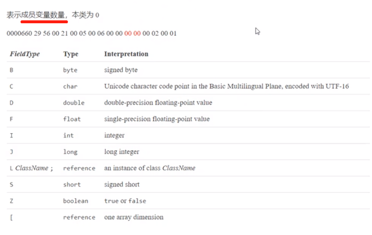

# 1. 类文件结构

我们尝试编译这个`HelloWorld.java`文件：
```
public class HelloWorld {
    public static void main(String[] args) {
        System.out.println("hello world");
    }
}
```
使用到的命令：
```
javac -parameters -d . HelloWorld.java
```
* -parameters： 保留方法参数的名称信息，比如：`main(args)`中的`args`

最终得到 `HelloWorld.class`字节码文件：
* windows用cmder执行以下命令打开：
    ```
    vim HelloWorld.class
    :%!xxd
    ```
* Linus/MacOS也可以执行以下命令打开：
    ```
    od -t xC HelloWorld.class
    ```

```
00000000: cafe babe 0000 0034 001f 0a00 0600 1109  .......4........
00000010: 0012 0013 0800 140a 0015 0016 0700 1707  ................
00000020: 0018 0100 063c 696e 6974 3e01 0003 2829  .....<init>...()
00000030: 5601 0004 436f 6465 0100 0f4c 696e 654e  V...Code...LineN
00000000: cafe babe 0000 0034 001f 0a00 0600 1109  .......4........
00000010: 0012 0013 0800 140a 0015 0016 0700 1707  ................
00000020: 0018 0100 063c 696e 6974 3e01 0003 2829  .....<init>...()
00000030: 5601 0004 436f 6465 0100 0f4c 696e 654e  V...Code...LineN
00000040: 756d 6265 7254 6162 6c65 0100 046d 6169  umberTable...mai
00000050: 6e01 0016 285b 4c6a 6176 612f 6c61 6e67  n...([Ljava/lang
00000060: 2f53 7472 696e 673b 2956 0100 104d 6574  /String;)V...Met
00000070: 686f 6450 6172 616d 6574 6572 7301 0004  hodParameters...
00000080: 6172 6773 0100 0a53 6f75 7263 6546 696c  args...SourceFil
00000090: 6501 000f 4865 6c6c 6f57 6f72 6c64 2e6a  e...HelloWorld.j
000000a0: 6176 610c 0007 0008 0700 190c 001a 001b  ava.............
000000b0: 0100 0b68 656c 6c6f 2077 6f72 6c64 0700  ...hello world..
000000c0: 1c0c 001d 001e 0100 2c63 6f6d 2f65 7861  ........,com/exa
000000d0: 6d70 6c65 2f73 7072 696e 6762 6f6f 7473  mple/springboots
000000e0: 7461 7274 6572 6465 6d6f 2f48 656c 6c6f  tarterdemo/Hello
000000f0: 576f 726c 6401 0010 6a61 7661 2f6c 616e  World...java/lan
00000100: 672f 4f62 6a65 6374 0100 106a 6176 612f  g/Object...java/
00000110: 6c61 6e67 2f53 7973 7465 6d01 0003 6f75  lang/System...ou
00000120: 7401 0015 4c6a 6176 612f 696f 2f50 7269  t...Ljava/io/Pri
00000130: 6e74 5374 7265 616d 3b01 0013 6a61 7661  ntStream;...java
00000140: 2f69 6f2f 5072 696e 7453 7472 6561 6d01  /io/PrintStream.
00000150: 0007 7072 696e 746c 6e01 0015 284c 6a61  ..println...(Lja
00000160: 7661 2f6c 616e 672f 5374 7269 6e67 3b29  va/lang/String;)
00000170: 5600 2100 0500 0600 0000 0000 0200 0100  V.!.............
00000180: 0700 0800 0100 0900 0000 1d00 0100 0100  ................
00000190: 0000 052a b700 01b1 0000 0001 000a 0000  ...*............
000001a0: 0006 0001 0000 0007 0009 000b 000c 0002  ................
000001b0: 0009 0000 0025 0002 0001 0000 0009 b200  .....%..........
```


根据JVM规范，类文件结构如下：
```
ClassFile {
    u4       magic;           // 第0~3个字节：魔数（表示是否是class类型的文件）
    u2       minor_version;   // 2个字节： 小版本号
    u2       major_version;   // 主版本号
    u2       constant_pool_count; // 常量池信息
    cp_info  constant_pool[constant_pool_count-1];
    u2       access_flags;   // 访问修饰（类到底是public还是）
    u2       this_class;     // 本类信息
    u2       super_class;    // 父类信息
    u2       interfaces_count;  // 有多少个接口
    u2       interfaces[interfaces_count]; // 接口信息
    u2       fields_count;
    field_info  fields[fields_count]; // 类变量、成员变量、类静态变量信息
    u2       vmethods_count;
    method_info  methods[methods_count]; // 方法信息
    u2       attributes_count;
    attribute_info  attribute[attributes_count]; //  方法属性信息
}
```

## 1.1 魔数
第0~3个字节：魔数（表示是否是class类型的文件）

好， 我们看到HelloWorld字节码文件第一行：
```
00000000: cafe babe 0000 0034 001f 0a00 0600 1109  .......4........
```
有个这么熟悉的词组，`cafe babe`，意思是什么？ 没错，这就表示的确是 class类型文件

## 1.2 版本
4~7 字节：表示类的版本 

上面的`0000 0034`（52） 表示Java 8


## 1.3 常量池
8~9 字节，表示常量池长度

上面 `001f`（31） 表示常量池有 #1~#30 项， 注意 #0 项 不计入，也没有值。

再往后面看：

`0a00 0600 1109`，其中：
* 第#1项 0a 表示一个 Method 信息；【查下图可以得知】
* `00 06` 和 `00 11(17)`表示它引用了常量池中 #6 和 #17 项来获得这个方法的【所属类】和【方法名】


## 1.4 访问标识与继承信息

好，我们可以看到，常量池所占位置，是一直到上图所示的 `29 56`，那么， 之后，就到了 access_flags，我们一起看看后面的两个字节：`00 21`，对比一下相关的解释表：


可以发现，`00 21` 表示 是一个public 的 类：


## 1.5 Field 信息


## 1.6 Method 信息 -- init（构造器）


## 1.7 Method 信息 -- main方法


## 1.8 附加属性


# 2. 字节码指令
可以参考此官方文档查看指令集： https://docs.oracle.com/javase/specs/jvms/se8/html/jvms-6.html#jvms-6.5

比如我们对照官方文档逐字解读`2a b7 00 01 b1`：
```
aload_0 = 42 (0x2a)        // 加载 slot 0 的局部变量，即 this，作为下面 invokespecial 构造方法调用的参数
invokespecial = 183 (0xb7) // 预备调用构造方法，哪个方法呢？
00 01 引用常量池#1 项， 即【Method java/lang/Object."<init>":()V】
b1 表示返回
```

再解读一下 `public static void main(java.lang.String[]);` 主方法的字节码指令：
```
b2 00 02 12 03 b6 00 04 b1
```
1. b2 -> getstatic: 用于加载静态变量，哪个静态变量呢？
2. 00 02 引用常量池中 #2 项，即【Field java/lang/System.out:Ljava/io/PrintStream;】
3. 0x12 -> ldc 加载参数，哪个参数？
4. 03 引用常量池中 #3 项，即【String hello world】
5. b6 -> invokevirtual 预备调用成员方法，哪个方法呢？
6. 00 04 引用常量池中 #4 项，即【Method java/io/PrintStream.println:(Ljava/lang/String;)V】
7. b1 表示返回

于是，就有了这样一个解释：
```
b2 00 02    12 03          b6  00 04       b1
PrintStream "hello world"  .   println()   return
```

## 2.2 javap 工具
Oracle提供了javap工具来反编译class文件

作用：帮你读字节码文件，并解释给你看。

```
javap -v HelloWorld.class
// -v 表示 输出class文件的字节码信息、常量池等详细信息
```

好，看回我们这个HelloWorld.java例子：
```
public class HelloWorld {
    public static void main(String[] args) {
        System.out.println("hello world");
    }
}
```
以上这个很简单的代码，在经过了:
1. `javac HelloWorld.java`
2. `javap -v HelloWorld.class >> ./output.txt`

之后 我们可以从这个output文件中得到：
```
Classfile /E:/Projects/IdeaProjects/spring-boot-starter-demo/src/main/java/com/example/springbootstarterdemo/com/example/springbootstarterdemo/HelloWorld.class
  Last modified 2019-12-24; size 496 bytes
  MD5 checksum 6f8be43a5db5ff80c7a2255c885f8315
  Compiled from "HelloWorld.java"
public class com.example.springbootstarterdemo.HelloWorld
  minor version: 0
  major version: 52
  flags: ACC_PUBLIC, ACC_SUPER
Constant pool:
   #1 = Methodref          #6.#17         // java/lang/Object."<init>":()V
   #2 = Fieldref           #18.#19        // java/lang/System.out:Ljava/io/PrintStream;
   #3 = String             #20            // hello world
   #4 = Methodref          #21.#22        // java/io/PrintStream.println:(Ljava/lang/String;)V
   #5 = Class              #23            // com/example/springbootstarterdemo/HelloWorld
   #6 = Class              #24            // java/lang/Object
   #7 = Utf8               <init>
   #8 = Utf8               ()V
   #9 = Utf8               Code
  #10 = Utf8               LineNumberTable
  #11 = Utf8               main
  #12 = Utf8               ([Ljava/lang/String;)V
  #13 = Utf8               MethodParameters
  #14 = Utf8               args
  #15 = Utf8               SourceFile
  #16 = Utf8               HelloWorld.java
  #17 = NameAndType        #7:#8          // "<init>":()V
  #18 = Class              #25            // java/lang/System
  #19 = NameAndType        #26:#27        // out:Ljava/io/PrintStream;
  #20 = Utf8               hello world
  #21 = Class              #28            // java/io/PrintStream
  #22 = NameAndType        #29:#30        // println:(Ljava/lang/String;)V
  #23 = Utf8               com/example/springbootstarterdemo/HelloWorld
  #24 = Utf8               java/lang/Object
  #25 = Utf8               java/lang/System
  #26 = Utf8               out
  #27 = Utf8               Ljava/io/PrintStream;
  #28 = Utf8               java/io/PrintStream
  #29 = Utf8               println
  #30 = Utf8               (Ljava/lang/String;)V
{
  public com.example.springbootstarterdemo.HelloWorld(); // init方法
    descriptor: ()V
    flags: ACC_PUBLIC
    Code:
      stack=1, locals=1, args_size=1     // 操作数栈深度为1， 成员变量数为1，形参有1个
         0: aload_0
         1: invokespecial #1                  // Method java/lang/Object."<init>":()V
         4: return
      LineNumberTable:
        line 7: 0           // 源码中的第7行 对应了这里的第0行

  public static void main(java.lang.String[]); // main() 方法
    descriptor: ([Ljava/lang/String;)V  // 方法参数是一个String[]
    flags: ACC_PUBLIC, ACC_STATIC       // 方法时 public static 的
    Code:
      stack=2, locals=1, args_size=1   // 方法栈有2层，。。。。
         0: getstatic     #2                  // 获取静态对象 Field java/lang/System.out:Ljava/io/PrintStream;
         3: ldc           #3                  // 获取字符串 String hello world
         5: invokevirtual #4                  // 调用方法  Method java/io/PrintStream.println:(Ljava/lang/String;)V
         8: return
      LineNumberTable:
        line 9: 0
        line 10: 8
    MethodParameters:
      Name                           Flags
      args
}
SourceFile: "HelloWorld.java"
```

## 2.3 图解运行流程
给你一段code：
```
public class Jvm02 {
    public static void main(String[] args) {
        int a = 10;
        int b = Short.MAX_VALUE + 1;
        int c = a + b;
        System.out.println(c);
    }
}
```
我们经过两步得到了解释后的字节码流程：
```
javac Jvm02.java
javap -v Jvm02.class
```

那么， 在去执行.class文件的过程中，到底有哪些操作呢？


### 1）常量池载入运行时常量池
将.class文件中涉及到的常量，加载到运行时常量池这一个内存区域中（虽然运行时常量池属于方法区的组成部分）


像这个例子，像 `10`，实际上是加载在方法区中、跟随着方法存储的，但是，如果是`Short.MAX_VALUE + 1 = 32768`这个值，则会被定义为常量池所属，于是会被加载到运行时常量池当中。

### 2）方法字节码载入方法区


### 3）main线程开始运行，分配栈帧内存


### 4）执行引擎开始执行字节码

**bipush 10**
* 作用：将一个大小为 1 byte的数字，压入操作数栈中，所以这个数字大小区间是：[-128,127]
* 操作数栈的宽度是4 byte，但是当前操作数只有 1 byte，所以，bipush等指令在压栈过程中会自动补齐 4 byte。
* 类似指令有：
  * sipush：将一个short压入操作数栈
  * ldc：将一个int 压入操作数栈
  * ldc2_w：将一个long 压入操作数栈（分两次压入，因为long 类型 8 byte）

**这里小的数字都是和字节码指令存在一起的，超过了 short 范围的数字存入了常量池。**

**istore 1**
* 作用：将操作数栈顶数据弹出，存入局部变量表的slot 1 (存入1号槽)


最终得到：


**ldc #3**
* 作用：加载常量池中 #3 数据，到 操作数栈
* 注意：`Short.MAX_VALUE = 32767`，所以`Short.MAX_VALUE + 1 = 32768` 是在编译期间计算好的


**istore 2**


**iload 1 和 iload 2**


**iadd**


**getstatic #4**
* 作用：到运行时常量池中，找到FieldRef成员变量，然后发现它实际引用指向的是 堆中的 System.out对象；找到之后，只是获取这个System.out 对象的引用而已，并不是将整个对象压入操作数栈。


**invokevirtual #5**

整个过程如下：
1. 找到常量池 #5 项
2. 定位到方法区 `java/io/PrintStream.println:(I)V`
3. 生成新的栈帧（分配 locals、stack等）
4. 传递参数，指向新栈帧中的字节码
5. 执行完毕，弹出栈帧
6. 清除 main 操作数栈内容


最终：
1. 完成main方法调用，弹出 main 栈帧
2. 程序结束


## 2.4 练习-- 分析 a++
看到这么一个例子：
```
public static void main(String[] args) {
    int a = 10;
    int b = a++ + ++a + a--;
    System.out.println(a);
    System.out.println(b);
}
```
反编译后得到这样的一个部分执行流程：
```
public static void main(java.lang.String[]);
    descriptor: ([Ljava/lang/String;)V
    flags: ACC_PUBLIC, ACC_STATIC
    Code:
      stack=2, locals=3, args_size=1
         0: bipush        10
         2: istore_1
         3: iload_1
         4: iinc          1, 1
         7: iinc          1, 1
        10: iload_1
        11: iadd
        12: iload_1
        13: iinc          1, -1
        16: iadd
        17: istore_2
        18: getstatic     #2                  // Field java/lang/System.out:Ljava/io/PrintStream;
        21: iload_1
        22: invokevirtual #3                  // Method java/io/PrintStream.println:(I)V
        25: getstatic     #2                  // Field java/lang/System.out:Ljava/io/PrintStream;
        28: iload_2
        29: invokevirtual #3                  // Method java/io/PrintStream.println:(I)V
        32: return
```
首先搞清楚两点：
* `iinc`：表示直接在局部变量slot 上进行运算；
* `a++` 是先执行 `iload`，后执行 `iinc`；而`++a`则相反；
* `iload`是将第i个slot区内存中的值，放入 操作数栈中；

可以自己捋一捋，整个过程，最终得到的值是： `a = 11; b = 34;`


## 2.5 条件判断指令
以下是条件判断相关指令和解释：

特别说明：
* byte, short, char 都按照 int 来比较，因为 操作数栈都是 4 字节；
* goto 用来进行跳转到指定行号的字节码；

来看一个例子：
```
public static void main(String[] args) {
    int a = -1;
    int b = -2;
    int c = 0;
    int d = 3;
    int e = 5;
    int f = 6;
}
```
反编译后得到的指令字节码：
```
Code:
  stack=2, locals=8, args_size=1
      0: iconst_m1              // 获取常量池中的 -1
      1: istore_1               // 将其放入slot[1] 中
      2: bipush        -2       // 将 -2 压入操作数栈
      4: istore_2               // 将操作数栈中的 -2 放到 slot[2] 中
      5: iconst_0               // 获取常量池中的 0
      6: istore_3
      7: iconst_3               // 获取常量池中的 3
      8: istore        4
    10: iconst_5                // 获取常量池中的 5
    11: istore        5
    13: bipush        6         // 将 6 压入操作数栈
    15: istore        6
    16: return
```
**注意**：-1~5 的数字，会用 `iconst_N`来表示，表示直接从常量池中拿到。而其他的值，则通过`bipush`压入slot区。


好，上面只是小插曲，我们看下面这个条件语句的例子：
```
public static void main(String[] args) {
    int a = 0;
    if (a == 0) {
        a = 10;
    } else if (a == 2) {
       a = 15;
    }
     else {
        a = 20;
    }
}
```
反编译得到：
```
Code:
  stack=1, locals=2, args_size=1
      0: iconst_0              // 获取常量池中的 0
      1: istore_1              // 将其放入slot[1] 中
      2: iload_1               // 将slot[1] 中 的 值 拿出，放入操作数栈中
      3: ifne          12      // 比较值是否 != 0，如果值 !=0， 则跳转到 12行
      6: bipush        10
      8: istore_1
      9: goto          26
    12: iload_1                // 将slot[1]的值压入操作数栈
    13: iconst_2               // 获取常量池中的 2 压入操作数栈
    14: if_icmpne     23       // 比较两者是否不等，是，则跳转，否则 ，继续往下走
    17: bipush        15
    19: istore_1
    20: goto          26      // 直接跳转到 15行，return
    23: bipush        20
    25: istore_1
    26: return
```

## 2.6 循环语句分析
### (1) while
```
public static void main(String[] args) {
    int a = 0;
    while (a < 10) {
        a++;
    }
}
```
反编译得到指令字节码：
```
 Code:
  stack=2, locals=2, args_size=1
      0: iconst_0             // 获取常量池中的 0
      1: istore_1             // 放入 slot[1] 中
      2: iload_1              // 加载 slot[1] 到 操作数栈中
      3: bipush        10     // 将 10 放入操作数栈中
      5: if_icmpge     14     // 如果 slot[1]值 >= 10，则直接return
      8: iinc          1, 1   // 否则，slot[1]值直接进行加1
    11: goto          2       // 然后，继续回到指令 #2
    14: return
```

### (2) do-while
```
public static void main(String[] args) {
    int a = 0;
    do {
        a++;
    } while (a < 10);
}
```
反编译得到指令字节码：
```
Code:
  stack=2, locals=2, args_size=1
      0: iconst_0             // 获取常量池中的 0
      1: istore_1             // 放入 slot[1] 中
      2: iinc          1, 1   // 让slot[1] 自增 1
      5: iload_1              // 加载 slot[1] 到 操作数栈中
      6: bipush        10     // 将 10 放入操作数栈中
      8: if_icmplt     2      // 如果 slot[1]值 < 10，回到 #2 继续执行
    11: return
```

### (3) for
```
public static void main(String[] args) {
    int a = 0;
    for(int i = 0; i < 10; i++) {
      a++;
    }
}
```
其实反编译后的字节码是几乎一致的。
```
 Code:
  stack=2, locals=3, args_size=1
      0: iconst_0
      1: istore_1
      2: iconst_0
      3: istore_2
      4: iload_2
      5: bipush        10
      7: if_icmpge     19
    10: iinc          1, 1
    13: iinc          2, 1
    16: goto          4
    19: return
```

## 2.7 练习-- 为什么 x 最终 = 0
```
public static void main(String[] args) {
    int i = 0;
    int x = 0;
    while (i < 10) {
        x = x++;
        i++;
    }
    System.out.println(x);
}
```
为什么这个最终结果是：`0` 呢？

原因：在每一轮for循环里，实际上执行的是这样一个过程：
```
iload_1      // 将 x=0 加载到 操作数栈
iinc x,1     // slot['x'] + 1 = 1
istore 1     // slot['x'] = 操作数栈中的 x = 0
```

## 2.8 构造方法
### (1) `<cinit>()V`：静态代码块与静态变量赋值的整合方法
```
public class Demo3_8_1 {
    static int i = 10;
    static {
        i = 20;
    }
    static {
        i = 30;
    }
}
```
编译器会按从上到下 的顺序， 收集所有 static 代码块 和 静态成员赋值 的 代码，合并成一个特殊的方法 `<cinit>()V`:
```
  static {};
    descriptor: ()V
    flags: ACC_STATIC
    Code:
      stack=1, locals=0, args_size=0
         0: bipush        10
         2: putstatic     #2                  // Field i:I --- 去常量池里找到一个叫做 'i' 的变量，并将这个 10 放入 常量池中
         5: bipush        20
         7: putstatic     #2                  // Field i:I --- 去常量池里找到一个叫做 'i' 的变量，并将这个 20 放入 常量池中
        10: bipush        30
        12: putstatic     #2                  // Field i:I --- 去常量池里找到一个叫做 'i' 的变量，并将这个 30 放入 常量池中
        15: return
```
`<cinit>()V` 会在类加载的初始化阶段被调用。

那么， 我们调换一下代码顺序：
```
public class Demo3_8_1 {
    static {
        i = 20;
    }
    static {
        i = 30;
    }
    static int i = 10;
}
```
反编译后，得到的结果的确符合我们预期：
```
Code:
      stack=1, locals=0, args_size=0
         0: bipush        20
         2: putstatic     #2                  // Field i:I  --- 加载 20
         5: bipush        30
         7: putstatic     #2                  // Field i:I  --- 加载 30
        10: bipush        10
        12: putstatic     #2                  // Field i:I  --- 加载 10
        15: return
```

### (2) `<init>()V`：类实例初始化时的实例代码块与实例成员初始化的整合方法

```
public class Demo3_8_2 {
    private String a = "s1";
    {
        b = 20;
    }

    private int b = 10;

    {
        a = "s2";
    }

    public Demo3_8_2() {
    }

    public Demo3_8_2(String a, int b) {
        this.a = a;
        this.b = b;
    }
}
```
编译后的指令字节码：
```
 public com.example.springbootstarterdemo.Demo3_8_2();
    descriptor: ()V
    flags: ACC_PUBLIC
    Code:
      stack=2, locals=1, args_size=1
         0: aload_0
         1: invokespecial #1                  // Method java/lang/Object."<init>":()V
         4: aload_0
         5: ldc           #2                  // String s1                   将 "s1"
         7: putfield      #3                  // Field a:Ljava/lang/String;  赋值给 this.a
        10: aload_0
        11: bipush        20                                                 将 20
        13: putfield      #4                  // Field b:I                   赋值给 this.b
        16: aload_0
        17: bipush        10
        19: putfield      #4                  // Field b:I
        22: aload_0
        23: ldc           #5                  // String s2
        25: putfield      #3                  // Field a:Ljava/lang/String;
        28: return

  public com.example.springbootstarterdemo.Demo3_8_2(java.lang.String, int);
    descriptor: (Ljava/lang/String;I)V
    flags: ACC_PUBLIC
    Code:
      stack=2, locals=3, args_size=3
         0: aload_0
         1: invokespecial #1                  // Method java/lang/Object."<init>":()V
         4: aload_0
         5: ldc           #2                  // String s1
         7: putfield      #3                  // Field a:Ljava/lang/String;
        10: aload_0
        11: bipush        20
        13: putfield      #4                  // Field b:I
        16: aload_0
        17: bipush        10
        19: putfield      #4                  // Field b:I
        22: aload_0
        23: ldc           #5                  // String s2
        25: putfield      #3                  // Field a:Ljava/lang/String;
        28: aload_0
        29: aload_1                           //  获取第一个String入参
        30: putfield      #3                  // Field a:Ljava/lang/String;
        33: aload_0
        34: iload_2                           //  获取第二个int入参
        35: putfield      #4                  // Field b:I
        38: return

```
可以看到，实际上，无论是无参构造器，还是有参构造器，都会在编译时和成员代码块整合到一起，生成不同入参的构造方法 `<init>()V`，并且，构造器中的logic，一定在成员代码块的后面才执行。
