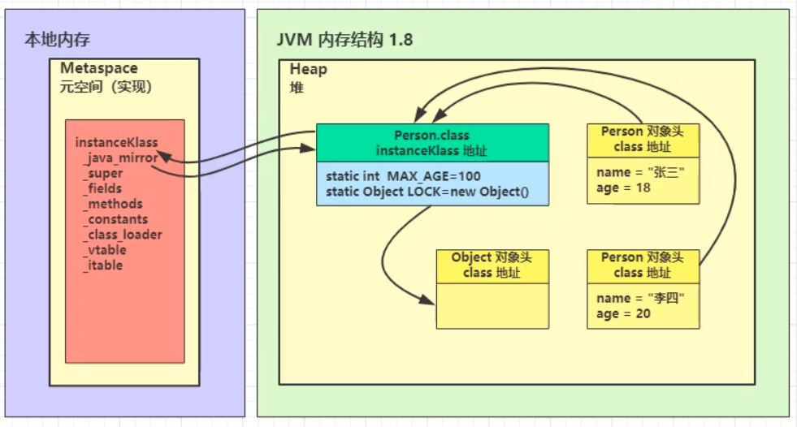
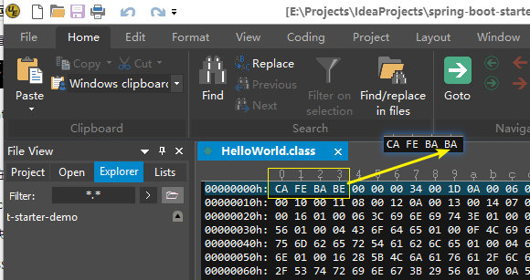
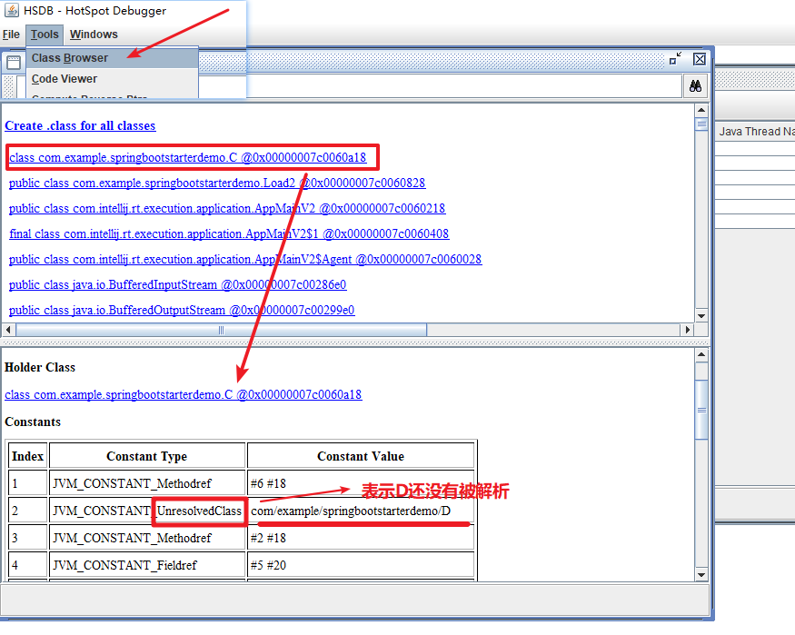

# 4. 类加载阶段
类加载分三个大阶段：加载--链接--初始化


## 4.1 加载
将类的字节码载入方法区中，内部采用C++的 `instanceKlass` 描述 java类，有很多关键的 field：
* `_java_mirror` 即 java 的类镜像，如：对于String来说，就是`String.class`，作用是把 klass暴露给 java使用。 （因为Java不能直接访问 klass，因为klass是C++ level的数据结构，那么这个`_java_mirror`就相当于是连接Java和C++的桥梁，通过它可以访问到方法区中的`instanceKlass`中存储的java类信息。这里的`String.class`就是个桥梁，否则，下面的什么父类等的信息，全部访问不到）
* `_super` 父类
* `_fields` 成员变量
* `_methods` 方法
* `_constants` 常量池
* `_class_loader` 类加载器
* `_vtable` 和方法多态相关，对应虚方法表 构造方法的入口地址
* `_itable` 接口的方法表

注意点：
* 先加载父类，后加载子类；
* 加载和链接可能是交替运行的；


从上图得知几个信息：
1. `instanceKlass`存在元空间中，而`_class_mirror`类镜像则存在于 堆中；
2. `instanceKlass`与`_class_mirror`相互持有对方的引用，这就起到了桥梁通信的作用；
3. 通过对象去获取对象类型信息：
   1. 步骤一：通过对象的对象头，拿到class对象地址
   2. 步骤二：通过class对象，找到元空间中的`klass`
4. 可通过 HSDB 工具去查看这些信息的地址；

## 4.2 链接
此阶段又分为三个小阶段：验证、准备、解析

### （1）验证
作用：验证类是否符合 JVM规范， 安全性检查。

我们可以尝试修改某个`.class`文件中类的魔数（使用UE等支持二进制的编辑器），然后尝试在控制台运行它，会发现报错：


```
E:\Projects\IdeaProjects\spring-boot-starter-demo\src\main\java
λ java com.example.springbootstarterdemo.HelloWorld
Error: A JNI error has occurred, please check your installation and try again
Exception in thread "main" java.lang.ClassFormatError: Incompatible magic value 3405691578 in class file com/example/springbootstarterdemo/HelloWorld
        at java.lang.ClassLoader.defineClass1(Native Method)
        at java.lang.ClassLoader.defineClass(Unknown Source)
        at java.security.SecureClassLoader.defineClass(Unknown Source)
        at java.net.URLClassLoader.defineClass(Unknown Source)
        at java.net.URLClassLoader.access$100(Unknown Source)
        at java.net.URLClassLoader$1.run(Unknown Source)
        at java.net.URLClassLoader$1.run(Unknown Source)
        at java.security.AccessController.doPrivileged(Native Method)
        at java.net.URLClassLoader.findClass(Unknown Source)
        at java.lang.ClassLoader.loadClass(Unknown Source)
        at sun.misc.Launcher$AppClassLoader.loadClass(Unknown Source)
        at java.lang.ClassLoader.loadClass(Unknown Source)
        at sun.launcher.LauncherHelper.checkAndLoadMain(Unknown Source)
```


### （2）准备
作用：为 static 变量 分配空间，设置默认值
* static变量 在JDK7 之前存储于 `instanceKlass` 末尾，从JDK7 开始，存储于 `_java_mirror`末尾；
* static变量 **分配空间** 和 **赋值** 是两个步骤：
   * 分配空间在**准备阶段**完成；
   * 赋值在**初始化阶段**完成；

**例子一**：
```
public class Load8 {
    static int a;
    static int b = 1;
}
```
编译后的字节码指令如下：
```
{
  static int a;
    descriptor: I
    flags: ACC_STATIC

  static int b;
    descriptor: I
    flags: ACC_STATIC

  public com.example.springbootstarterdemo.Load8();
    descriptor: ()V
    flags: ACC_PUBLIC
    Code:
      stack=1, locals=1, args_size=1
         0: aload_0
         1: invokespecial #1                  // Method java/lang/Object."<init>":()V
         4: return
      LineNumberTable:
        line 7: 0
      LocalVariableTable:
        Start  Length  Slot  Name   Signature
            0       5     0  this   Lcom/example/springbootstarterdemo/Load8;

  static {};
    descriptor: ()V
    flags: ACC_STATIC
    Code:
      stack=1, locals=0, args_size=0
         0: iconst_1
         1: putstatic     #2                  // Field b:I
         4: return
      LineNumberTable:
        line 9: 0
}
```
可以得知：
1. 对于普通静态变量 a 和 b 都是在准备阶段，分配空间；
2. 看到这里的 b 的赋值操作，实际在`static{}`这个位置，而这里的`static{}`实际上是类的构造方法，也可以理解成静态代码块，也就是说，赋值这一步是在类加载的初始化阶段才执行的；

例子二：
```
public class Load8 {
    static int a;
    static int b = 1;
    static final int c = 20;
    static final String d = "hello";
    static final Person e = new Person("XiaoMing");

    static class Person {
        public String name;
        Person(String name) {
            this.name = name;
        }
    }
}
```
得到：
```
{
  static int a;
    descriptor: I
    flags: ACC_STATIC // ------- a没有被赋值

  static int b;
    descriptor: I
    flags: ACC_STATIC // ------- b没有被赋值

  static final int c;
    descriptor: I
    flags: ACC_STATIC, ACC_FINAL
    ConstantValue: int 20 // --- c 是final基本类型，编译时就知道值了，所以准备阶段赋值

  static final java.lang.String d;
    descriptor: Ljava/lang/String;
    flags: ACC_STATIC, ACC_FINAL
    ConstantValue: String hello  // --- d 是final String类型，String被特殊看待，所以准备阶段赋值

  static final com.example.springbootstarterdemo.Load8$Person e;
    descriptor: Lcom/example/springbootstarterdemo/Load8$Person;
    flags: ACC_STATIC, ACC_FINAL // --- e 是final 类型的Person类，会等到类初始化阶段才赋值

  public com.example.springbootstarterdemo.Load8();
    descriptor: ()V
    flags: ACC_PUBLIC
    Code:
      stack=1, locals=1, args_size=1
         0: aload_0
         1: invokespecial #1                  // Method java/lang/Object."<init>":()V
         4: return
      LineNumberTable:
        line 7: 0
      LocalVariableTable:
        Start  Length  Slot  Name   Signature
            0       5     0  this   Lcom/example/springbootstarterdemo/Load8;

  static {};
    descriptor: ()V
    flags: ACC_STATIC
    Code:
      stack=3, locals=0, args_size=0
         0: iconst_1
         1: putstatic     #2                  // Field b:I
         4: new           #3                  // class com/example/springbootstarterdemo/Load8$Person
         7: dup
         8: ldc           #4                  // String XiaoMing
        10: invokespecial #5                  // Method com/example/springbootstarterdemo/Load8$Person."<init>"
:(Ljava/lang/String;)V
        13: putstatic     #6                  // Field e:Lcom/example/springbootstarterdemo/Load8$Person;
        16: return
      LineNumberTable:
        line 9: 0
        line 12: 4
}
```
说明：
1. 如果 static变量 是 final 的基本类型 或者String类型，那么编译阶段值就确定了，赋值在准备阶段完成；
2. 如果 static变量 是 final 的引用类型，那么赋值也会在初始化阶段完成；

### （3）解析
作用：将常量池中的符号引用解析为直接引用

默认情况下，类的加载是 懒惰式的，也就是说，如果 `C` 没有用到 `D`，那么`D`类是不会加载的。
```
public class Load2 {
    public static void main(String[] args) throws ClassNotFoundException, IOException {
        ClassLoader classLoader = Load2.class.getClassLoader();
        // loadClass() 方法不会导致类的解析和初始化
        Class<?> c = classLoader.loadClass("com.example.springbootstarterdemo.C");
        System.in.read();
    }
}

class C {
    D d = new D();
}

class D {
}
```
使用jdk自带的HSDB工具查看类加载情况：

的确表明了，如果是通过类加载器去加载，那么没被使用到的类，虽然会被加载，但是不会进行解析和初始化的。

但是，如果用：`new C();`那么，类`D`则会 被加载到JVM中并被链接和初始化。

所以，就说明了 “解析”这一步的作用。那就是将 符号上涉及的类，变成实际上类的地址信息，相当于：原来你只有一张地图，地图上只写着“有个盘丝洞”，现在相当于帮你在地图上标好了“盘丝洞”的具体地址。


## 4.3 初始化
初始化其实就是去调用 `<cinit>()v` 方法，JVM会保证这个类的 **‘构造方法’** 的线程安全。

类初始化总是 【懒惰的】

触发类初始化的时机：
* main方法所在的类，总会被首先初始化；
* 首次访问这个类的静态变量或静态方法时；
* 子类初始化，如果父类还没有初始化，则初始化父类先；
* 子类访问父类的静态变量，只会触发父类的初始化；
* 执行 `Class.forName`时，会导致类的初始化；
* new对象时，会导致 对象的类初始化；

以下不会触发 类初始化：
* 访问类的 `static final`静态常量（基本类型和字符串）时；
  > 因为它们都是在类链接的准备阶段，就已经决定值了的，所以不需要类初始化，就能够拿到对应的值；
* 访问类的类对象 `X.class` 不会触发X类的初始化，因为在加载阶段，就已经生成了`X.class`；
* 创建该类的数组不会触发初始化；
* 类加载器的 `loadClass` 方法；
    ```
    ClassLoader classLoader = Load2.class.getClassLoader();
    Class<?> c = classLoader.loadClass("com.example.springbootstarterdemo.C");
    ```
* `Class.forName`的参数 2 为 false时；
    ```
    ClassLoader c2 = Thread.currentThread().getContextClassLoader();
    Class.forName("xxx.C", false, c2);
    ```

应用在 Lazy安全单例模式：
```
class Singleton {

    private Singleton() {
    }

    // 知识点一：静态内部类可以访问外部类的所有方法，包括私有的初始化方法
    private static class LazyLoader {
        private static Singleton INSTANCE = new Singleton();
    }

    // 知识点二：只要不调用到这个静态方法，就不会使用到这个静态内部类，
    // 于是 LazyLoader 只有在被用到了，才会走 类 加载--链接--初始化 过程
    public static Singleton getInstance() {
        return LazyLoader.INSTANCE;
    }
}
```