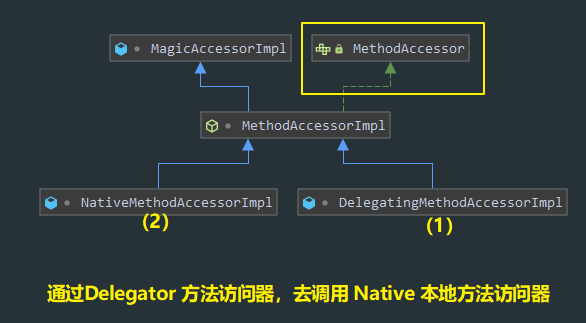
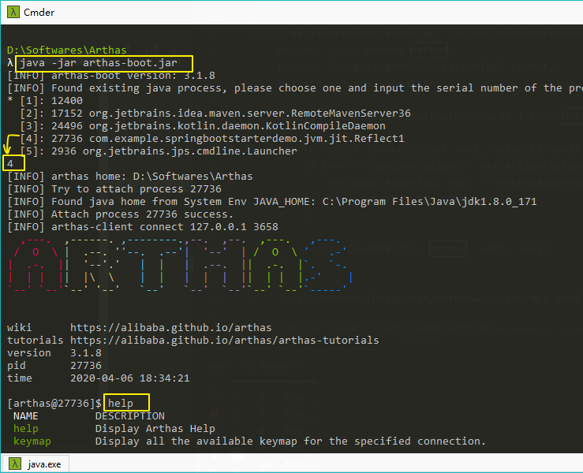
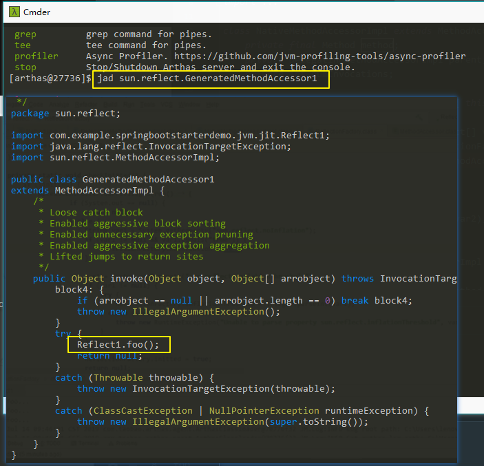

<!--more-->

## 运行期优化--逃逸分析
看下面例子，200次循环，每次循环加载1000个Object，看看效率：
```java
public class JIT1 {
    public static void main(String[] args) {
        for (int i = 0; i < 200; i++) {
            long start = System.nanoTime();
            for (int j = 0; j < 1000; j++) {
                new Object();
            }
            long end = System.nanoTime();
            System.out.printf("%d\t%d\n", i, (end - start));
        }
    }
}
```
得到结果：
```
0	24433
1	24068
2	22245
3	22245
....
72	21880
73	22245
74	12763
75	10211
76	9846 ----- C1
77	14951
78	6564
79	13493
80	13493
81	9118
82	6199
83	7293
...
133	6200
134	46678
135	14587
136	365 ----- C2
137	365
138	364
139	365
140	364
141	365
142	0
143	22245
144	30997
...
```
可以看来，一开始效率是比较慢的，到达 第75次时，效率翻倍了，到达 第137次时，效率直接提高一个数量级，第143次直接效率爆表，然后又变回低效加载了。

看样子，JVM在执行过程中，做了一下手脚或者说优化。


### 分层编译
原因是什么？

JVM 将执行状态分成了 5 个层次：
* 0层，解释执行（Interpreter）；
* 1层，使用 C1 即时编译器编译执行（不带profiling）；
* 2层，使用 C1 即时编译器编译执行（带基本的profiling）；
* 3层，使用 C1 即时编译器编译执行（带完全的profiling）；
* 4层，使用 C2 即时编译器编译执行；

> profiling 是指：在运行过程中收集一些程序执行状态的数据，例如：
> * 方法的调用次数
> * 循环的回边次数
>
> 等

即时编译器（JIT）与解释器的区别：
* 解释器是将字节码解释为机器码,下次即使遇到相同的字节码,仍会执行重复的解释；
* JIT是将一些字节码编译为机器码，并存入 Code Cache，下次遇到相同的代码，直接执行，无需再编译；
* 解释器是将字节码解释为针对所有平台都通用的机器码；
* JIT会根据平台类型，生成平台特定的机器码；

对于占据大部分的不常用的代码，我们无需耗费时间将其编译成机器码，而是采取解释执行的方式运行；另一方面，对于仅占据小部分的热点代码，我们可以将其编译成机器码，以达到理想的运行速度。执行效率上：Interpreter < C1（效率提高5倍） < C2（效率提高10~100倍），总的目标是发现热点代码（hotspot名称的由来），优化之。

所以，上述代码中，JVM发现这个`new Object();`只是循环中不断创建的对象，并且这个对象并没有被用到，那既然这样，我为什么要创建你呢？于是用JIT进行逃逸分析，并用 C2 编译器优化字节码。

我们可以尝试加上VMOptions：
```
-XX:+PrintCompliation
-XX:-DoEscapeAnalysis 【关闭逃逸分析】
```
可以看到，此时，关闭了逃逸分析后，字节码的优化无法达到C2级别。


## 方法内联(Inlining)
如果发现 某方法：
1. 是热点方法；
2. 长度不会太长；

则会进行内联。

内联就是：把方法内的代码拷贝、粘贴到调用者的位置：

内联前：
```java
private static int square(final int i) {
    return i * i;
}

System.out.println(square(9));
```

内联后：
```java
System.out.println(9 * 9);
```
还能进行常量折叠（constant folding）的优化：
```java
System.out.println(81);
```

### 例子
同样是 不断循环调用方法，而且这个方法很短：
```java
public class JIT2 {
    public static void main(String[] args) {
        int x = 0;
        for (int i = 0; i < 200; i++) {
            long start = System.nanoTime();
            for (int j = 0; j < 1000; j++) {
                x = square(9);
            }
            long end = System.nanoTime();
            System.out.printf("%d\t%d\n", i, (end - start));
        }
    }

    private static int square(int x) {
        return x * x;
    }
}
```
得到结果：
```
0	23704
1	28080
2	13858
3	13857
4	13857
5	13857
.......
73	13858
74	8387
75	2188
76	2188
77	3282
78	2188
....
146	2188
147	2188
148	2188
149	2188
150	36102
151	15681
152	0
153	14952
154	18598
```
的确，优化后，效率比一开始高了不少。

相关VMOptions：
```
-XX:+UnlockDiagnosticVMOptions -XX:+PrintInlining 【打印方法内联情况，不仅是当前我们的方法，对于所有相关方法都会进行尝试内联】

-XX:CompileCommand=dontinline,*JIT2.square 【指定square不想被内联】
```

## 字段优化
注意：方法内联 会影响 遍历的数组的成员读取的优化。

```java
@Benchmark
public void test1() {
    for (int i = 0; i < elements.length; i++) {
        doSum(elements[i]);
    }
}

// 默认就是 启用 方法内联
@CompilerControl(CompilerControl.Mode.INLINE)
private void doSum(int x) {
    sum += x;
}
```
以上的例子，我们看 启用方法内联 和 不启用方法内联 的区别：

当我们启用方法内联，它将会变成这样：
```java
@Benchmark
public void test1() {
    // elements.length 首次读取会缓存起来 -> int[] local
    int[] local  = this.elements;
    for (int i = 0; i < local.length; i++) { // 后续求长度 <- local
        doSum(local[i]); // 1000次取下标 i 的元素 <- local
    }
}
```

当我们不启用时，那么，它是不会进行局部变量优化的，这样就会每次都去访问成员变量，去计算长度。这样是效率低下的。推荐是操作局部变量，而不是成员变量。

## 反射优化

先看看例子：
```java
public class Reflect1 {
    public static void foo() {
        System.out.println("foo...");
    }

    public static void main(String[] args) throws NoSuchMethodException, InvocationTargetException, IllegalAccessException, IOException {
        Method foo = Reflect1.class.getMethod("foo");
        for (int i = 0; i <= 16; i++) {
            System.out.printf("%d\t", i);
            foo.invoke(null);
        }
        System.in.read();
    }
}
```
会发现，前16次调用，效率都比较低，但是到了第17次调用，效率就上去了。

究其源码：
1. 首先，`Method.invoke` 里头调用的是 `MethodAccessor.invoke`接口方法，背后通过 delegate方法访问器 去 调用 本地方法访问器。

2. 然后，看看`NativeMethodAccessorImpl.invoke`
```java
class NativeMethodAccessorImpl extends MethodAccessorImpl {
    private final Method method;
    private DelegatingMethodAccessorImpl parent;
    private int numInvocations;

    NativeMethodAccessorImpl(Method var1) {
        this.method = var1;
    }

    public Object invoke(Object var1, Object[] var2) throws IllegalArgumentException, InvocationTargetException {
        // 2. 每次调用 此方法，就会加一，直到和 “成长阈值（默认是15）”对比大于它，
        if (++this.numInvocations > ReflectionFactory.inflationThreshold() && !ReflectUtil.isVMAnonymousClass(this.method.getDeclaringClass())) {
            // 此时，会将当前的方法访问器，换成运行时动态生成的方法访问器
            MethodAccessorImpl var3 = (MethodAccessorImpl)(new MethodAccessorGenerator()).generateMethod(this.method.getDeclaringClass(), this.method.getName(), this.method.getParameterTypes(), this.method.getReturnType(), this.method.getExceptionTypes(), this.method.getModifiers());
            this.parent.setDelegate(var3);
        }
        
        // 1. 刚开始，没达到上面的条件，就去调用 native方法（C++ level），效率低
        return invoke0(this.method, var1, var2);
    }

    void setParent(DelegatingMethodAccessorImpl var1) {
        this.parent = var1;
    }

    private static native Object invoke0(Method var0, Object var1, Object[] var2);
}
```
那么，这个达到 15次的 阈值后，`this.parent`替换为了一个运行时动态生成的方法访问器，那这个方法访问器到底是如何提升性能的呢？

我们先debug 拿到 上面源码的`var3`到底是什么类型：
```java
sun.reflect.GeneratedMethodAccessor1
```
再运行上面的例子，并使用Alibaba Arthas 工具进行分析：


所以这里内部已经不是反射了，而是直接调用静态方法了。