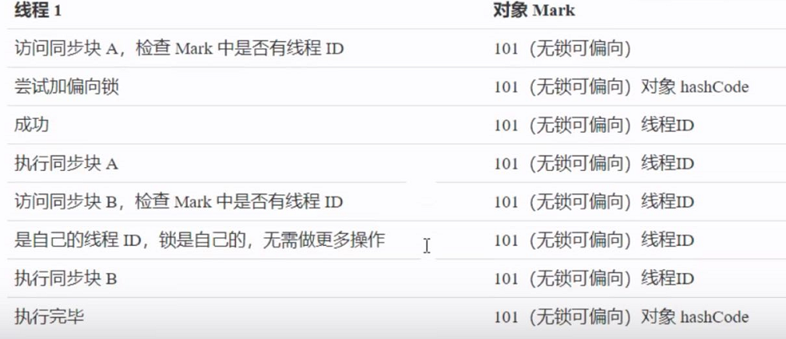

<!--more-->

# synchronized优化
在JDK6 以后，JVM对synchronized进行了优化，使得它的性能大幅提升了，某些时候比CAS更高效。

Java Hotspot VM中，每个对象都有对象头（包括：class指针 和 Mark Word）。Mark Word平时存储这个对象的hash 码、分代年龄。当加锁之后，这些信息就根据情况被替换为：标记位、线程锁记录指针、重量级锁指针、线程ID等内容。

## 轻量级锁
一个对象，虽然很多线程会去访问它，但是线程之间的访问对象时间是错开的（**没有竞争**），就可以使用**轻量级锁**来优化。

生动例子：
* 学生（t1）用课本占座，上了半节课，出门了（CPU时间到），回来一看，发现课本没变，说明没有竞争，继续上他的课；
* 如果这期间有其他学生（t2）来了，会告知（t1）有并发访问，（t1）随即升级为重量级锁，进入重量级锁的流程。

而**重量级锁**就不是课本占座这么简单了，（t1）走之前，直接把座位用一个铁栅栏围起来。

### 轻量级锁加锁过程
每个线程的栈帧都会包含一个锁记录的结构，内部可以存储锁定对象的Mark Word
```java
static Object obj = new Object();
public static void method1() {
    synchronized(obj) {
        // 同步块 A
        method2();
    }
}
public static void method2() {
    synchronized(obj) {
        // 同步块 B
    }
}
```


### 锁膨胀
如果在尝试加轻量级锁的过程中，CAS操作无法成功，这时，其中一种原因是其他线程已经为此对象加上了轻量级锁（**有锁竞争**），此时就需要进行**锁膨胀**，将轻量级锁 变成 重量级锁。

```java
static Object obj = new Object();
public static void method1() {
    synchronized(obj) {
        // 同步块 
    }
}
```


### 重量锁
锁原理：通过`monitorenter` 和 `monitorexit`来完成加锁解锁操作。

自旋锁是一种JVM对运行时多线程同步的一个优化方案，优化的是那种我前一秒排队玩游戏机，前面的人下一秒就玩完了的情况。

重量级锁竞争时，可以使用自旋来进行优化，如果当前线程自旋成功（即 此时 持有锁的线程已经退出了），那么这时当前线程就可以避免阻塞。

特点：
* JDK6 之后自旋锁 是自适应的，比如：
  * 对象刚刚的一次自旋操作成功过，那么认为这次自旋成功的可能性会高，就多自旋几次；
  * 反之，就少自旋甚至不自旋，总之，比较智能。
* JDK7 之后不能控制是否开启自旋功能；
* 自旋会占用 CPU时间，单核CPU自旋就是浪费，多核CPU自旋才能发挥优势；
* 好比等红灯时汽车是不是熄火，不熄火相当于自旋（等待时间短了划算），熄火了相当于阻塞（等待时间长了划算）；


## 偏向锁
前面讲到，线程进行**锁重入**的操作时，实际上是重新执行CAS去交换地址信息，这样是没必要的，锁本来就是我自己拿着，没必要又重新获得锁，也没必要再做什么额外校验等。

于是，JDK6引入了偏向锁。

优化：只有第一次使用CAS将**线程ID**设置到对象的Mark Word 头，之后发现这个线程ID是自己的就表示没有竞争，不用重新 CAS。（<u>对象的Mark Word 头 不是放线程锁记录地址了，而是放线程ID</u>）

特点：
* 撤销偏向锁需要将<u>持有锁的线程</u>升级为**轻量级锁**，此过程中所有线程需要暂停（STW）；
* 访问对象的 `hashCode` 也会撤销偏向锁；（因为对象头在无锁情况下，存储的是对象自己的hashCode，但是在有锁情况下，存储的就是线程ID了，hashCode被放到了加锁的线程）
* 如果对象虽然被多个线程访问，但是没有竞争，那么这时 偏向了线程T1 的对象仍有机会重新偏向T2，重偏向 会重置对象的 Thread ID；
* 撤销偏向和重偏向 都是批量进行的，以类为单位（这个类的所有对象一并会进行）；
* 如果撤销偏向到达某个阈值，整个类的所有对象都会变成不可偏向的（那么一上来就是轻量级锁）；
* 可以主动使用 `-XX:-UseBiasedLocking`禁用偏向锁（因为看起来，偏向锁是弊大于利呀~）；

例子：
```java
static Object obj = new Object();
public static void method1() {
    synchronized(obj) {
        // 同步块 A
        method2();
    }
}
public static void method2() {
    synchronized(obj) {
        // 同步块 B
    }
}
```



## 其他优化
### 1. 减少上锁时间
同步代码块中尽量短。

### 2. 减少锁的粒度
将一个锁拆分为多个锁提高并发读，如：
* ConcurrentHashMap（数组上每一个链表的链表头，来进行加锁）
* LongAdder 分为 base 和 cells 两部分。没有并发争用时 或者是 cells数组 正在初始化时，会使用CAS来累加值到 base，有并发争用时，则会初始化cells数组，数组有多少个cell，就允许多少线程并行修改，最后将数组中每个cell累加，再加上 base 就是最终的值。
* LinkedBlockingQueue 入队和出队使用不同的锁，相对于 LinkedBlockingArray只有一个锁效率要高；

### 3. 锁粗化
多次循环进入同步块 不如 同步块内再循环；

另外JVM 可能会做如下优化，把多次 append 的加锁操作粗化为一次（因为都是对同一个对象加锁，没必要重入多次）：
```java
new StringBuffer().append("a").append("b").append("c");
```

### 4. 锁消除
JVM会进行代码的逃逸分析，例如：某个加锁对象是方法内局部变量，不会被其他线程访问到，此时 就会被即时编译器忽略掉所有同步操作。

### 5. 读写分离
CopyOnWriteArrayList、CopyOnWriteSet