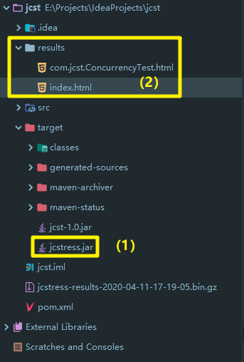
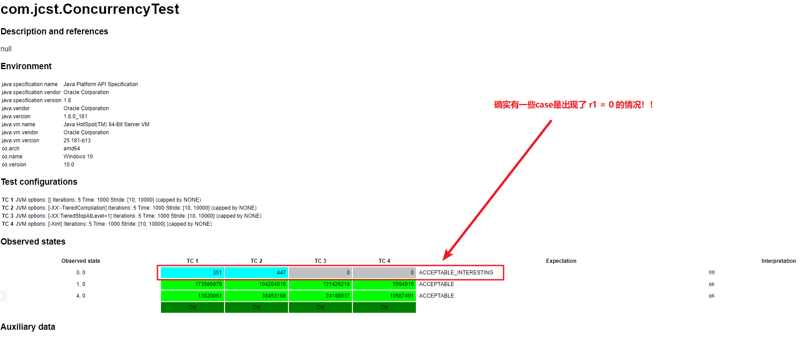
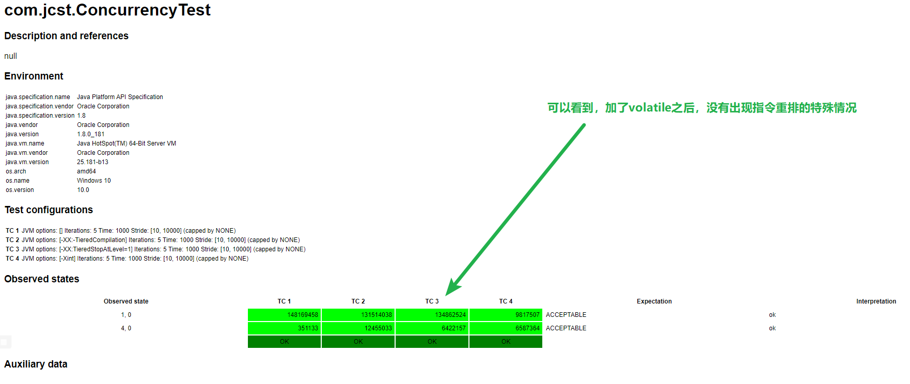

<!--more-->

# 内存模型

## java 内存模型
Java Memory Model（JMM），java 内存模型。

一句话：JMM定义了一套在多线程读写共享数据时（成员变量、数组）时，对数据的可见性、有序性、原子性 的规则和保障。

## 原子性
synchronized(同步关键字)

```java
static Object obj = new Object();

public static void main(....) {
    new Thread(() -> {
        synchronized (obj) {
            ...........
        }
    })
}
```
其中，这个`obj`，在对其加上`synchronized`关键字后，其内存管理会分为几个区域：


* Monitor区：每个对象，都有自己的一个monitor区域，翻译为“监视器”，只有用了`synchronized`关键字才有。
* Owner区：Monitor监视器的所有者，同一时刻，只能有一个线程成为Owner；
  * 一旦这个线程调用`monitorenter`成功，即锁定了此对象的monitor区，成为owner，可以跑logic；
  * 跑完logic，调用`monitorexit`成功，本线程释放此锁；
* EntryList：等待区，t2发现t1已经成为了Owner，那么t2就会进入此区域，进入阻塞态，不占用CPU时间；
* WaitSet：Object 的方法 `wait` 和 `notify` 所用到的一个区域；


```java
public class Atomicity01 {
    static int a = 0;

    public static void main(String[] args) throws InterruptedException {
        Thread t1 = new Thread(() -> {
            for (int i = 0; i < 5000; i++) {
                a++;
            }
        });
        Thread t2 = new Thread(() -> {
            for (int i = 0; i < 5000; i++) {
                a--;
            }
        });
        t1.start();
        t2.start();
        t1.join();
        t2.join();
        System.out.println(a);
    }
}
```
执行以上代码，得到的 a 结果 有时是0，有时是正数，有时是负数。

为什么呢？

我们知道，`a++` 和 `a--`，也就是自增和自减，分两种情况:
* 情况一：当`a` 是局部变量，那么，字节码指令只有1条：
    ```
    iinc          1, 1  // 直接找到 slot[1]，给里面的a值加一即可
    ```
* 情况二：当`a` 是静态变量，那么，字节码指令有4条，也就是4个动作；
    ```
    getstatic  a   // 获取静态变量a 的值 【放入操作数栈】
    iconst_1       // 准备常量 1【放入操作数栈】
    iadd           // 自增【此操作在操作数栈中进行】
    putstatic  a   // 将修改后的值存入静态变量a
    ```
    ```
    getstatic  a   // 获取静态变量a 的值 【放入操作数栈】
    iconst_1       // 准备常量 1【放入操作数栈】
    isub           // 自减【此操作在操作数栈中进行】
    putstatic  a   // 将修改后的值存入静态变量a
    ```

所以，静态变量的自增自减操作，不是原子操作！！

JMM 会将内存 划分为几个区域：


自增自减操作，需要在主内存 和 线程内存 中的进行数据交换。

那么，在多线程情况下，这  8条字节码指令，会交错执行！！因为CPU时间片是随机的，选择哪个线程执行是看时间片的，是以单条指令执行完毕为时间片切换点，不会等你4条指令都执行完毕，才切换时间片。


## 可见性
好，上面提到，每次读取静态变量，都要去读主内存中的共享地址的值，很麻烦，于是 JIT编译器会将 静态变量的值缓存至自己工作内存中的高速缓存中，减少对主存中的变量的访问，提高效率。（“每次开宿舍门都要问宿管拿钥匙，很烦，我自己偷偷copy一条钥匙吧”）


### 复制变量到工作内存的问题
这样虽然提高了效率，但是也会遇到一些问题：当main线程此时更改了 run 的值，并同步到主存，那么线程t此时拿着的值，就永远变成了旧值。（“换了新宿舍，宿管换了把钥匙，但是我却一直还拿着旧钥匙，进出旧宿舍”）


### 解决方法
volatile(易变关键字)

详情可看笔者另一篇文章。简单来说，它可以用来修饰成员变量和静态成员变量，可以避免线程从自己的工作缓存中查找变量的值，必须到主存中获取它的值，线程操作 volatile 变量都是直接操作主存。（班主任一直盯着我，我不能偷偷copy钥匙了，必须每次进宿舍，都找宿管拿钥匙）

### 可见性
班主任就让钥匙对于 宿管、我以及我宿友 来说，有了**可见性**。

可见性保证的是多个线程之间，一个线程对 volatile 变量 的修改对另一个线程可见（宿管换钥匙了，我们第一时间知道），但不能保证原子性，仅适用在一个写线程（宿管），多个读线程（我和宿友）的情况。

#### 例子一
假如线程t 读取的这个 `run`对象加上了`volatile`关键字:
```java
public class Atomicity01 {
    volatile static boolean run = true;

    public static void main(String[] args) throws InterruptedException {
        Thread t = new Thread(() -> {
            while(run) {
            }
        });
        t.start();

        Thread.sleep(1000L);
        run = false;
    }
}
```

字节码指令执行过程变成：
```
getstatic run // 线程 t 获取 run true
getstatic run // 线程 t 获取 run true
getstatic run // 线程 t 获取 run true
getstatic run // 线程 t 获取 run true
putstatic run // 线程 main 修改 run 为 false，仅此一次
getstatic run // 线程 t 获取 run false
```

#### 例子二
不能保证原子性，仅适用在一个写线程，多个读线程的情况，可以看以下这个例子：

将之前原子性相关例子的这个`a`用`volatile`进行修饰：
```java
public class Test02 {
    volatile static int a = 0;

    public static void main(String[] args) throws InterruptedException {
        Thread t1 = new Thread(() -> {
            for (int i = 0; i < 5000; i++) {
                a++;
            }
        });
        Thread t2 = new Thread(() -> {
            for (int i = 0; i < 5000; i++) {
                a--;
            }
        });
        t1.start();
        t2.start();
        t1.join();
        t2.join();
        System.out.println(a);
    }
}
```
这里其实是两个线程都在写和读，此时，运行时的指令可能是这样的：

所以，依然最终得不到正确的结果，因为 可见性和 原子性 是两个不同维度的东西。而`synchronized`能够同时保证可见性和原子性，因为硬生生变成同步了。

可以看看，`synchronized`是否能保证可见性：
```java
public class Atomicity01 {
    static boolean run = true;

    public static void main(String[] args) throws InterruptedException {
        Thread t = new Thread(() -> {
            while(run) {
                System.out.println(1);
            }
        });
        t.start();

        Thread.sleep(1000L);
        run = false;
    }
}
```
此时，就算不加`volatile`关键字修饰变量`run`，程序依然能够在1s后停止，为什么呢？

因为，`System.out.println(1);`内部使用到了`synchronized(this)`，会强制让每次读取都去找主存。

## 3. 有序性
### 诡异的例子
```java
public class Case01 {
    int num = 0;
    boolean ready = false;

    public void actor1(Result r) {
        if (ready) {
            r.r1 = num + num;
        }else {
            r.r1 = 1;
        }
    }

    public void actor2(Result r) {
        num = 2;
        ready = true;
    }

    public static void main(String[] args) throws InterruptedException {
        for (int i = 0; i < 100; i++) {
            Result result = new Result();

            Case01 case01 = new Case01();
            Thread t1 = new Thread(() -> {
                case01.actor1(result);
            });

            Thread t2 = new Thread(() -> {
                case01.actor2(result);
            });
            
            t1.start();
            t2.start();
            
            t1.join();
            t2.join();
            System.out.println("result.r1: " + result.r1);
        }
        // 结果：
        // 情况一： 1
        // 情况二： 1
        // 情况三： 4
        // 情况四： 0
    }

}

class Result {
    public int r1;
}
```
这里居然会得到四种情况:
* 情况一： 1（t1 先执行，此时 ready=false，进入 else 分支结果为1）
* 情况二： 1（t2 先执行 num=2，但没来得及执行 ready=true，t1 还是进了 else分支，结果为1）
* 情况三： 4（t2 执行了 num=2 和 ready=true，t1 后执行 进入 if 逻辑）
* 情况四： 0（t2 先执行 num=2 和 ready=true，但是 num=2命令的赋值还没有做完，t1执行了，进入if逻辑，得到的 num + num 是 0+0）

原因就是：JMM中，称为指令重排序， 是JIT编译器在运行期间的一些优化。 此现象难复现，需要大量线程工作来验证。


### java 并发压测工具 `jcstress`
全称：Java Concurrency Stress tests

相关link：
* https://wiki.openjdk.java.net/display/CodeTools/jcstress
* https://www.jianshu.com/p/aa0e7d0bf158

#### 场景一：mvn generate
环境要求：
* maven
* JDK8+

1. 首先，通过mvn命令创建项目（最终得到一个 `jcst`的项目）
    非交互模式
    ```
    mvn archetype:generate \
    -DinteractiveMode=false \
    -DarchetypeGroupId=org.openjdk.jcstress \
    -DarchetypeArtifactId=jcstress-java-test-archetype \
    -DarchetypeVersion=0.5 \
    -DgroupId=com.jcst \
    -DartifactId=jcst \
    -Dversion=1.0
    ```
    或者在交互模式下，自己填信息
    ```
    mvn archetype:generate \
    -DarchetypeGroupId=org.openjdk.jcstress \
    -DarchetypeArtifactId=jcstress-java-test-archetype
    ```
2. 然后，cd到项目中，build一下，生成 runnable Jar包
    ```
    cd jcst
    mvn clean package
    java -jar target/jcstress.jar
    ```
3. 最终会生成相关的结果报告
    

#### 场景二： 构建和运行整套现有测试
环境要求：
* maven
* [Mercurial](http://mercurial.selenic.com/)
* JDK 9+

1. 拉项目
    ```
    $ hg clone http://hg.openjdk.java.net/code-tools/jcstress/ jcstress
    $ cd jcstress/
    $ mvn clean install
    $ java -jar tests-all/target/jcstress.jar
    ```
2. 你可能需要分开地build and run某些测试集合，像这样：
    ```
    $ mvn clean install -pl tests-custom -am
    $ java -jar tests-custom/target/jcstress.jar
    ```
    Run the JAR with `-h` to get the help.

#### 其他相关说明
**Developing tests**

If you want to develop a test, these steps are useful:

Read and understand jcstress-samples. They come in three groups: APISample_* describe the API, JMMSample_* describe the basics of Java Memory Model, ConcurrencySample_* show the interesting concurrent behaviors of standard library. There is a runnable JAR available at Maven Central: jcstress-samples-0.1-full.jar (change the version accordingly to get the most recent build). Please consider contributing the interesting tests back, for greater public good! We follow the OpenJDK contribution policy for patches.

Review jcstress API Javadocs. Understand the properties and conditions that are guaranteed for those APIs. If you need some other test interface/harness support, please don't hesitate to raise the issue and describe the scenario you want to test. You are encouraged to provide the thorough explanation why particular test outcome is acceptable/forbidden/special. Even though harness will print the debug output into the console if no description is given.

**Project layout**
* `jcstress-core`: jcstress infrastructure itself. Any jcstress-driven project should depend on this module. If you have the standalone jcstress tests, you may depend on this module alone.
* `jcstress-test-gen`: Generator which builds the autogenerated tests in the suite.
* `jcstress-java-test-archetype`: Maven archetype sources.
* `tests-chapter-*`: Generated suite tests. The build of this module will invoke the test generator, and compile the generated tests.
* `tests-custom`: Custom tests, not coming from the generator. You can use this module to add your own custom tests. Use the JAR for this module to only run the custom tests.
* `tests-all`: Aggregates all the tests. The build of this module will merge the tests available in other modules.


### 利用 jcstress 工具写测试
因为上面的例子code只能展现前三种结果，对于第四种场景，需要这个工具来协助才能重现。

在create好jcstress Maven项目后，打开`ConcurrencyTest.java`编写：
```java
@JCStressTest
// 表示 (r1, r2) 值为：(1,0) 和 (4,0)的情况，我们视为success，描述为"ok"
@Outcome(id = {"1, 0", "4, 0"}, expect = Expect.ACCEPTABLE, desc = "ok")
// 表示 (r1, r2) 值为：(0,0)是我们感兴趣的情况，描述为"!!!!"
@Outcome(id = "0, 0", expect = Expect.ACCEPTABLE_INTERESTING, desc = "!!!!")
@State
public class ConcurrencyTest {
    int num = 0;
    boolean ready = false;

    @Actor
    public void actor1(II_Result r) {
        if (ready) {
            r.r1 = num + num;
        } else {
            r.r1 = 1;
        }
    }

    @Actor
    public void actor2(II_Result r) {
        num = 2;
        ready = true;
    }
}
```
执行maven命令：
```
mvn clean package
java -jar target/jcstress.jar
```
得到的report如下：


### 如何解决指令重排序
#### 方法一：volatile修饰
volatile修饰的变量，可以禁止指令重排。
```java
...
int num = 0;
volatile boolean ready = false;
...
```
得到的report如下：



### 有序性的理解
同一个线程内，JVM会在不影响正确性的前提下，可以调整语句的执行顺序：
```java
static int i;
static int j;

// 在某个线程内 执行如下赋值操作：
i = ...; // 耗时操作
j = ...;
```
上述code中，因为 i 和 j 不相互依赖，先执行i和先执行j，对最终结果没有影响，所以，上面code 真正执行时，既可以是：
```java
i = ...; // 耗时操作
j = ...;
```
也可以是：
```java
j = ...;
i = ...; // 耗时操作
```
这就是“指令重排”。

指令重排 对于单线程来说没问题，但是多线程下，就会影响正确性。例如DCL（double-checked-locking）单例模式：
```java
public final class Singleton {
    private Singleton() {}
    private Singleton INSTANCE = null;
    private static Singleton getInstance() {
        if (INSTANCE == null) {
            //  也许其他线程已经创建了实例，于是要加锁
            synchronized (Singleton.class) {
                if (INSTANCE == null) {
                    // [关键]
                    INSTANCE = new Singleton();
                }
            }
        }
        return INSTANCE;
    }
}
```
看这里的【关键】部分，它没有考虑指令重排问题：
```java
INSTANCE = new Singleton();
```
对应的字节码：
```java
0: new           #2 // 为堆内存分配一个 Singleton类大小的空间，为 Singleton对象生成了引用地址
3: dup
4: invokespecial #3 // 调用 Method "<init>":()V ，真的执行构造方法，创建一个 Singleton对象【堆】
7: putstatic     #4 // 将这个对象引用赋值给 INSTANCE【栈】
```
关键是 4 和 7 这两行字节码指令，他们顺序不固定，有时会被JVM优化为 `7 -> 4`，那就变成了：先将引用地址赋值给 INSTANCE变量，再执行构造方法！！

```
time1: t1 执行到 INSTANCE = new Singleton();
time2: t1 为堆内存分配一个 Singleton类大小的空间，为 Singleton对象生成了引用地址（字节码 0 处）
time3: t1 将引用地址赋值给 INSTANCE，这时 INSTANCE != null（字节码 7 处）
time4: t2 进入 getInstance()发现 INSTANCE != null，直接返回
time5: t1 执行 Singleton()构造方法（字节码 4 处）
```
这样一来，t2 拿到的就是一个没有初始化完毕的单例。


> 注意： volatile关键字 只有在  JDK5 以上才有这个 禁止指令重排 的功能。


### happens-before
happens-before 规定了哪些写操作可以对其他线程的读操作可见， 是可见性和有序性的一套规则。

* 线程解锁 m 之前对变量的写，对于接下来对 m 加锁的其他线程对该变量的读可见。
    ```java
    static int x;
    static Object m = new Object();

    new Thread(() -> {
        synchronized(m) {
            x = 10; // 先
        }
    }, "t1").start();

    new Thread(() -> {
        synchronized(m) {
            System.out.println(x); // 后
        }
    }, "t2").start();
    ```
* 线程对 volatile 变量的写，对接下来其他线程对该变量的读可见。
    ```java
    volatile static int x;
    new Thread(() -> {
        x = 10; // 先
    }, "t1").start();

    new Thread(() -> {
        System.out.println(x); // 后
    }, "t2").start();
    ```
* 线程 start 前对变量的写，对该线程开始后对该变量的读可见
```java
static int x;
x = 10; // 先
new Thread(() -> {
    System.out.println(x); // 后
}, "t2").start();
```
* 线程结束前对变量的写， 对其他线程得知它结束后的读可见（如：其他线程调用 `t1.isAlive()` 或 `t1.join()`等待它结束）
    ```java
    static int x;
    Thread t1 = new Thread(() -> {
        x = 10;  // 先
    }, "t1");
    t1.start();

    t1.join();
    System.out.println(x); // 后
    ```
* 线程 t1 打断 t2 （interrupt）前 对变量的写，对于其他线程得知 t2 被打断后对变量的读 可见（通过 `t2.interrrupted` 或 `t2.isInterrupted`）
    ```java
    static int x;
    public static void main(...) {
        Thread t2 = new Thread(() -> {
            while(true) {
                if(Thread.currentThread().isInterrupted()) {
                    System.out.println(x); // 后1
                    break;
                }
            }
        }, "t2");
        t2.start();

        new Thread(() -> {
            try {
                Thread.sleep(1000);
            } catch(InterruptedException e) {
                //...
            }
            x = 10; // 先（打断前写）
            t2.interrupt(); // 打断 t2 线程
        }, "t1").start();

        while(!t2.isInterrupted()) {
            Thread.yield();
        }
        System.out.println(x); // 后2 （打断后读）
    }
    ```
* 对变量默认值（0, false, null） 的写，对其他线程对该变量的读可见；
* 具有传递性，如果 `x hb -> y` 并且 `y hb -> z`，那么 `x hb -> z`；

> 注意：
>
> 这里的变量，都是些 被多线程共享的 静态变量或者成员变量。
