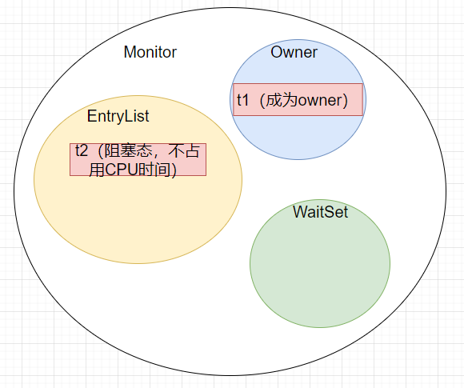
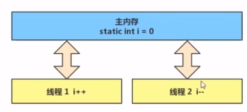
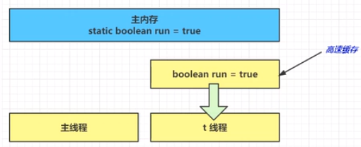
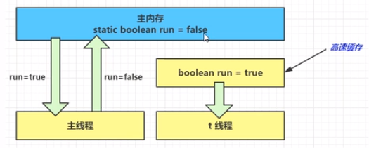
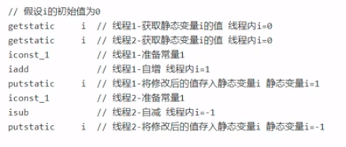

<!--more-->

# 内存模型

## java 内存模型
Java Memory Model（JMM），java 内存模型。

一句话：JMM定义了一套在多线程读写共享数据时（成员变量、数组）时，对数据的可见性、有序性、原子性 的规则和保障。

## 原子性
synchronized(同步关键字)

```java
static Object obj = new Object();

public static void main(....) {
    new Thread(() -> {
        synchronized (obj) {
            ...........
        }
    })
}
```
其中，这个`obj`，在对其加上`synchronized`关键字后，其内存管理会分为几个区域：



* Monitor区：每个对象，都有自己的一个monitor区域，翻译为“监视器”，只有用了`synchronized`关键字才有。
* Owner区：Monitor监视器的所有者，同一时刻，只能有一个线程成为Owner；
  * 一旦这个线程调用`monitorenter`成功，即锁定了此对象的monitor区，成为owner，可以跑logic；
  * 跑完logic，调用`monitorexit`成功，本线程释放此锁；
* EntryList：等待区，t2发现t1已经成为了Owner，那么t2就会进入此区域，进入阻塞态，不占用CPU时间；
* WaitSet：Object 的方法 `wait` 和 `notify` 所用到的一个区域；


```java
public class Atomicity01 {
    static int a = 0;

    public static void main(String[] args) throws InterruptedException {
        Thread t1 = new Thread(() -> {
            for (int i = 0; i < 5000; i++) {
                a++;
            }
        });
        Thread t2 = new Thread(() -> {
            for (int i = 0; i < 5000; i++) {
                a--;
            }
        });
        t1.start();
        t2.start();
        t1.join();
        t2.join();
        System.out.println(a);
    }
}
```
执行以上代码，得到的 a 结果 有时是0，有时是正数，有时是负数。

为什么呢？

我们知道，`a++` 和 `a--`，也就是自增和自减，分两种情况:
* 情况一：当`a` 是局部变量，那么，字节码指令只有1条：
    ```
    iinc          1, 1  // 直接找到 slot[1]，给里面的a值加一即可
    ```
* 情况二：当`a` 是静态变量，那么，字节码指令有4条，也就是4个动作；
    ```
    getstatic  a   // 获取静态变量a 的值 【放入操作数栈】
    iconst_1       // 准备常量 1【放入操作数栈】
    iadd           // 自增【此操作在操作数栈中进行】
    putstatic  a   // 将修改后的值存入静态变量a
    ```
    ```
    getstatic  a   // 获取静态变量a 的值 【放入操作数栈】
    iconst_1       // 准备常量 1【放入操作数栈】
    isub           // 自减【此操作在操作数栈中进行】
    putstatic  a   // 将修改后的值存入静态变量a
    ```

所以，静态变量的自增自减操作，不是原子操作！！

JMM 会将内存 划分为几个区域：


自增自减操作，需要在主内存 和 线程内存 中的进行数据交换。

那么，在多线程情况下，这  8条字节码指令，会交错执行！！因为CPU时间片是随机的，选择哪个线程执行是看时间片的，是以单条指令执行完毕为时间片切换点，不会等你4条指令都执行完毕，才切换时间片。


## 可见性
好，上面提到，每次读取静态变量，都要去读主内存中的共享地址的值，很麻烦，于是 JIT编译器会将 静态变量的值缓存至自己工作内存中的高速缓存中，减少对主存中的变量的访问，提高效率。（“每次开宿舍门都要问宿管拿钥匙，很烦，我自己偷偷copy一条钥匙吧”）



### 复制变量到工作内存的问题
这样虽然提高了效率，但是也会遇到一些问题：当main线程此时更改了 run 的值，并同步到主存，那么线程t此时拿着的值，就永远变成了旧值。（“换了新宿舍，宿管换了把钥匙，但是我却一直还拿着旧钥匙，进出旧宿舍”）




### 解决方法
volatile(易变关键字)

详情可看笔者另一篇文章。简单来说，它可以用来修饰成员变量和静态成员变量，可以避免线程从自己的工作缓存中查找变量的值，必须到主存中获取它的值，线程操作 volatile 变量都是直接操作主存。（班主任一直盯着我，我不能偷偷copy钥匙了，必须每次进宿舍，都找宿管拿钥匙）

### 可见性
班主任就让钥匙对于 宿管、我以及我宿友 来说，有了**可见性**。

可见性保证的是多个线程之间，一个线程对 volatile 变量 的修改对另一个线程可见（宿管换钥匙了，我们第一时间知道），但不能保证原子性，仅适用在一个写线程（宿管），多个读线程（我和宿友）的情况。

#### 例子一
假如线程t 读取的这个 `run`对象加上了`volatile`关键字:
```java
public class Atomicity01 {
    volatile static boolean run = true;

    public static void main(String[] args) throws InterruptedException {
        Thread t = new Thread(() -> {
            while(run) {
            }
        });
        t.start();

        Thread.sleep(1000L);
        run = false;
    }
}
```

字节码指令执行过程变成：
```
getstatic run // 线程 t 获取 run true
getstatic run // 线程 t 获取 run true
getstatic run // 线程 t 获取 run true
getstatic run // 线程 t 获取 run true
putstatic run // 线程 main 修改 run 为 false，仅此一次
getstatic run // 线程 t 获取 run false
```

#### 例子二
不能保证原子性，仅适用在一个写线程，多个读线程的情况，可以看以下这个例子：

将之前原子性相关例子的这个`a`用`volatile`进行修饰：
```java
public class Test02 {
    volatile static int a = 0;

    public static void main(String[] args) throws InterruptedException {
        Thread t1 = new Thread(() -> {
            for (int i = 0; i < 5000; i++) {
                a++;
            }
        });
        Thread t2 = new Thread(() -> {
            for (int i = 0; i < 5000; i++) {
                a--;
            }
        });
        t1.start();
        t2.start();
        t1.join();
        t2.join();
        System.out.println(a);
    }
}
```
这里其实是两个线程都在写和读，此时，运行时的指令可能是这样的：

所以，依然最终得不到正确的结果，因为 可见性和 原子性 是两个不同维度的东西。而`synchronized`能够同时保证可见性和原子性，因为硬生生变成同步了。

可以看看，`synchronized`是否能保证可见性：
```java
public class Atomicity01 {
    static boolean run = true;

    public static void main(String[] args) throws InterruptedException {
        Thread t = new Thread(() -> {
            while(run) {
                System.out.println(1);
            }
        });
        t.start();

        Thread.sleep(1000L);
        run = false;
    }
}
```
此时，就算不加`volatile`关键字修饰变量`run`，程序依然能够在1s后停止，为什么呢？

因为，`System.out.println(1);`内部使用到了`synchronized(this)`，会强制让每次读取都去找主存。

