<!--more-->

# 1. 如果判断对象可以回收

## 1.1. 引用计数法
早期的Python虚拟机的GC，用的就是这个算法。

如果对象被其他对象所引用，那么，它的引用数大于0，此时，对象无法进行GC。

缺点：遇到循环引用，凉凉！！


## 1.2. 可达性分析算法
JVM的垃圾回收器，采用的就是这个“可达性分析”来探索所有存活的对象。

如果一个对象，没有给根对象引用，那么，就可以进行GC。

扫描堆中的对象，看是否能在 以 GC Root对象 为起点的引用链 找到该对象，找不到，表示可以回收。


### 哪些对象可以作为GC Root？

这里有个内存分析工具：MAT [官网](http://www.eclipse.org/mat/)

下面看个代码例子：
```
public static void main(String[] args) throws IOException {
    List<String> list = new ArrayList<>();
    list.add("A");
    list.add("B");
    System.out.println(1); // status: 1
    System.in.read();
    list = null;
    System.out.println(2); // status: 2
    System.in.read();
    System.out.println("end");
}
```
然后，通过以下命令，生成代码调用栈信息到.bin文件中：
```sh
// 查看已启动的Java进程
jps

// 导出运行时栈信息，将其转成格式是"b"即二进制、且"live"即只显示还没被回收掉的对象（存活对象），文件名为 "1.bin"
jmap -dump:format=b,live,file=1.bin <Java进程ID>
```


然后，将这几个.bin文件，于 MAT工具中打开，就可以查看此时刻所有的CG Root对象：


好，那么，线程运行时，每次方法调用，都会生成一个栈帧，也就是说，每个栈帧内生成的局部变量所引用的对象，都可以成为一个CG Root对象。（注意：不是指 这个局部变量，因为它只是一个引用，而指的是这个变量所引用的堆中的对象）

## 五种引用类型
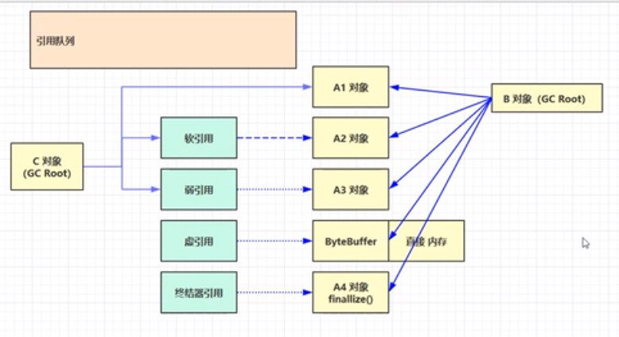
* 强引用：平常用的对象间引用，都是强引用；沿着GC Root链，能够找到它，它那就是强引用，如：A1。只有当所有链都断开了，A1对象才能被回收。
* 软引用（SoftReference）：当B对象和A2对象之间断开，那么，满足以下全部条件，A2对象 是能够被回收的：
  * 没有Root对象对其强引用
  * 正在进行GC
  * 回收完发现还是内存不足时
* 弱引用（WeakReference）： 和软引用的回收条件，唯一区别：弱引用是无论内存是否足够，一定会被回收。
  > 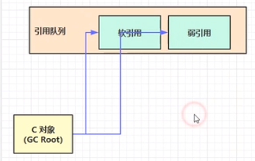
  > 当软引用或者弱引用的对象被GC后，因为它们本身也是对象，也需要占内存，所以，会随后进入 引用队列中，等待进一步的操作，如：引用队列遍历进行GC。
* 虚引用（PhantomReference）：
  * 必须配合引用队列使用。
  * 内部生成Cleaner对象，并记录直接内存地址，为了是在其引用的`ByteBuffer`对象被GC后，能够通过入队，并遍历看是否有新的Cleaner，来达到进一步回收“直接内存”的目的。
* 终结器引用（FinalReference）：
  * 必须配合引用队列使用
  * 对象回收过程：
    1. 当A4对象继承Object并重写了`finallize()`方法时，并且又没有Root对象强引用它时；
    2. 此时，A4对象不会立即被回收，JVM会将终结器引用对象入队；
    3. 然后，入队后的终结器引用依然连着A4对象；
    4. 随后，再由一个名为“finallize”的、优先级很低的线程，去查看这个引用队列中，是否存在终结器引用，如果发现，就会通过这个终结器引用，找到A4对象，调用其`finallize()`方法；
    5. 完了之后，在下一次GC触发时，A4对象才会被最终释放内存。
  * 不推荐用它来释放资源。

## 软链接回收例子
看看下面代码：
```
public static final int _4MB = 1024*1024<<2;
private static void soft() throws IOException {
    List<SoftReference<byte[]>> list = new ArrayList<>();
    for (int i = 0; i < 5; i++) {
        SoftReference<byte[]> ref = new SoftReference<>(new byte[_4MB]);
        list.add(ref);
        System.out.println(String.format("第%d次加入list后 ---------------", i+1));
        for (SoftReference<byte[]> item : list) {
            System.out.println(item.get());
        }
    }
    System.out.println("end.................");
    for (SoftReference<byte[]> softReference : list) {
        System.out.println(softReference.get());
    }
}
```
我们在启动时给他以下启动参数：最大堆内存20MB，并打印垃圾回收详细信息
```
-Xmx20m -XX:+PrintGCDetails -verbose:gc
```
最终运行结果：
```
第1次加入list后 ---------------
[B@f6f4d33
第2次加入list后 ---------------
[B@f6f4d33
[B@23fc625e
第3次加入list后 ---------------
[B@f6f4d33
[B@23fc625e
[B@3f99bd52
[GC (Allocation Failure) [PSYoungGen: 3305K->480K(6144K)] 15593K->13397K(19968K), 0.0011852 secs] [Times: user=0.00 sys=0.00, real=0.00 secs] 
[Full GC (Ergonomics) [PSYoungGen: 480K->0K(6144K)] [ParOldGen: 12917K->13273K(13824K)] 13397K->13273K(19968K), [Metaspace: 3960K->3960K(1056768K)], 0.0068424 secs] [Times: user=0.00 sys=0.00, real=0.01 secs] 
第4次加入list后 ---------------
[B@f6f4d33
[B@23fc625e
[B@3f99bd52
[B@4f023edb
[Full GC (Ergonomics) [PSYoungGen: 4208K->4096K(6144K)] [ParOldGen: 13273K->13214K(13824K)] 17482K->17310K(19968K), [Metaspace: 3960K->3960K(1056768K)], 0.0061849 secs] [Times: user=0.00 sys=0.00, real=0.01 secs] 
[Full GC (Allocation Failure) [PSYoungGen: 4096K->0K(6144K)] [ParOldGen: 13214K->889K(7680K)] 17310K->889K(13824K), [Metaspace: 3960K->3960K(1056768K)], 0.0055080 secs] [Times: user=0.00 sys=0.00, real=0.01 secs] 
第5次加入list后 ---------------
null
null
null
null
[B@3a71f4dd
end.................
null
null
null
null
[B@3a71f4dd
Heap
 PSYoungGen      total 6144K, used 4376K [0x00000000ff980000, 0x0000000100000000, 0x0000000100000000)
  eden space 5632K, 77% used [0x00000000ff980000,0x00000000ffdc63d0,0x00000000fff00000)
  from space 512K, 0% used [0x00000000fff00000,0x00000000fff00000,0x00000000fff80000)
  to   space 512K, 0% used [0x00000000fff80000,0x00000000fff80000,0x0000000100000000)
 ParOldGen       total 7680K, used 889K [0x00000000fec00000, 0x00000000ff380000, 0x00000000ff980000)
  object space 7680K, 11% used [0x00000000fec00000,0x00000000fecde5e0,0x00000000ff380000)
 Metaspace       used 3973K, capacity 4646K, committed 4864K, reserved 1056768K
  class space    used 435K, capacity 462K, committed 512K, reserved 1048576K
```
解释一下上面的输出log：
1. 首先，前三次循环，没有问题；
2. 到了第四次循环，内存已经很紧张了，尝试进行一次Minor GC `GC (Allocation Failure)`:
   ```
   [GC (Allocation Failure) [PSYoungGen: 3402K->480K(6144K)] 15690K->13423K(19968K), 0.0014941 secs]
   新生代从 3MB多 回收到了 480KB
   ```
   然后又触发了一次Full GC
   ```
   [Full GC (Allocation Failure) [PSYoungGen: 4096K->0K(6144K)] [ParOldGen: 13214K->889K(7680K)] 17310K->889K(13824K), [Metaspace: 3960K->3960K(1056768K)], 0.0055080 secs] [Times: user=0.00 sys=0.00, real=0.01 secs]
   ```
   循环结束后，4个 软引用关联的对象依然没有被回收；
3. 到了第五次循环，直接先触发full GC：
   ```
   [Full GC (Ergonomics) [PSYoungGen: 4208K->4096K(6144K)] [ParOldGen: 13273K->13214K(13824K)] 17482K->17310K(19968K), [Metaspace: 3960K->3960K(1056768K)], 0.0061849 secs] [Times: user=0.00 sys=0.00, real=0.01 secs]
   ```
   full GC之后，发现还是没有释放掉什么空间，于是，触发了下面的软引用的GC：
   ``` 
   [Full GC (Allocation Failure) [PSYoungGen: 4096K->0K(6144K)] [ParOldGen: 13214K->889K(7680K)] 17310K->889K(13824K), [Metaspace: 3960K->3960K(1056768K)], 0.0055080 secs] [Times: user=0.00 sys=0.00, real=0.01 secs] 
   ```
   这样一来，此时，在塞第5个`byte[]`时，前4个`byte[]`由于软引用回收时机被触发（条件：GC之后还是内存不足），所以，在塞第5个之前，前4个都被回收掉了。


好，那代码走到最后，对象是释放掉了，但是，软引用本身自己要怎么释放呢？ 利用引用队列

改一下上面例子的code：
```
 private static void soft() throws IOException {
    List<SoftReference<byte[]>> list = new ArrayList<>();
    // 1. 引用队列
    ReferenceQueue<byte[]> queue = new ReferenceQueue<>();

    for (int i = 0; i < 5; i++) {
        // 2. 关联引用队列，当关联的byte[]被回收，软引用自己会加入到queue中
        SoftReference<byte[]> ref = new SoftReference<>(new byte[_4MB], queue);
        list.add(ref);
        System.out.println(String.format("第%d次加入list后 ---------------", i+1));
        for (SoftReference<byte[]> item : list) {
            System.out.println(item.get());
        }
    }
    System.out.println("end.................");
    // 3. 遍历queue，找到，则删除，直到删除完毕
    Reference<? extends byte[]> poll = queue.poll();
    while (poll != null) {
        list.remove(poll);
        poll = queue.poll();
    }
}
```
这样，就能在关联对象被回收时，软引用对象自身也会被加入到这个队列中。

## 弱引用回收实例
```
public static final int _4MB = 1024*1024<<2;

public static void main(String[] args) throws IOException {
    List<WeakReference<byte[]>> list = new ArrayList<>();
    // 1. 引用队列
    ReferenceQueue<byte[]> queue = new ReferenceQueue<>();

    for (int i = 0; i < 5; i++) {
        // 2. 关联引用队列，当关联的byte[]被回收，软引用自己会加入到queue中
        WeakReference<byte[]> ref = new WeakReference<>(new byte[_4MB], queue);
        list.add(ref);
        System.out.println(String.format("第%d次加入list后 ---------------", i+1));
        for (WeakReference<byte[]> item : list) {
            System.out.println(item.get());
        }
    }
    System.out.println("end.................");
    // 3. 遍历queue，找到，则删除，直到删除完毕
    Reference<? extends byte[]> poll = queue.poll();
    while (poll != null) {
        list.remove(poll);
        poll = queue.poll();
    }
}
```
好，同样打印结果：
```
第1次加入list后 ---------------
[B@f6f4d33
第2次加入list后 ---------------
[B@f6f4d33
[B@23fc625e
第3次加入list后 ---------------
[B@f6f4d33
[B@23fc625e
[B@3f99bd52
[GC (Allocation Failure) [PSYoungGen: 3305K->488K(6144K)] 15593K->13362K(19968K), 0.0014076 secs] [Times: user=0.00 sys=0.00, real=0.00 secs] 
[Full GC (Ergonomics) [PSYoungGen: 488K->0K(6144K)] [ParOldGen: 12874K->986K(12800K)] 13362K->986K(18944K), [Metaspace: 3950K->3950K(1056768K)], 0.0050504 secs] [Times: user=0.00 sys=0.00, real=0.00 secs] 
第4次加入list后 ---------------
null
null
null
[B@4f023edb
第5次加入list后 ---------------
null
null
null
[B@4f023edb
[B@3a71f4dd
end.................
Heap
 PSYoungGen      total 6144K, used 4265K [0x00000000ff980000, 0x0000000100000000, 0x0000000100000000)
  eden space 5632K, 75% used [0x00000000ff980000,0x00000000ffdaa568,0x00000000fff00000)
  from space 512K, 0% used [0x00000000fff00000,0x00000000fff00000,0x00000000fff80000)
  to   space 512K, 0% used [0x00000000fff80000,0x00000000fff80000,0x0000000100000000)
 ParOldGen       total 12800K, used 5082K [0x00000000fec00000, 0x00000000ff880000, 0x00000000ff980000)
  object space 12800K, 39% used [0x00000000fec00000,0x00000000ff0f6840,0x00000000ff880000)
 Metaspace       used 3957K, capacity 4646K, committed 4864K, reserved 1056768K
  class space    used 435K, capacity 462K, committed 512K, reserved 1048576K
```
与软引用唯一不同的是，full GC在发生之后，所有的前面被弱引用引用的对象，都被回收掉了。


# 2. 垃圾回收算法

## 标记清除
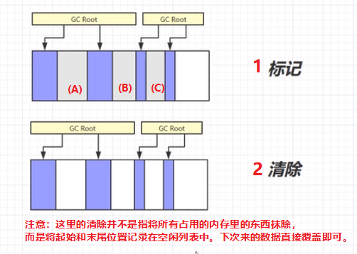

优点：
* 速度快（只需要记录一下哪些空间是空闲的）

缺点：
* 空间不连续，容易产生内存碎片（缺乏空间整理，分配大对象时就很尴尬）

## 标记整理


优点：
* 无内存碎片

缺点：
* 牵扯到内存数据的拷贝移动，还需要改变对象引用地址，所以，效率较低。

## 复制

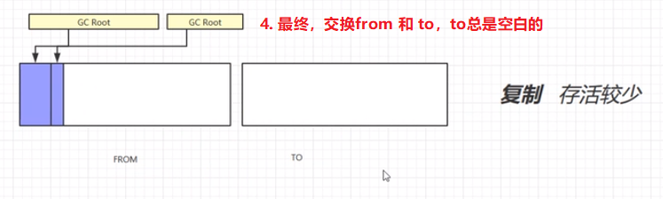

优点：
* 相对于“标记整理”算法，更快
* 没有内存碎片

缺点：
* 占用双倍的内存空间

# 3. 分代垃圾回收
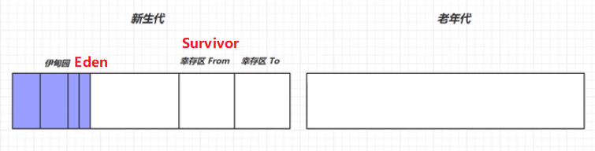
打个比方：
* 整个堆内存：一栋公寓
* 新生代：公寓楼下垃圾存放点
* 老年代：楼上住着的每家每户
* GC：清洁工

那么，清洁工就不需要每次都家家户户走一遍去收集垃圾了，我们每户人家会将真的没用的常见垃圾自己倒到楼下垃圾场中，清洁工每天负责清理楼下的垃圾即可。而家中一些坏椅子等可能还有价值的垃圾，就先放在家中，在家里实在拥挤时，再让清洁工上班清理它。

1. 对象进来，首先暂存在伊甸园
2. 如果发现伊甸园空间不足，那么，触发 Minor GC（复制算法）
   1. 标记 Eden区和 Survivor From区中 要清除的无用对象；
   2. 将仍存活的对象复制到Survivor To 区；
   3. 接着，给Survivor To区的幸存对象，标记寿命加 1（默认，只要幸存区中的对象的寿命达到15次（最大也是15次【对象头存寿命的位置，只有4bit】），就会晋升到老年代中）；
   4. 然后，清理整个Eden区；
   5. 交换 Survivor From 和 Survivor To的内存。（实际上是交换from 和 to 的指针，不会进行数据的拷贝）
3. 如果发现老年代空间不足时，会先触发minor gc，如果仍然空间不足，触发Full GC（对新生代和老年代 都进行一次GC）
4. 如果Full GC后，依然空间不足，那么，触发 OOM Error。

Minor GC 和 Full GC 都会引发 stop the world，暂停所有其他用户线程，等到GC线程清理完垃圾后，其他线程才能恢复运行。（因为对象地址都可能改了，如果这时其他线程还在跑，可能造成大问题）

Full GC 的STW时间更长（因为用的是标记+整理/清除 算法，而且对象本身较多）

## GC相关JVM参数
看另一篇笔记。

## GC分析例子
用以下vm参数去跑一个空的main方法：
```
-Xms20M -Xmx20M -Xmn10M -XX:+UseSerialGC -XX:+PrintGCDetails -verbose:gc
```
> 其中：
> * `+UseSerialGC`: 串行，Young区 和 Old区都使用串行，使用复制算法回收，逻辑简单高效，无线程切换开销

得到的打印结果是：
```
Heap
 def new generation   total 9216K, used 2845K [0x00000000fec00000, 0x00000000ff600000, 0x00000000ff600000)
  eden space 8192K,  34% used [0x00000000fec00000, 0x00000000feec75e0, 0x00000000ff400000)
  from space 1024K,   0% used [0x00000000ff400000, 0x00000000ff400000, 0x00000000ff500000)
  to   space 1024K,   0% used [0x00000000ff500000, 0x00000000ff500000, 0x00000000ff600000)
 tenured generation   total 10240K, used 0K [0x00000000ff600000, 0x0000000100000000, 0x0000000100000000)
   the space 10240K,   0% used [0x00000000ff600000, 0x00000000ff600000, 0x00000000ff600200, 0x0000000100000000)
 Metaspace       used 3374K, capacity 4496K, committed 4864K, reserved 1056768K
  class space    used 369K, capacity 388K, committed 512K, reserved 1048576K
```
其中：
* `def new generation`：新生代，总大小 9216k（9MB），为什么呢？ 因为 Eden区和Survivor区默认比例是`8:1`，而Survivor to 区被认为是不能用的1MB，所以剩下的总大小就是9MB；
* `tenured generation`：老年代。总大小10MB，还没有被使用到；
* `Metaspace`：元空间

好，那如果我们在main方法中初始化一些对象，看看整个过程：


有趣的是，如果我们一开始就给他一个大于等于8MB的对象，那么，它会发现Eden区就算GC也是放不下的，于是他直接选择将对象放到老年代，不触发GC。

如果再来一个大对象，那就OOM了：
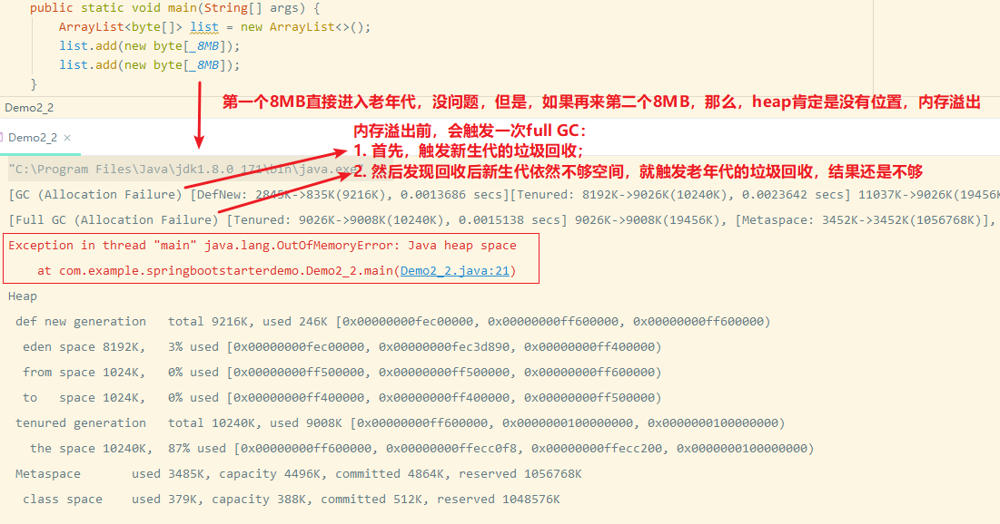

那如果用一个线程去塞两个大对象会怎么样？
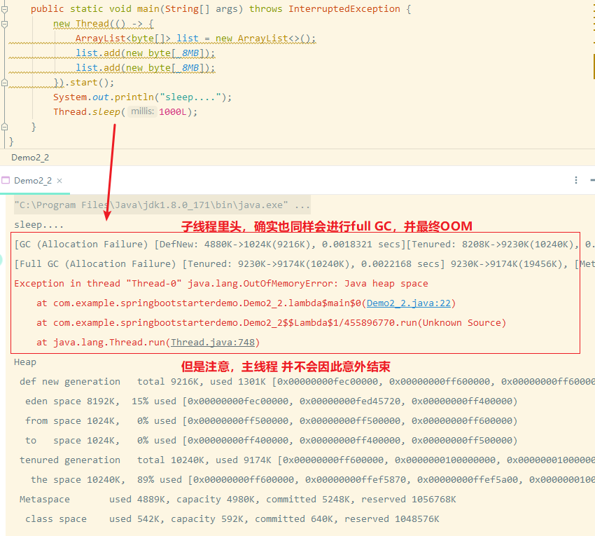

# 4. 垃圾回收器
1. 串行
   * 单线程（一个保洁工人）
   * 适用场景：堆内存较小（楼层矮）、适合个人电脑
2. 吞吐量优先
   * 多线程
   * 适用场景：堆内存较大、需要多核CPU支持（否则，就是多个线程去争抢时间片，效率就比串行更低）
   * 单位时间内，STW（Stop The World）时间最短。（每次GC虽然时间长一点点，但是每小时只有2次GC）
3. 响应时间优先
   * 多线程
   * 适用场景：同上
   * 尽可能让单次GC的暂定时间变短。STW 时间越短越好。（每次GC虽然时间很短，但是每小时只有N次GC）

## 串行
VM参数：
```
-XX:+UseSerialGC = Serial + SerialOld
```
使用串行，并且，新生代采用复制算法， 老年代采用 标记-整理 算法。

工作模式：
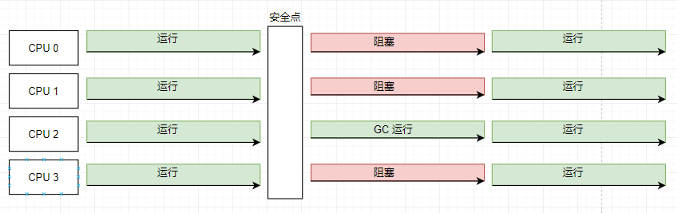

## 吞吐量优先
VM参数：
```
// jdk 1.8 下，默认开启
-XX:+UseParallelGC -XX:+UseParallelOldGC
```
同样是：新生代用复制算法，老年代用 标记-整理 算法。 只是变成了“并行”。默认的线程个数等于CPU核数。

当然，当发生GC时，CPU占有率瞬间很高。

工作模式：


相关配置：
* `-XX:ParallelGCThreads=n`：设置线程数
* `-XX:+UseAdaptiveSizePolicy`：自动动态调整新生代大小（Eden 和 Survivor的比例，以及整个堆的大小，以及晋升到老年代的阈值，都会动态调整）
* `-XX:GCTimeRatio=ratio`：调整GC时间 与 总时间的 占比。（ratio默认值是 99） 会利用这个公式：`1/(1 + ratio)`来计算比值。 但是因为99是基本无法达到的，不可能100分钟只有1分钟是GC的，所以，一般我们用 19.
* `-XX:MaxGCPauseMillis=ms`：最大暂停毫秒数（默认值是200ms） 注意：堆越大， GC时需要的时间就越多，所以，注意折中。


## 响应时间优先
```
// 简称：CMS 垃圾回收器
-XX:+UseConcMarkSweepGC
```
用于老年代的、并发的、基于 ‘标记-清除’ 算法的 垃圾回收器；

与之相对的，就是适用于新生代的、基于复制算法的垃圾回收器：`-XX:+UseParNewGC`

有时，CMS回收器会发生并发失败问题，此时，就会退化为 `SerialOld`（单线程的、串行的、基于标记-整理的、老年代的垃圾回收器）

特点：可以和用户线程一起执行，不会触发stop-the-world

工作模式：
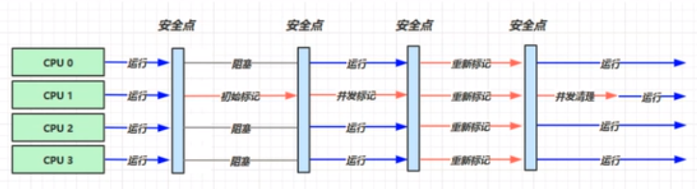
1. 首先，当老年代内存不足时，到达安全点时，会先触发一次“初始标记”；
2. “初始标记” 依然会触发STW，但是持续时间很短，因为此过程只需要标记一些根对象；
3. 接着，用户线程就可以恢复运行，与此同时，GC线程就可以在不触发STW的同时，去标记那些需要被回收的对象；
4. “并发标记” 结束后，来到“重新标记”，此阶段也会触发STW，因为其他线程有可能干预到相关对象，所以要重新标记需要清理的对象；
5. 最后，到了“并发清理”，此时，又可以不用STW了。

并行线程数一般用`-XX:ParallelGCThreads=n`来标记，默认是CPU核数，但是，对于并发线程数的配置，用的是：`-XX:ConcGCThreads=threads`，其中这个`threads`一般设置为CPU核数的 1/4。 因为需要留CPU给到用户线程去干活的。

GC线程对于CPU占用，没用并行这么高，但是，如果考虑到少了一个线程去跑主逻辑，那么， 整个应用的吞吐量，就降低了。

其他相关配置：
* `-XX:CMSInitiatingOccupancyFraction=percent`：执行CMS垃圾回收的内存占比（默认是`60`）；比如设置为：`80`，表示：只要老年代占用达到80%时，就进行CMS垃圾回收，目标就是要预留空间给到正在“并发清理”时其他用户线程可能产生的新对象。
* `-XX:+CMSScavengeBeforeRemark`：是否先进行新生代GC；一个开关，`+`就是打开，`-`就是关闭；
  * 背景：新生代对象可能会引用老年代对象，so，在进行“重新标记”的过程中，实际上，会扫描整个堆，通过扫描新生代每个对象，去做可达性分析，看看有没有用到老年代的这个对象，这个过程对性能影响较大，因为新生代对象多，而且很多新生代对象本身就是垃圾 ，将来本来就要被回收的。
  * 于是：用这个配置，就可以在每次进行“重新标记”之前，都先进行一次 新生代的GC（一般用这个`-XX:+UseParNewGC`来回收）

缺点：将来，内存碎片越来越多，会导致并发失败，此时，就是采用 串行回收，此时，消耗时间就大大提高。

## G1
定义：Garbage First

背景：
* 2004 论文发布
* 2009 JDK6u14 体验
* 2012 JDK 7u4 官方支持
* 2017 JDK 9 默认（取代了CMS回收器）

适用场景：
* 同时注重吞吐量(Throughput) 和 低延迟(Low Latency)，默认暂停目标是200ms，增大暂停目标，会提高吞吐量；
* 超大堆内存，会将堆划分为多个大相等的Region；
* 整体上是 ‘标记-整理’算法，两个区域之间是复制算法；

相关参数：
* `-XX:+UseG1GC`：启用G1GC（JDK8默认不启用）
* `-XX:G1HeapRegionSize=size`：设置上述的`Region`的大小，必须是2的N次幂
* `-XX:MaxGCPauseMillis=time`：最大暂停时间


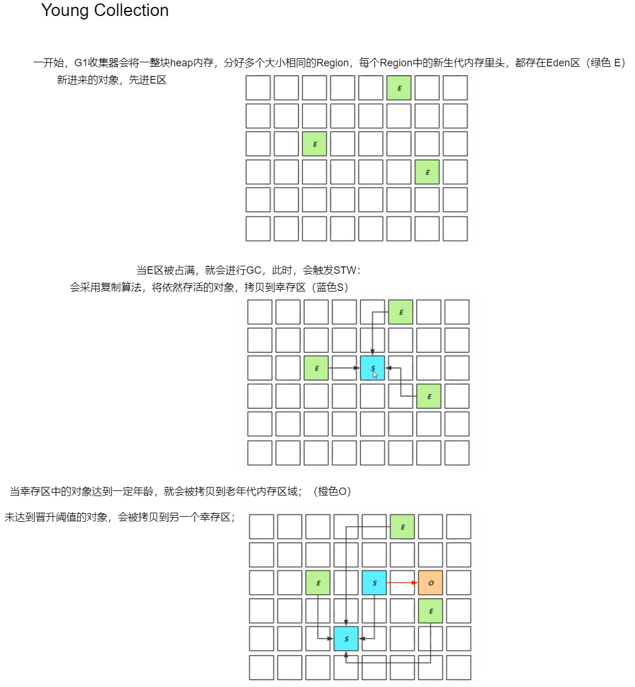
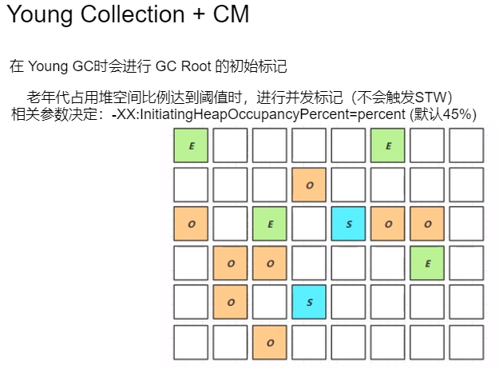
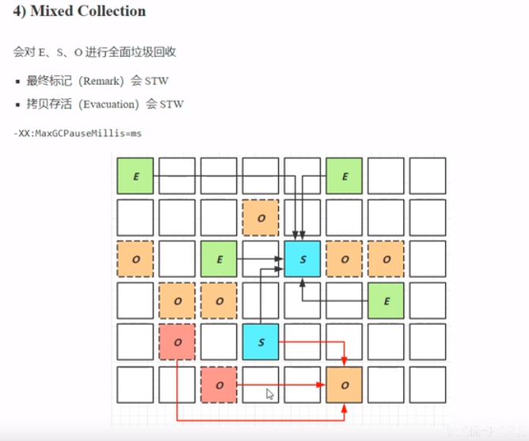
在 Mix Collection（混合收集）阶段：
* 虚线表示没有用的对象（待被回收的对象）；
* 其中，Eden区和Survivor区的对象都通过复制算法进入到另一个Survivor区，并且年龄+1；
* 等对象的年龄到底一定岁数，就会晋升到老年区；
* 老年区中也有无用的对象，这时，并不是所有的无用对象都会被回收（指的是红色虚线"o"）而是同样会用 复制算法 来将其复制到另一个老年区中，等到下一次时机更加成熟时，再来回收它；
* 以上这句话，目的是：为了达到`-XX:MaxGCPauseMillis=ms`这个最大GC暂停时间 的目标，因为老年代空间大，要进行GC需要花费的时间长，很容易就大于 这个最大GC暂停时间。所以，为了控制一下暂停时间，G1就会在老年代里，挑选出回收价值最高的部分区域，来进行GC，那么，复制的区域少了，GC时间就相对变短了；


### G1 的 Full GC
* SerialGC
  * 新生代内存不足发生的垃圾收集- minor gc
  * 老年代内存不足发生的垃圾收集- full ge
* ParallelGC
  * 新生代内存不足发生的垃圾收集- minor gc
  * 老年代内存不足发生的垃圾收集 full gc
* CMS
  * 新生代内存不足发生的垃圾收集· minor gc
  * 老年代内存不足
* G1
  * 新生代内存不足发生的垃圾收集 minor gc
  * 老年代内存不足（默认：垃圾占了超过45%）

CMS 和 G1收集器，它们在老年代内存不足时，需要分情况，不一定就是full GC：
* 当垃圾收集的时间 小于 新垃圾产生的时间，那么，就不算是full GC，此时还是属于并发收集阶段；
* 当垃圾收集的时间 大于 新垃圾产生的时间，那么，就会退用串行垃圾收集策略，此时占用时间和资源较多，就可以称为full GC。

### G1的 Young Collection 跨代引用
我们研究一下新生代垃圾回收时的跨代引用问题。

好，我们要进行新生代垃圾回收，首先，要找到根对象（Root），然后进行可达性分析，最终找到它引用的存活对象，决定这些被引用对象不能被回收，则复制到幸存区。

那么，首先就是找GC Roots对象。

一些根对象，是存活在老年代的，那么，我们如果遍历一个庞大的老年代去找根对象，显然是效率低下的。

于是，我们把老年代区域，作为一个Card Table，划分为一个个Card区域，每个Card大约是512KB。

有时候，老年代中会有一些对象，引用了新生代中的某些对象，此时，这些对象所在的区域，就被标记为“脏卡”；

好处：将来，就不用遍历整个老年代了，而只需要关注“脏卡”区域，即可；


* 粉色区域，就是脏卡区域，里头都有对象引用了其他region的对象；
* 那么，新生代这边，有一个 Remembered Set，回记录有哪些外部对象，引用了我这边的某个对象；（于是，记录了有哪些脏卡）
* 那么， 下一次进行新生代GC时，就会遍历这个 Remembered Set，去扫描 对应的脏卡区域，从而遍历得到脏卡里头的GC Roots；
* 标记操作，是一个异步操作，通过一个写屏障（`post-write barrier + dirty card queue`）在每次引用变更时，将这个指令放入脏卡任务队列当中，以后会有一个对应的线程去更新对应的脏卡记录；

### Remark（重新标记阶段）
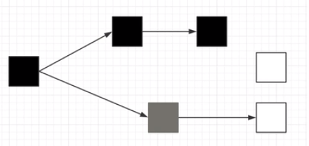
上图表示：并发标记 阶段时，对象的处理状态：
* 黑色：表示已经处理完毕，并且都有引用，所以最终都会被保留的对象；
* 灰色：正在被处理的对象；
* 白色：仍未被处理的对象；
* 最终，等待大家都处理完毕后，“灰色”对象会变成“黑色”，因为有强引用引用着它；那么，“白色”对象由于也被终将变“黑”的“灰色”对象引用，所以，“白色”对象终将变成“黑色”并存活下来；至于没有人引用的“白色”对象，最终还是“白色”；

那么，如果处于并发交际阶段，那么，对象前一秒被引用，后一秒可能就不被需要了，那么，被标成什么颜色，就很难说了，比如：


1. 图一：此时 对象B 还正在被并发标记，此时此刻，由于对象B 依然被其他对象强引用，所以，被标记为 黑色；
2. 图二：对象B 已经被标记为 黑色，此时，准备轮到对象B引用的 对象C 了；
3. 图三：但是，此时此时，由于用户线程同时在运行的，此时，用户线程已经不用对象C了，那么，对象B 与 对象C 之间的引用断开了。于是，此时并发标记时，就会将 对象C标记为 白色，标记即将要被回收；

好，在下一秒，突然，对象A 想要引用对象C了：

但是此刻，对象C已经被标记为白色，如果并发标记完毕后就立马进行白色对象的回收，那么，对于对象A的伤害，就很大了！！

所以，我们要对对象的引用做进一步检查：Remark（重新标记）

具体做法：当对象的引用发生改变时（比如：对象A引用了对象C），就会触发一个写屏障指令（`pre-write barrier`），干了什么事呢？
1. 将对象C，加入到一个队列（`satb_mark_queue`）当中；
2. 并且，将对象C 变成 灰色，表示还没有处理完毕；
3. 等到并发标记阶段结束了，那么， 进入重新标记阶段，此时，触发 STW，用户线程暂停，此时，重新标记相关的线程就会去这个队列中遍历对象C，发现对象C有对象A引用，于是，把他标记为 黑色，最终，对象C 不会被回收；


### JDK 8u20 字符串去重
 在**JDK 8u20** 中，实现了 字符串去重，很关键！！
* 优点：节省大量内存
* 缺点：略微多占了CPU时间，新生代回收时间略微增加

相关配置参数：开启字符串去重（默认是开启的）
```
-XX:+UseStringDeduplication
```

也就是说，上图的两个字符串对象`s1`和`s2`，他们虽然表面上看是两个对象，因为看起来他们都是new了一个String对象，但是，实际上，这两个String对象的底层会指向同一个char数组。简单来说，就是：两个对象引用，两个对象，一个char[]。
* 将所有新分配的字符串放入一个队列
* 当新生代回收时，G1并发检查是否有字符串重复，如果它们值一样,让它们引用同一个char[]
* 注意：与 `String.internt()`不一样
   * `String.intern()`关注的是字符串对象
   * 而字符串去重关注的是char[]
   * 在 JVM内部,使用了不同的字符串表

### JDK 8u40 并发标记类卸载

（条件一）<u>所有对象都经过井发标记后</u>，就能知道哪些类不再被使用，（条件一）<u>当一个类加载器的所有类都不再使用</u>，则卸载它所加载的所有类。

换言之：一个类加载器所加载的所有的类以及类的实例，都没有人使用了，此时，就会将这些类全部卸载。

虽然看似条件比较苛刻，但是对于一些框架来说，确实会有许多自定义的类加载器，可能满足以上的条件，那么此时，就有用了。

当然，对于JDK的自带的三个类加载器：启动类加载器、扩展类加载器、应用程序类加载器，他们倒是始终存在的，不会发生类卸载。

相关配置参数：（默认是开启的）
```
-XX:+ClassUnloadingWithConcurrentMark
```

### JDK 8u60 回收巨型对象
* 条件：一个对象 **大于** region的一半时，称为巨型对象；
* G1 不会对巨型对象进行拷贝；
* 回收时会优先考虑巨型对象；
* ，G1会跟踪老年代所有incoming引用，这样 老年代incoming引用为0的巨型对象 可以在新生代GC时被处理掉。（也就是：老年代中的脏卡中没有对象去引用这个巨型对象了）


### JDK 9 并发标记起始时间的调整
背景：G1 垃圾回收器也会面临 Full GC问题，如果GC速度跟不上垃圾产生的速度，则会触发Full GC（并发标记必须在堆空间占满之前完成，否则，退化为 FullGC）。

在当前G1版本中，虽然，即使是 Full GC，也是多线程来处理，但是STW还是较长，不太好。那，怎么去减少FullGC发生呢？
> 答：提前让垃圾回收开始：让并发标记、混合收集 开始

* JDK 9 之前，需要使用：`-XX:+InitiatingHeapOccupancyPercent`
* JDK 9 可以动态调整
   * `-XX:InitiatingHeapOccupancyPercent` 用来设置初始值，比如`45`；
   * 进行数据采样动态调整；
   * 总会添加一个安全的空档空间

# 5. 垃圾回收调优

> 建议看看Oracle官网GC调优指南：
> * https://docs.oracle.com/en/java/javase/11/gctuning/index.html
> * https://docs.oracle.com/javase/8/docs/technotes/guides/vm/gctuning/

明白一点：调优 与 引用、环境有关，没有放之四海而皆准的法则。

一个java命令可以查看Java虚拟机运行时的GC相关参数：
```
java -XX:+PrintFlagsFinal -version | findstr "GC"
```

## 5.1 调优领域
* 内存
* 锁竞争
* CPU 占用
* I/O

## 5.2 确定目标
* 低延迟（如：互联网应用），还是，高吞吐量（如：科学运算）？ 选择合适的回收器
* CMS(JDK 9 已经不推荐，取而代之是G1)，G1，ZGC(JDK 12中推出)（低延迟）
* ParallelGC（高吞吐量）
* 如果不选择Oracle HotSpot VM，那么，有这个：Zing，据说STW可以忽略不计。


## 5.3 最快的GC是不发生GC
* 查看FullGC前后的内存占用,考虑下面几个问题:
* 数据是不是太多?
    ```
    resultset= statement. execute Query" select * from大表 limit n"
    ```
* 数据表示是否太臃肿?
  * 对象图
  * 对象大小（Java对象最小占16字节，Integer 24 int 4），所以能用基本类型就不要用包装类型；
* 是否存在内存泄漏?
  * 软、弱引用；
  * 第三方缓存实现更好：ehcache, redis；

## 5.4  新生代调优
内存调优，最好先从新生代开始！新生代的优化空间大！
* new对象的内存分配速度非常快，也非常廉价
  * TLAB (threadLocal allocation buffer)：一个线程私有缓冲区，先在这个区域里分配内存空间来new一个对象，也就是用每个线程自己的Eden区来分配内存空间（JVM帮忙做的，目的就是对象创建过程是线程安全的），这样，即使多个线程同时new对象，也不互相干扰。
* 新生代中，死亡对象的回收代价为零；
* 大部分对象用过即死；
* Minor GC的时间 远低于 Full GC
   > 因为新生代对象用过即死，而且新生代使用的是“标记-复制”算法，所以，导致 Minor GC时间非常短，远低于Full GC（1到2个数量级）

一个最简单直接的调优方法：加大新生代的内存空间

那是不是越大越好？
* 太小：新对象进来发现放不下，那么就触发Minor GC，从而 STW
* 太大：如果新生代分配空间太大，那么，反之，老年代拥有的空间就越小，那么，一旦触发GC，那就是Full GC了。

Oracle官方推荐：新生代最好，占整个堆空间的百分比区间：(25%, 50%)

由于是采用“标记-复制”算法，然后，如果调大新生代的内存占比，那么主要耗费时间在‘复制’这一步上（房子越大，搬运东西就越多越久），但是，由于新生代的存活者往往很少，所以每次最终要复制的对象数量有限，所以时间相比于标记，也差不多，就大家都很快。

推荐：
* 新生代能够容纳所有【并发量*(请求-响应)】的数据
  * 比如：每一次‘请求-响应’过程，大约创建512KB的对象，此过程的并发量大约是1000，这时，新生代的理想内存大小，应该是：512KB * 1000 大约是 512MB；
* 幸存区能够保留【当前活跃对象 + 需要晋升对象】
  * 当前活跃对象：指的是生命周期较短、可能下一次GC就会被回收的、但是当前还有别人在用它的对象；
  * 需要晋升对象：指的是肯定将来会到老年代，但是由于当前年龄不够，所以暂存在Survivor区中的对象；
  * 太小，JVM就会动态调整晋升的难易程度，让本来轮不到它晋升老年代的对象，也一块进到老年代了，导致让对象提前进到老年代，那么，就只能等到老年代空间不足而触发Full GC时，才会被回收；
* 晋升阈值需要设置得当，让长时间存活的对象尽快晋升；
  * 否则：新生代中的存活对象越多，就会导致'复制'花费时间越长；
    ```
    //  调整最大晋升阈值：默认是
    -XX:MaxTenuringThreshold=threshold
    // 显示晋升的详细页（会在每次GC时，就会打印详情）
    -XX:+PrintTenuringDistribution
    ```
    然后，实际打印出来的内容如下：
    ```
    Desired survivor size 3333 bytes, new threshold 10 (max 10)
    - age 1: 1000 bytes, 1000 total
    - age 2: 100 bytes, 1100 total
    - age 3: 20 bytes, 1120 total
    ```
    上面显示了GC之后，幸存区中的年龄为1,2,3的所有对象的总大小等...

## 5.5 老年代调优
以CMS 为例：
* CMS 老年代内存越大越好；
   * 原因：拥有更多的空间，避免由于浮动垃圾引起的并发GC失败。CMS 是低响应时间、并发的垃圾回收器，在进行GC时，用户线程能同时运行。于是用户线程就会产生新的垃圾，称为‘浮动垃圾’，那么，当浮动垃圾产生 而又 导致内存不足时，就会导致 CMS 并发失败，此时，垃圾回收器无法正常工作，于是退化为串行回收，所以，触发 STW，慢。
* 先尝试不做调优，让程序正常运行一段时间，如果没有出现 Full GC 那么说明老年代空间不是不够；即使发生了Full GC，也先尝试调优新生代；
* 观察发生 Full GC 时老年代内存占用，将老年代内存预设调大 1/4 ~ 1/3
    ```
    -XX:CMSInitiatingOccupancyFraction=70
    ```
    这个参数是设置一个百分比：当老年代空间被垃圾占用了百分之几时，才触发GC。有大神建议直接设置为 `0`，也就是只要老年代有垃圾，就会进行GC，但这样会提高CPU繁忙程度。一般我们设置为：75%~80% ， 也就是预留 一些空间给到浮动垃圾。

## 5.6 案例
* 案例一：Full GC 和 Minor GC 频繁（Minor GC 一分钟上百次）
   * 原因：空间紧张。进一步分析，如果是新生代空间紧张，那么， 一到高峰期，就会由大量对象创建，新生代空间就被塞满了，那么，对象的晋升阈值就会降低，很多对象就会进入到老年代，然后，进一步触发老年代的full GC；
   * 解决方法：增大新生代空间；
* 案例一：请求高峰期发生 Full GC，单次暂停时间特别长（CMS）
   * 背景：由于高峰期想要低延迟，所以选择了CMS；
   * 分析：CMS 的哪一个阶段 耗费的时间较长呢？ 我们知道，CMS有几个阶段：初始标记--> 并发标记 --> 重新标记 --> 并发清理，其中，重新标记阶段耗时长，因为此阶段会扫描整个堆，新老年代对象都会扫描，如果高峰期对象多，那么，就需要遍历久；
   * 解决方法：能否在重新标记之前，先做一次GC，从而减少新生代对象数量？ 利用这个参数： `-XX:+CMSScavengeBeforeRemark`，打开它，就能启动先GC一次；
* 案例三：老年代充裕情况下，发生 Full GC（CMS jdk1.7）
   * 原因初步定位：永久代空间不足，导致Full GC。jdk1.8 采用的是元空间作为方法区的实现，而1.7及以前是采用永久代来实现方法区内存分配， 元空间的内存分配不由JDK空间，而且使用的是OS的空间，一般是充裕的；

