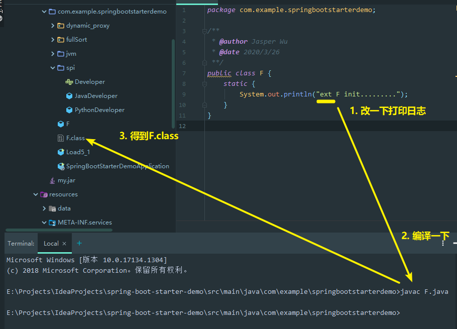
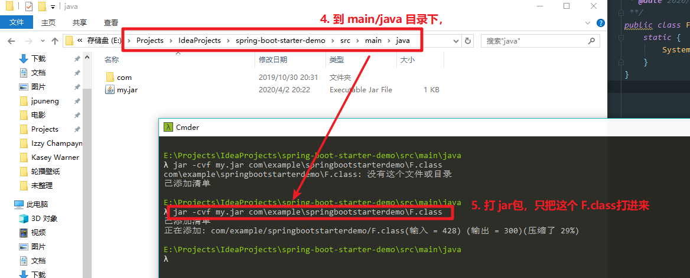
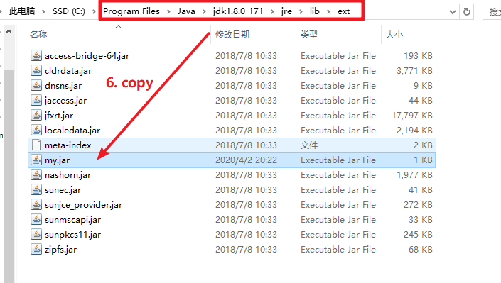
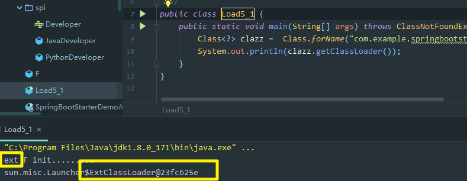
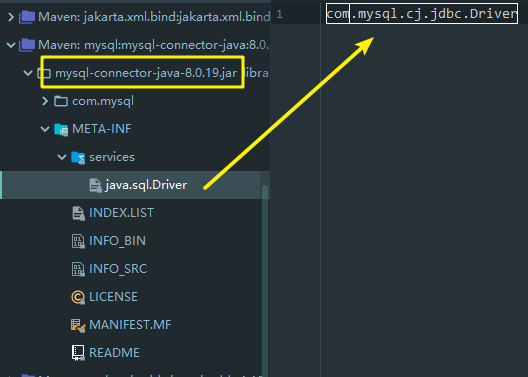

# 5. 类加载器
JDK 8 为例：

名称 | 加载哪的类 | 说明
--- | --- | ---
Bootstrap ClassLoader【再无parent，本身属于C++ level】 | JAVA_HOME/jre/lib | 无法直接访问
Extension ClassLoader | JAVA_HOME/jre/lib/ext 【扩展目录】 | 上级为 Bootstrap，显示为 null
Application ClassLoader | classpath【类路径下】 | 上级为 Extension
自定义类加载器 | 自定义 | 上级为 Application


加载机制为：双亲委派机制，就是“我要问问我爸妈是否已经买了菜，没买，我再去买。”

## 5.1 启动类加载器
这里我们通过一个例子，去修改 启动类加载器的 加载目录， 让它加载本该由 `AppClassLoader`去加载的类：
1. 首先，准备一个`F.java`，
    ```
    public class F {
        static {
            System.out.println("F init.........");
        }
    }
    ```
2. 并将其编译成`.class`文件：
    ```
    javac -g F.java
    ```
3. 然后，让main方法去调用`ClassLoader.loadClass()`
    ```
    public class Load5_1 {
        public static void main(String[] args) throws ClassNotFoundException {
            Class<?> clazz =  Class.forName("com.example.springbootstarterdemo.F");
            System.out.println(clazz.getClassLoader());
        }
    }
    ```
4. 最后，我们尝试修改初始类加载器的加载目录(注意：命令行要在`project的src/main/java` 目录下执行)
    ```
    java -Xbootclasspath/a:. com.example.springbootstarterdemo.Load5_1
    ```
    > `-Xbootclasspath` 表示设置 初始类加载器的 加载目录环境变量 `bootclasspath`
    > * 其中 `/a:.`表示将当前目录追加到 `bootclasspath`之后
    > * 可以用这个办法替换核心类：
    >   * `java -Xbootclasspath:<new bootclasspath>`
    >   * `java -Xbootclasspath/a:<追加路径>`
    >   * `java -Xbootclasspath/p:<追加路径>`
5. 最终得到输出结果，输出为`null`，表示是通过来自C++ Level的初始类加载器加载的。
    ```
    F init.........
    null
    ```

## 5.2 扩展类加载器
以上的例子，如果我们不用 `-Xbootclasspath/a:.`，就会默认用 应用加载器 来加载类了。

那么， 如果我们想使用 扩展类加载器，又得怎么触发呢？




最终，得到的确实是 扩展类加载器加载的结果。

说明，爸爸已经加载的类，儿子不会再加载。

## 5.3 双亲委派模式
所谓双亲委派，指：调用类加载器的 `loadClass` 方法时，查找类的规则，上级已加载，下级就不加载，下级要加载，先问过上级。其实这里的“双亲”更像是“上级”的意思，毕竟它们之间没有继承关系。

我们看看`ClassLoader.loadClass(String, boolean)`源码：

```java
protected Class<?> loadClass(String name, boolean resolve)
        throws ClassNotFoundException {
    synchronized (getClassLoadingLock(name)) {
        // First, check if the class has already been loaded
        Class<?> c = findLoadedClass(name);
        if (c == null) {
            long t0 = System.nanoTime();
            try {
                if (parent != null) {
                    // 有上级，就 委派上级 去加载
                    c = parent.loadClass(name, false);
                } else {
                    // 如果没有上级了（如：ExtClassLoader），则委派 BootstrapClassLoader
                    // 这里debug不进去，因为这里是调用了C++级别的源码
                    c = findBootstrapClassOrNull(name);
                }
            } catch (ClassNotFoundException e) {
                // 上级 找不了，报错了，没关系，这里下级 catch住了
                // ClassNotFoundException thrown if class not found
                // from the non-null parent class loader
            }

            if (c == null) {
                // If still not found, then invoke findClass in order
                // to find the class. （这里就调用 每个类加载器自己 扩展的方法，去加载）
                long t1 = System.nanoTime();
                c = findClass(name);

                // this is the defining class loader; record the stats
                sun.misc.PerfCounter.getParentDelegationTime().addTime(t1 - t0);
                sun.misc.PerfCounter.getFindClassTime().addElapsedTimeFrom(t1);
                sun.misc.PerfCounter.getFindClasses().increment();
            }
        }
        if (resolve) {
            resolveClass(c);
        }
        return c;
    }
}
```
注意：上级上级 找不了，报错了，没关系，这里下级 catch住了；但是 下级自己找不到，就会往外抛`ClassNotFoundException`。

## 5.4 线程上下文类加载器

以下是 加载 `com.mysql.jdbc.Driver`的一个例子，看看特殊情况下，JVM如何打破双亲委派机制。

我们引入包
```xml
<dependency>
    <groupId>mysql</groupId>
    <artifactId>mysql-connector-java</artifactId>
    <version>8.0.19</version>
</dependency>
```
之后，当我们需要使用 JDBC时，原则上，Driver 驱动是肯定得加载并ready的，否则我们无法连接DB。但是，根据之前类加载的条件，是需要一些code才会去加载类，如`Class.forName("com.mysql.jdbc.Driver")`，但是这里我们从头到尾都没有显式用过`Class.forName("com.mysql.jdbc.Driver")`，也就是有人帮我们加载了这个`com.mysql.jdbc.Driver`

我们看看来自jre里面的包 `java.sql.DriverManager`源码：
```java
public class DriverManager {

    // 注册驱动的集合
    // List of registered JDBC drivers
    private final static CopyOnWriteArrayList<DriverInfo> registeredDrivers = new CopyOnWriteArrayList<>();
    
    /**
     * 初始化驱动
     * Load the initial JDBC drivers by checking the System property
     * jdbc.properties and then use the {@code ServiceLoader} mechanism
     */
    static {
        loadInitialDrivers();
        println("JDBC DriverManager initialized");
    }
```
但首先，我们要知道，这个`DriverManager` 是启动类加载器去加载的，所以这个加载器 会去 `JAVA_HOME/jre/lib` 下搜索类，但是 这路径下压根没有 `mysql-connector-java-8.0.19.jar` 这个包，那怎么办呢，它的静态代码块得执行呀，这个“上级”要怎么找呢？

往下看：
```java
private static void loadInitialDrivers() {
    String drivers;
    try {
        drivers = AccessController.doPrivileged(new PrivilegedAction<String>() {
            public String run() {
                return System.getProperty("jdbc.drivers");
            }
        });
    } catch (Exception ex) {
        drivers = null;
    }
    // If the driver is packaged as a Service Provider, load it.
    // Get all the drivers through the classloader
    // exposed as a java.sql.Driver.class service.
    // ServiceLoader.load() replaces the sun.misc.Providers()
    // 1) 使用ServiceLoader 机制 加载驱动，即 SPI
    AccessController.doPrivileged(new PrivilegedAction<Void>() {
        public Void run() {
            // 而 ServiceLoader 自然也只能用AppClassLoader ，才能完成某些类的加载
            ServiceLoader<Driver> loadedDrivers = ServiceLoader.load(Driver.class);
            Iterator<Driver> driversIterator = loadedDrivers.iterator();

            /* Load these drivers, so that they can be instantiated.
                * It may be the case that the driver class may not be there
                * i.e. there may be a packaged driver with the service class
                * as implementation of java.sql.Driver but the actual class
                * may be missing. In that case a java.util.ServiceConfigurationError
                * will be thrown at runtime by the VM trying to locate
                * and load the service.
                *
                * Adding a try catch block to catch those runtime errors
                * if driver not available in classpath but it's
                * packaged as service and that service is there in classpath.
                */
            try{
                while(driversIterator.hasNext()) {
                    driversIterator.next();
                }
            } catch(Throwable t) {
            // Do nothing
            }
            return null;
        }
    });

    println("DriverManager.initialize: jdbc.drivers = " + drivers);

    // 2) 使用 jdbc.drivers定义的 驱动名 加载驱动
    if (drivers == null || drivers.equals("")) {
        return;
    }
    String[] driversList = drivers.split(":");
    println("number of Drivers:" + driversList.length);
    for (String aDriver : driversList) {
        try {
            println("DriverManager.Initialize: loading " + aDriver);
            // 这里的 ClassLoader.getSystemClassLoader() 得到的是 AppClassLoader
            Class.forName(aDriver, true,
                    ClassLoader.getSystemClassLoader());
        } catch (Exception ex) {
            println("DriverManager.Initialize: load failed: " + ex);
        }
    }
}
```
总结：所以在某些情况下， Java会打破双亲委派机制，也就是：虽然我是上级，但是需要让下级去帮助加载。


### Service Provider Interface（SPI）
```java
 ServiceLoader<Driver> loadedDrivers = ServiceLoader.load(Driver.class);
Iterator<Driver> driversIterator = loadedDrivers.iterator();
try{
    while(driversIterator.hasNext()) {
        driversIterator.next();
    }
} catch(Throwable t) {
// Do nothing
}
return null;
```
上面这个源码，就是 SPI的机制。

SPI机制约定： 在jar包的 `META-INF/services`包下，以接口全限定名 命名文件，文件内容是实现类名称



这样就可以使用：
```java
ServiceLoader<接口类型> allImpls = ServiceLoader.load(接口类型.class);
Iterator<接口类型> iter  = allImpls.iterator();
while(iter.hasNext()) {
    iter.next();
}
```
来得到实现类，体现的是【面向接口编程 + 解耦】的思想，还有很多框架都运用此思想：
* JDBC
* Servlet 初始化器
* Dubbo（对SPI 进行了扩展）

接着看 `ServiceLoader.load` 方法：
```java
public static <S> ServiceLoader<S> load(Class<S> service) {
    // 获取线程上下文类加载器
    ClassLoader cl = Thread.currentThread().getContextClassLoader();
    return ServiceLoader.load(service, cl);
}
```
这里，就用上了之前提到的 线程上下文类加载器 了。

线程上下文类加载器 是 当前线程使用的类加载器，默认就是 应用程序类加载器，它内部就是由 Class.forName 调用了线程上下文类加载器 完成类加载，具体代码在 ServiceLoader 内部类 LazyIterator中。破坏双亲委派机制。


## 5.5 自定义类加载器
### 什么时候需要呢？
1. 想加载非 classpath 随意路径中的类文件；
2. 都通过接口来使用实现，希望解耦时，常用于框架设计；
3. 这些类希望予以隔离，不同应用的同名类都可以加载，不冲突，常用于 tomcat 容器；

### 步骤
1. 继承 ClassLoader 父类；
2. 要遵从 双亲委派机制，重写 `findClass`方法（注意，是`findClass`，不是`loadClass`）；
3. 读取类文件的字节码（byte数组）；
4. 调用父类的 `defineClass` 方法来加载类；
5. 使用者调用该类加载器的 `loadClass` 方法；


### 例子
1. 首先，我们定义一个类，**没有包名**的类，然后，将其编译后，将.class文件放到 `D://myclasspath/`目录下；
```java
public class MyPrinter {
    public void print(String word) {
        System.out.println(String.format("I am printer!!! I want to print: %s", word));
    }
}
```

2. 接着，我们定义一个自定义的 `ClassLoader`子类，并重写其`findClass`方法，让他去我们的自定义目录下去找类：
```java
/**
 * 自定义 ClassLoader
 */
class MyClassLoader extends ClassLoader {
    @Override
    protected Class<?> findClass(String name) throws ClassNotFoundException {
        String path = "D:\\myclasspath\\" + name + ".class";
        try {
            ByteArrayOutputStream bos = new ByteArrayOutputStream();
            Files.copy(Paths.get(path), bos);
            byte[] bytes = bos.toByteArray();
            return defineClass(name, bytes, 0, bytes.length);
        } catch (IOException e) {
            e.printStackTrace();
        }
        return null;
    }
}
```
3. 然后，我们尝试在main方法中加载`MyPrinter`类：
```java
public class Load7 {
    public static void main(String[] args) throws ClassNotFoundException, IllegalAccessException, InstantiationException, NoSuchMethodException, InvocationTargetException {
        MyClassLoader classLoader = new MyClassLoader();
        Class<?> myPrinter = classLoader.loadClass("MyPrinter");
        Class<?> myPrinter1 = classLoader.loadClass("MyPrinter");
        // 同一个类加载器，重复加载同一个类时，会指向同一个类信息地址
        System.out.println(myPrinter == myPrinter1);
        MyClassLoader classLoader2 = new MyClassLoader();
        Class<?> myPrinter2 = classLoader2.loadClass("MyPrinter");
        // 而不同的类加载器，重复加载同一个类名时，其实类名一样，但却不会指向同一个类信息地址
        System.out.println(classLoader == classLoader2);
        // 因为判断两个类完全一致的条件：类名、包名、加载器 都一样

        // 实例化，并调用方法
        Object printer = myPrinter.newInstance();
        Method printMethod = printer.getClass().getMethod("print", String.class);
        printMethod.invoke(printer, "hello");
    }
}
```
得到打印结果：
```
true
false
I am printer!!! I want to print: hello
```

