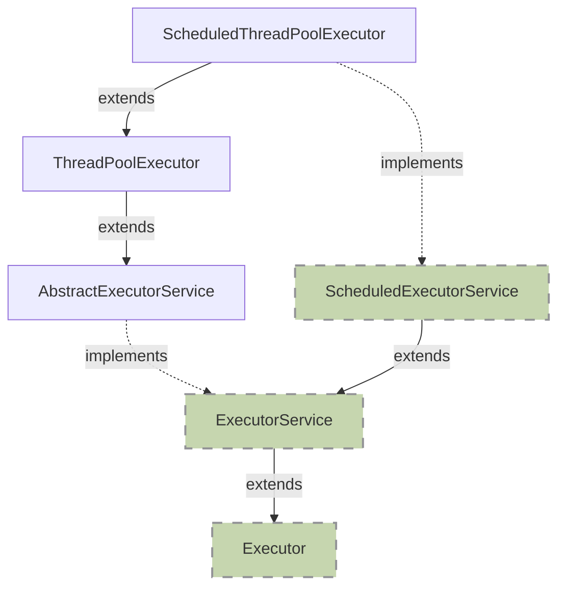

<!-- more -->

## 普通的新建线程去处理异步任务，有什么缺点？
1. 创建和销毁线程造成资源消耗（包括时间、系统资源、cpu资源）。
2. 线程无法管理。

## 什么是线程池？
线程池是：一组已经创建好的，一直在等待任务执行的线程的集合。

## 线程池的作用
* 降低资源消耗。通过重复利用已创建的线程降低线程创建和销毁造成的消耗。
* 提高响应速度。当任务到达时，任务可以不需要等到线程创建就能立即执行。
* 提高线程的可管理性。

## jdk线程池详解
`java.util.concurrent`
其中，蓝色表示 类/抽象类，绿色代表 接口：


## Executor接口
* 自jdk1.5引入
* 只有一个方法`execute`(是线程池最基本的作用)

## ExecutorService接口
* 继承 Executor 接口
* 更加丰富的方法：
  * `shutdown():void`："优雅地"关闭线程。（因为这个线程池在关闭前会先等待线程池中已经有的任务执行完成，一般会配合方法`awaitTermination`一起使用，调用该方法后，线程池中不能再加入新的任务。）
  * `shutdownNow():List<Runnable>`： “尝试”终止正在执行的线程，返回在正在等待的任务列表，调用这个方法后，会调用正在执行线程的interrupt（）方法，所以如果正在执行的线程如果调用了sleep，join，await等方法，会抛出InterruptedException异常。
  * `awaitTermination(long timeout, TimeUnit unit):boolean`： 该方法是一个阻塞方法，参数分别为时间和时间单位。这个方法一般配合上面两个方法之后调用。如果先调用shutdown方法，所有任务执行完成返回true，超时返回false，如果先调用的是shutdownNow方法，正在执行的任务全部完成true，超时返回false。
  * `isTerminated():boolean`：调用方法1或者2后，如果所有人物全部执行完毕则返回true，也就是说，就算所有任务执行完毕，但是不是先调用1或者2，也会返回false。
  * `<T> Future<T> submit(Callable<T> task)`：提交一个能够返回结果的Callable任务，返回任务结果抽象对象是Future，调用Future.get()方法可以阻塞等待获取执行结果，例如：`result = exec.submit(aCallable).get();`，提交一个任务并且一直阻塞知道该任务执行完成获取到返回结果。
  * `<T> Future<T> submit(Runnable task, T result)`：提交一个Runnable任务，执行成功后调用Future.get()方法返回的是result（这是什么骚操作？）。
  * `Future<?> submit(Runnable task)`：和上一个方法不同的是调用Future.get（）方法返回的是null（这又是什么操作？）。
  * `<T> List<Future<T>> invokeAll(Collection<? extends Callable<T>> tasks)`：提交一组任务，并且返回每个任务执行结果的抽象对象List<Future<T>>，Future作用同上，值得注意的是：
当调用其中任一Future.isDone()(判断任务是否完成，正常，异常终止都算）方法时，必须等到所有任务都完成时才返回true，简单说：全部任务完成才算完成。
  * `<T> List<Future<T>> invokeAll(Collection<? extends Callable<T>> tasks, long timeout, TimeUnit unit)`： 同上，多了一个时间参数，不同的是：如果超时，Future.isDone()同样返回true。
  * `<T> T invokeAny(Collection<? extends Callable<T>> tasks)`：这个看名字和上面对比就容易理解了，返回第一个正常完成的任务地执行结果，后面没有完成的任务将被取消。
  * `<T> T invokeAny(Collection<? extends Callable<T>> tasks, long timeout, TimeUnit unit)`：同前一个方法相比，多了一个超时参数。不同的是：在超时时间内，一个任务都没有完成，将抛出TimeoutException。

## AbstractExecutorService 抽象类
仅仅实现了ExecutorService接口的三个方法：
* `submit`：
  1. 对传入的Runnable对象判空
  2. 然后创建一个RunnableFuture（Future的子类）对象
  3. 并执行这个future对象（`execute`方法交由子类实现）
  4. 最终返回这个future对象（`RunnableFuture`同时继承 `Runnable`和`Future`接口，其实现是`FutureTask`）
* `invokeAll`：
  1. 声明一个flag用于判断所有任务是否全部完成。
  2. 调用`newTaskFor`构建`RunnableFuture`对象，循环调用`execute`方法添加每个任务。
  3. 遍历每个任务的结果，判断是否执行完毕，没有完成则调用`get()`方法来等待它完成。
  4. 所有任务全部完成，将flag设置为true。
  5. 如果存在异常，且此时有任务还没有执行完毕，那么，所有任务取消（`Future.cancel()`实际内部调用`Thread.interrupt()`）
* `invokeAny`：实际内部调用另一个方法`doInvokeAny`
  1. 声明一个ExecutorCompletionService ecs，这个对象实际是一个任务执行结果阻塞队列和线程池的结合，所以它可以加入任务，执行任务，将任务执行结果加入阻塞队列。
  2. 向ecs添加tasks中的第一个任务并且执行。
  3. 从ecs的阻塞队列中取出第一个（队头），如果为null（不为null跳到注释⑤），说明一个任务都还没执行完成，继续添加任务。
  4. 如果所有任务都被添加了，阻塞等待任务的执行结果，知道有任一任务执行完成。
  5. 如果取到了某个任务的执行结果，直接返回。
  6. 取消所有还没执行的任务。

## ThreadPoolExecutor
它是线程池的具体实现。

分析它的构造函数：
```java
/**
* corePoolSize: 核心线程数
* maximumPoolSize: 线程池最大允许线程数
* keepAliveTime, unit: 等待时长 （指的是非 CoreThread 的 线程在空闲情况下的存活时间）
* workQueue: 任务队列
* threadFactory: 线程创建工厂
* handler: 任务拒绝决策
**/
public ThreadPoolExecutor(int corePoolSize, int maximumPoolSize, long keepAliveTime, TimeUnit unit, BlockingQueue<Runnable> workQueue, ThreadFactory threadFactory, RejectedExecutionHandler handler)
```

以下是线程池的主要流程图：


ThreadPoolExecutor执行`execute()`分4种情况：
1. 若当前运行的线程少于 corePoolSize,则创建新线程来执行任务(执行这一步需要获取全局锁)
2. 若运行的线程多于或等于 corePoolSize,则将任务加入 BlockingQueue
3. 若无法将任务加入 BlockingQueue,则创建新的线程来处理任务(执行这一步需要获取全局锁)
4. 若创建新线程将使当前运行的线程超出 maximumPoolSize,任务将被拒绝,并调用 `RejectedExecutionHandler.rejectedExecution()`

采取上述思路,是为了在执行 `execute()`时,尽可能避免获取全局锁。在ThreadPoolExecutor完成预热之后（当前运行的线程数大于等于corePoolSize),几乎所有的execute()方法调用都是执行步骤2,而步骤2不需要获取全局锁。

> 注意：
> 在线程池里头，核心线程在处理完当前任务后，会去取任务队列中队头的任务去执行。所以，如果核心线程全部都在跑耗时任务，那么，只有一种情况下，进来的新任务能够被执行：
>
> 答： 核心线程全部在工作，并且此时任务队列已经是满人状态，并且此时当前线程数仍然小于线程池的最大线程数，那么，就会创建新线程来处理这个新进来的任务。
>
> 另外，线程只要能够进入核心线程池，那他的身份就会是核心线程。所以不会有特别的核心线程的创建逻辑，线程池里头的每个线程的自身结构是一致的。

### 参数解释
* `corePoolSize`: 必须 >= 0，否则报错
* `maximumPoolSize`: 必须 >= 1, 否则报错
* `workQueue`：workQueue 的 任务 一定是 Runnable 类型 ，如果是Callable 类型，会在submit内部转换为 Runnable对象

### 线程池的特殊化
1. `corePoolSize=maximuPoolSize`: 这里我们可以创建一个线程池线程数量固定的任务。
2. `maximuPoolSize`设置很大(`Integer.MAX_VALUE`):  我们可以无限制的加入任务。
3. `workQueue`设置足够大，线程池中的数量不会超过`corePoolSize`，此时`maximumPoolSize`参数无效。
4. `corePoolSize=0`: 线程池一旦空闲（超过时间），线程都将被回收。
5. 通过`allowCoreThreadTimeOut`方法，我们可以让TimeOut 应用到所有的线程（包括coreThread）。
6. workQueue的三种实现：
  * `SynchronousQueue`：【直连队列】一个空队列，不会保存提交的task（添加操作必须等待另外的移除操作），队列不会存储任何任务。当有任务提交线程试图向队列中添加待执行任务时会被阻塞，直到有任务处理线程试图从队列中获取待执行任务时会与阻塞状态中的任务提交线程发生直接联系，由任务提交线程把任务直接交给任务执行线程。吞吐量通常高于`LinkedBlockingQueue`，`Executors.newCachedThreadPool`使用此队列。
  * `ArrayBlockingQueue`：【有界队列】数组实现的队列，可以指定队列的长度。
  * `LinkedBlockingQueue`：【无界队列】链表实现的队列，所以理论上可以无限大，也可以指定链表长度。当使用无界队列时，线程池中的线程最多只能达到核心线程数就不会再增长了，最大线程数maximumPoolSize参数不会产生作用。此队列采用FIFO排序元素，吞吐量通常高于`ArrayBlockingQueue`，静态工厂方法`Executors.newFixedThreadPool()`采用此队列。
7. RejectedExecutionHandler的四种实现：
  * 【default】`AbortPolicy`：直接抛出RejectedExecutionException，这是线程池中的默认实现。
  * `DiscardPolicy`：什么都不做
  * `DiscardOldestPolicy`：丢弃workQueue队头任务，加入新任务
  * `CallerRunsPolicy`：直接在调用者的线程执行任务(直接绕过线程线程池，执行任务的`run()`方法)

### RejectedExecutionHandler有哪几种友好的拒绝策略？
1. save DB, 削峰填谷，等空闲时提取出来执行
2. 转向某个提示页面
3. 打印日志

### ThreadFactory给线程起个好名字
开源框架guava提供ThreadFactoryBuilder可以快速给线程池里的线程设置有意义的名字：
```java
new ThreadFactoryBuilder().setNameFormat("XX-task-%d").build();
```

## ScheduledExecutorService 接口
继承自`ExecutorService`接口，多了一个功能：可以定时执行任务（执行一次）和定期执行任务（重复执行）。

方法：
* `public ScheduledFuture<?> schedule(Runnable command, long delay, TimeUnit unit);`: 这个方法用于定时执行任务command，延迟的时间为delay*unit，它返回一个ScheduledFuture对象用于获取执行结果或者剩余延时，调用Future.get()方法将阻塞当前线程最后返回null。
* `public <V> ScheduledFuture<V> schedule(Callable<V> callable, long delay, TimeUnit unit);`：同上，不同的是，调用Future.get()方法将返回执行的结果，而不是null。
* `public ScheduledFuture<?> scheduleAtFixedRate(Runnable command, long initialDelay, long period,TimeUnit unit);`: 重复执行任务command，第一次执行时间为initialDelay延迟后，以后的执行时间将在initialDelay + period * n，unit代表时间单位，值得注意的是，如果某次执行出现异常，后面该任务就不会再执行。或者通过返回对象Future手动取消，后面也将不再执行。
* `public ScheduledFuture<?> scheduleWithFixedDelay(Runnable command,long initialDelay,long delay, TimeUnit unit);`: 效果同上，不同点：如果command耗时为 y，则上面的计算公式为initialDelay + period * n + y，也就是说，它的定时时间会加上任务耗时，而上面的方法则是一个固定的频率，不会算上任务执行时间！

## ScheduledThreadPoolExecutor类
继承自ThreadPoolExecutor类，实现了ScheduledExecutorService接口。

它的构造器比它的父类构造器简洁，主要因为它的任务队列workQueue是默认的（DelayedWorkQueue），并且最大的线程数为最大值。

### 关于`DelayWorkQueue`
它内部使用数组维护了一个二叉树，提高了任务查找时间，而之所以ScheduledThreadPoolExecutor能够实现延时的关键也在于DelayedWorkQueue的`take()`方法：

1. 工作线程调用take方法获取剩余任务。
2. 检查这个任务是否已经到了执行时间。
3. 未到执行时间，await等待。
4. 自己唤醒，进入循环再次计算时间。
