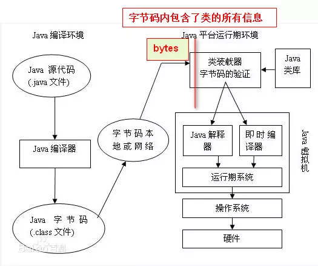
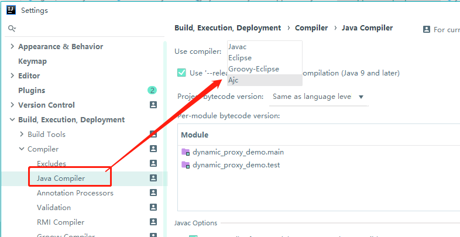
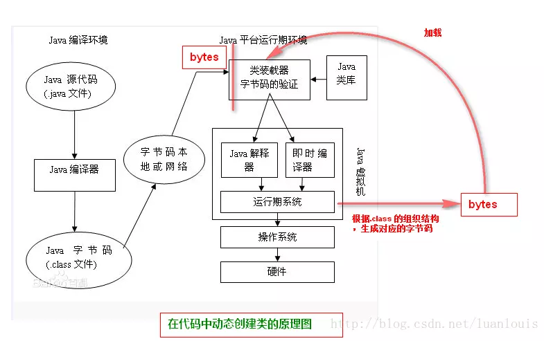

# AOP简介
AOP（Aspect Orient Programming），我们一般称为面向方面（切面）编程，作为面向对象的一种补充，用于处理系统中分布于各个模块的横切关注点，比如事务管理、日志、缓存等等。AOP实现的关键在于AOP框架自动创建的AOP代理，AOP代理主要分为静态代理和动态代理，静态代理的代表为AspectJ；而动态代理则以Spring AOP为代表。

# Spring AOP
其实，`org.springframework.boot:spring-boot-starter` 内部就依赖了`org.springframework:spring-aop`，也就是说，基本上只要用到spring-boot-starter相关库，内部就会有spring-aop相关支持。

比如，我们去打印一个Application的启动情况，就会发现，它其实是用GCLib动态代理后的对象：
```
@SpringBootApplication
public class DynamicProxyDemoApplication implements ApplicationRunner {
    @Resource
    DynamicProxyDemoApplication mainApp;

    public static void main(String[] args) {
        SpringApplication.run(DynamicProxyDemoApplication.class, args);
    }

    @Override
    public void run(ApplicationArguments args) throws Exception {
        System.out.println(mainApp);
    }
}
```
打印结果：
```
com.example.dynamic_proxy_demo.DynamicProxyDemoApplication$$EnhancerBySpringCGLIB$$c4f6520e@420bc288
```

Spring AOP 其实提供了多种横切逻辑织入机制（Weaving），性能损耗上也是各有差别，从运行期间的动态代理和字节码增强 Weavng，到类加载期间的 Weaving，甚至高冷的 AspectJ 二次静态编译 Weaving。


# 静态代理--AspectJ

AspectJ属于编译时增强实现AOP。

AspectJ是一个Java实现的面向切面的框架，它扩展了Java语言。AspectJ有自定义的语法，所以它有一个专门的编译器用来生成遵守Java字节编码规范的Class文件。

* 所谓静态代理：AOP框架在编译阶段生成AOP代理类。
* 静态代理也被称为“编译时增强”。

原理：AspectJ会在Java文件编译生成Class文件时，Aspect J编译器会将需要做的额外的代码逻辑的字节码一并补全到被代理类的逻辑字节码周围。之后，在运行期间，一旦命中被代理类相关的逻辑，就会进入这个增强后的AOP对象，并调用增强后的逻辑。

> 注意：这里说的是 AspectJ编译器（acj编译器），也就说明了其是在编译期生成新的类。

## 例子

1. 首先maven引入依赖：
    ```
    <dependency>
      <groupId>org.aspectj</groupId>
      <artifactId>aspectjrt</artifactId>
      <version>1.8.9</version>
    </dependency>
    <dependency>
      <groupId>org.aspectj</groupId>
      <artifactId>aspectjtools</artifactId>
      <version>1.8.9</version>
    </dependency>
    ```
2. 然后，在idea中将javac编译器变成acj编译器来支持AspectJ语法：
    
3. 将明星的表演抽象成一个ShowService接口，包括了唱歌、跳舞的功能
    ```
    public interface ShowService {
        // 歌唱表演
        void sing(String songName);
        // 舞蹈表演
        void dance();
    }
    ```
    明星类实现了ShowService接口：
    ```
    public class Star implements ShowService{
        private String name;
    
        @Override
        public void sing(String songName) {
            System.out.println(this.name + " sing a song: " + songName);
        }
    
        @Override
        public void dance() {
            System.out.println(this.name + "dance");
        }
    
        public Star(String name) {
            this.name = name;
        }
    
        public Star() {
        }
    
        public static void main(String[] args) {
            Star star = new Star("Eminem");
            star.sing("Mockingbird");
        }
    }
    ```
4. 【关键】用AspectJ 的语法，来写切面类
    ```
    public aspect AgentAspectJ {
    
        /**
         * 定义切点
         */
        pointcut sleepPointCut():call(* Star.sing(..));
    
        /**
         * 定义切点
         */
        pointcut eatPointCut():call(* Star.eat(..));
    
        /**
         * 定义前置通知
         *
         * before(参数):连接点函数{
         *     函数体
         * }
         */
        before():sleepPointCut(){
            getMoney();
        }
    
        /**
         * 定义后置通知
         * after(参数):连接点函数{
         *     函数体
         * }
         */
        after():sleepPointCut(){
            writeReceipt();
        }
    
        private void getMoney() {
            System.out.println("get money");
        }
    
        private void writeReceipt() {
            System.out.println("write receipt");
        }
    }
    ```

# 动态代理--Spring AOP


所谓动态代理：AOP框架不会修改字节码，而是在内存中临时为方法生成一个AOP对象，这个AOP对象包含了目标对象的全部方法（相当于动态创建目标对象的一个子类对象），并在特定的切点做了增强处理，并回调原对象的方法。

Spring AOP动态代理的两种方式：
## JDK动态代理（反射）
JDK动态代理通过反射来接收被代理的类，并且要求被代理的类必须实现一个接口。JDK动态代理的核心是InvocationHandler接口和Proxy类。
```
// 提供了一系列的static方法，用来创建代理类或对象，这个类是所有动态代理类的父类
java.lang.reflect.Proxy

// 这是调用处理器接口，只有一个invoke方法，处理动态代理类对象方法的调用，每个动态代理类都会关联一个InvocationHandler
// 可以通过实现该接口定义横切逻辑，并通过反射机制调用目标类的代码，动态地将横切逻辑和业务逻辑编织在一起
java.lang.reflect.InvocationHandler
```

例子：
```
public class ProxyDemo_1 {

    public static void main(String[] args) throws IllegalAccessException, InvocationTargetException, InstantiationException, NoSuchMethodException {
        //(1)通过实现 InvocationHandler 接口创建自己的调用处理器
        InvocationHandler handler = new InvocationHandler() {
            //创建委托类对象实例
            private RealSubject subject = new RealSubject();
            @Override
            public Object invoke(Object proxy, Method method, Object[] args) throws Throwable {
                //调用委托类的方法
                return method.invoke(subject, args);
            }
        };

        //(2)通过为 Proxy 类指定 ClassLoader 对象和一组 interface 来创建动态代理类
        Class<?> proxyClass = Proxy.getProxyClass(ProxyDemo_1.class.getClassLoader(), new Class<?>[]{Subject.class});
        //(3)通过反射机制获得动态代理类的构造函数，其唯一参数类型是调用处理器接口类型
        Constructor<?> proxyClassConstructor = proxyClass.getConstructor(new Class<?>[]{InvocationHandler.class});
        //(4)通过构造函数创建动态代理类实例，构造时调用处理器对象作为参数被传入
        Object o = proxyClassConstructor.newInstance(handler);
        //(5)通过动态代理对象调用
        Subject subject = (Subject) o;
        //(6)输出委托类的结果
        subject.doSomething();
    }

    public static interface Subject {
        void doSomething();
    }


    public static class RealSubject implements Subject {
        @Override
        public void doSomething() {
            System.out.println("Hello");
        }
    }
}
```

不足：动态代理只能支持接口的代理，这也是因为java的继承性本质所限制的，因为所有的动态代理类都继承了Proxy类，所以再也无法同时继承其他类

## CGLIB动态代理（继承）
如果目标类没有实现接口，那么Spring AOP会选择使用CGLIB来动态代理目标类。CGLIB（Code Generation Library），是一个代码生成的类库，可以在运行时动态的生成某个类的子类，在子类中采用方法拦截的技术拦截所有父类方法的调用并顺势织入横切逻辑，注意，CGLIB是通过继承的方式做的动态代理，因此如果某个类**被标记为final**，那么它是**无法使用CGLIB做动态代理**的。

例子：
```
public class 中介所B implements MethodInterceptor {

    public static <T extends 房东> 房东 newProxyInstance(Class<T> targetClass) {
        Enhancer enhancer = new Enhancer();
        enhancer.setSuperclass(targetClass);
        enhancer.setCallback(new 中介所B());
        return (房东) enhancer.create();
    }

    @Override
    public Object intercept(Object o, Method method, Object[] objects, MethodProxy methodProxy) throws Throwable {
        System.out.print(objects[0] + "你好，其实我是中介B，让我帮你转接电话给业务本人吧：");
        return methodProxy.invokeSuper(o, objects);
    }
}
```


# JDK和CGLib两种动态代理性能对比

* 无论如何，他们两者相对于直接`new`对象，还是慢一点；
* JDK1.8之前，JDK动态代理方式会比CGLib方式慢一点点；
* JDK1.8之后，JDK动态代理方法甚至比后者更快。


# Spring AOP 与 AspectJ 的关系
目前来看，Spring貌似和AspectJ没半毛钱关系，那为什么在许多应用了Spring AOP的项目中都出现了@AspectJ的注解呢？Spring是应用的动态代理，怎么会还和AspectJ有关系呢，原因是Spring AOP基于注解配置的情况下，需要依赖于AspectJ包的标准注解，但是不需要额外的编译以及AspectJ的织入器，而基于XML配置不需要，所以Spring AOP只是复用了AspectJ的注解，并没有其他依赖AspectJ的地方。

所以，虽然使用了Aspect的Annotation，但是并没有使用它的编译器和织入器。其实现原理是JDK动态代理或Cglib，在运行时生成代理类。


# Spring AOP 方式配置
当需要使用@Aspectj 注解支持时，需要在Spring配置中加入如下配置：
```
<aop:aspectj-autoproxy/>
```

当需要强制使用CGLIB：
```
<aop:aspectj-autoproxy proxy-target-class="true"/>
```

## 基于xml
切面类：
```
package com.fufu.spring.aop;

import org.springframework.stereotype.Component;

@Component
public class AgentAdvisorXML {

    public void getMoney() {
        System.out.println("get money");
    }

    public void writeReceipt() {
        System.out.println("write receipt");
    }
}
```
配置文件：
```
<?xml version="1.0" encoding="UTF-8"?>
<beans xmlns="http://www.springframework.org/schema/beans"
       xmlns:xsi="http://www.w3.org/2001/XMLSchema-instance"
       xmlns:aop="http://www.springframework.org/schema/aop"
       xmlns:context="http://www.springframework.org/schema/context"
       xsi:schemaLocation="http://www.springframework.org/schema/beans
       http://www.springframework.org/schema/beans/spring-beans.xsd
       http://www.springframework.org/schema/context
       http://www.springframework.org/schema/context/spring-context.xsd
       http://www.springframework.org/schema/aop
       http://www.springframework.org/schema/aop/spring-aop.xsd">

    <bean id="star" class="com.fufu.proxy.Star">
        <property name="name" value="Eminem"/>
    </bean>

    <bean id="agentAdvisorXML" class="com.fufu.spring.aop.AgentAdvisorXML"/>
    
     <!--Spring基于Xml的切面-->
     <aop:config>
         <!-- 定义切点函数 -->
         <aop:pointcut id="singPointCut" expression="execution(* com.fufu.proxy.Star.sing(..))"/>
         <!-- 定义切面 order 定义优先级,值越小优先级越大-->
         <aop:aspect ref="agentAdvisorXML" order="0">
             <!--前置通知-->
             <aop:before method="getMoney" pointcut-ref="singPointCut"/>
             <!--后置通知-->
             <aop:after method="writeReceipt" pointcut-ref="singPointCut"/>
         </aop:aspect>
     </aop:config>

</beans>
```
测试类：
```
package com.fufu.spring.aop;

import com.fufu.proxy.ShowService;
import org.springframework.context.support.ClassPathXmlApplicationContext;

public class Main {

    public static void main(String[] args) {
        ClassPathXmlApplicationContext applicationContext = new ClassPathXmlApplicationContext("spring-aop.xml");

        Object star = applicationContext.getBean("star");

        ShowService showService = (ShowService)star;
        showService.sing("Mockingbird");
    }
}
```

## 基于注解
切面类：
```
@Aspect
@Component
public class AgentAdvisor {

    @Before(value = "execution(* com.fufu.proxy.ShowService.sing(..))")
    public void getMoney() {
        System.out.println("get money");
    }

    @After(value = "execution(* com.fufu.proxy.ShowService.sing(..))")
    public void writeReceipt() {
        System.out.println("write receipt");
    }
}
```
配置文件：
```
<?xml version="1.0" encoding="UTF-8"?>
<beans xmlns="http://www.springframework.org/schema/beans"
       xmlns:xsi="http://www.w3.org/2001/XMLSchema-instance"
       xmlns:aop="http://www.springframework.org/schema/aop"
       xmlns:context="http://www.springframework.org/schema/context"
       xsi:schemaLocation="http://www.springframework.org/schema/beans
       http://www.springframework.org/schema/beans/spring-beans.xsd
       http://www.springframework.org/schema/context
       http://www.springframework.org/schema/context/spring-context.xsd
       http://www.springframework.org/schema/aop
       http://www.springframework.org/schema/aop/spring-aop.xsd">


    <context:component-scan base-package="com.fufu.proxy, com.fufu.spring.aop"/>

    <aop:aspectj-autoproxy  proxy-target-class="true"/>
</beans>
```
测试类：
```
package com.fufu.spring.aop;

import com.fufu.proxy.ShowService;
import org.springframework.context.support.ClassPathXmlApplicationContext;

public class Main {

    public static void main(String[] args) {
        ClassPathXmlApplicationContext applicationContext = new ClassPathXmlApplicationContext("spring-aop-annotation.xml");

        Object star = applicationContext.getBean("star");

        ShowService showService = (ShowService)star;
        showService.sing("Mockingbird");
    }
}
```


# Spring Boot Starter AOP 方式配置
当需要使用@Aspectj 注解支持时，.properties中配置：
```
// 默认是true
spring.aop.auto=true
```

当需要强制使用CGLIB，.properties中配置：
```
spring.aop.proxy-target-class=true
```


# 总结
* AspectJ在编译时就增强了目标对象，Spring AOP的动态代理则是在每次运行时动态的增强，生成AOP代理对象。
* 两者区别：生成AOP代理对象的时机不同。
* AspectJ的静态代理方式具有更好的性能，但是AspectJ需要特定的编译器进行处理，而Spring AOP则无需特定的编译器处理。

# 相关Demo
https://github.com/androidjp/dynamic_proxy_demo.git

# 参考文章
* http://thinkdevos.net/2017/09/22/2017-09-22/#more
* https://juejin.im/post/5ad3e6b36fb9a028ba1fee6a
* https://juejin.im/post/5a99048a6fb9a028d5668e62
* https://www.cnblogs.com/MOBIN/p/5597215.html
* https://mp.weixin.qq.com/s/NZP2_I918SplJy_zAuhing
* https://juejin.im/post/5b90e648f265da0aea695672