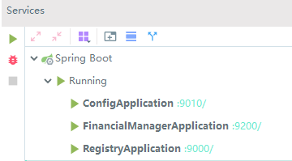
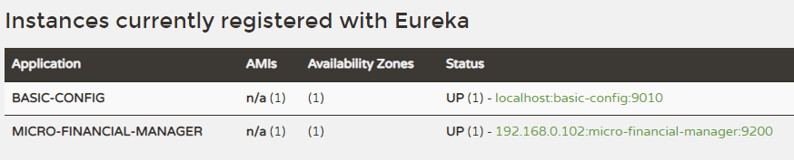
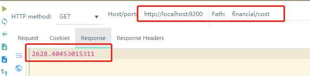
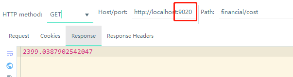
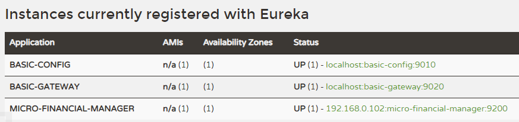
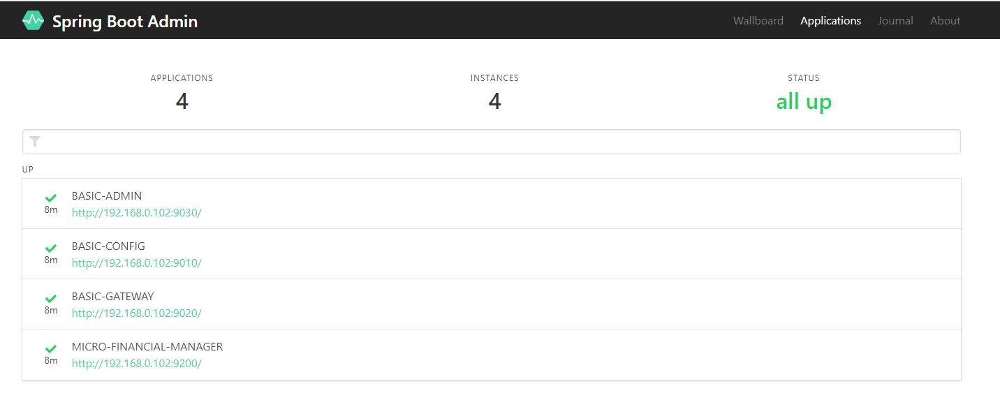
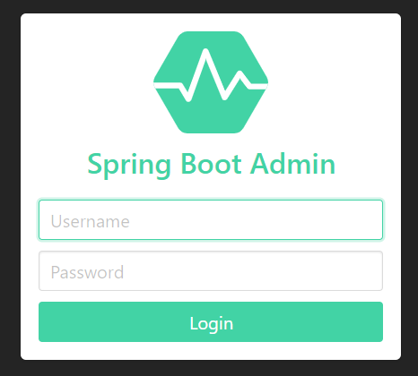

> 引言：
> * [Greenwich.SR3 Release Blog](https://spring.io/blog/2019/09/12/spring-cloud-greenwich-sr3-released)
> * [Greenwich.SR4 Release Blog](https://spring.io/blog/2019/11/19/spring-cloud-greenwich-sr4-released)

# 总体框架
* gradle版本：6.0.1
* Spring Boot版本：2.1.10.RELEASE
* Spring Cloud版本：Greenwich.SR4
* 服务注册与发现：Eureka
* 配置中心：Spring Cloud Config

# 相关规范
端口：
* 基础服务（`basic-xxx`）：90xx ~ 91xx
  * 注册服务器（`basic-registry`）：900x
  * 配置服务器（`basic-config`）：901x
  * 路由服务器（`basic-gateway`）：902x
  * 其他基础服务器
* 业务相关微服务: 92xx ~

# 一、搭建一个父Gradle目录(root project)
## 纯命令create
1. 新创建项目纯gradle项目
    ```
    mkdir jp-cloud-gradle
    cd jp-cloud-gradle
    gradle init --type=basic
    ```
2. 假设你现在的系统全局Gradle版本是5.4.1，那么，如果要变成Gradle 6.0.1，两个选择：
   1. 将当前系统Gradle换成6.0.1，然后执行运行`gradle wrapper`，即可将当前项目换成当前系统默认Gradle版本。然后执行`gradlew`即可用到当前6.0.1版本去进行项目构建；
   2. 直接用当前生成的5.4.1版本的Gradle命令，来切换版本至6.0.1：
        ```
        gradlew wrapper --gradle-version=6.0.1
        gradlew
        // or gradlew tasks
        ```
3. 更新root project的`build.gradle`，将Spring Cloud 和 Spring Boot相关基础依赖集成进来：
    ```
    apply plugin: 'java'
    group 'com.jpcloud'
    version '1.0.0'
    
    sourceCompatibility = 1.8
    
    buildscript {
        ext {
            //定义一个变量，统一规定springboot的版本
            // 注意：Spring Boot版本一定要匹配上 Spring Cloud 版本
            // There should be a mismatch version between spring boot and spring cloud.
            // If you use spring boot version 2.2.0.RELEASE you have to use spring cloud version Hoxton.RC1.
            // If you use spring boot version 2.1.9.RELEASE, you have to use spring cloud version Greenwich.SR3.
            // If you use spring boot version 2.1.10.RELEASE, you have to use spring cloud version Greenwich.SR4.
            // 否则，会报错：No qualifying bean of type 'javax.servlet.Filter' available
            springBootVersion = '2.1.10.RELEASE'
            springCloudVersion = 'Greenwich.SR4'
        }
        repositories {
            maven { url 'http://maven.aliyun.com/nexus/content/groups/public/' }
            jcenter()
            mavenCentral()
        }
        dependencies {//用来打包
            classpath("org.springframework.boot:spring-boot-gradle-plugin:${springBootVersion}")
            // 作用：设置依赖管理插件版本
            classpath "io.spring.gradle:dependency-management-plugin:1.0.2.RELEASE"
        }
    }
    
    
    allprojects {
        repositories {
            maven { url 'http://maven.aliyun.com/nexus/content/groups/public/' }
            jcenter()
            mavenCentral()
        }
        // 指定编码格式
        tasks.withType(JavaCompile) {
            options.encoding = "UTF-8"
        }
    }
    
    // 作用：配置这个项目的子项目。这个方法对这个项目的每个子项目执行给定的闭包。目标项目作为闭包的委托传递给闭包
    subprojects {
        apply plugin: 'java'
        apply plugin: 'idea'
        // spring boot 插件
        apply plugin: 'org.springframework.boot'
        // A Gradle plugin that provides Maven-like dependency management functionality
        apply plugin: 'io.spring.dependency-management'
        dependencies {
            testCompile group: 'org.springframework.boot', name: 'spring-boot-starter-test'
        }
        dependencyManagement {
            imports {
                //spring bom helps us to declare dependencies without specifying version numbers.
                mavenBom "org.springframework.cloud:spring-cloud-dependencies:${springCloudVersion}"
            }
        }
        jar {
            manifest.attributes provider: 'gradle'
        }
    }
    ```

最终，使用的相关版本是：
* Spring Cloud: GreenWich SR4 (基于Spring Boot 2.1.10)
* Spring Boot: 2.1.10

# 二、服务注册与发现
## 相关依赖
```
org.springframework.cloud:spring-cloud-starter-netflix-eureka-server
```

## 步骤
1. 创建一个module `basic-registry`，纯命令操作如下：
    ```
    mkdir basic-registry
    cd basic-registry
    gradlew init
    ```
2. 配置`build.gradle`
    ```
    dependencies {
        compile group: 'org.springframework.cloud', name: 'spring-cloud-starter-netflix-eureka-server'
    }
    ```
3. 配置`application.yml`
    ```
    server:
      port: 9000
    
    spring:
      application:
        name: basic-registry
    eureka:
      instance:
        hostname: localhost
        prefer-ip-address: true
      client:
        register-with-eureka: false
        fetch-registry: false # eureka服务是否向自己注册,默认true.这里我们不想自己注册
        service-url:          # eureka的注册地址
          defaultZone: http://${eureka.host:localhost}:${eureka.port:9000}/eureka/
    ```
4. 创建App入口
    ```
    @EnableEurekaServer
    @SpringBootApplication
    public class RegistryApplication {
        public static void main(String[] args) {
            SpringApplication.run(RegistryApplication.class, args);
        }
    }
    ```
    
# 三、配置中心
## 相关依赖
```
dependencies {
    compile group: 'org.springframework.cloud', name: 'spring-cloud-starter-netflix-eureka-client'
    compile group: 'org.springframework.cloud', name: 'spring-cloud-config-server'
}
```

## 步骤
1. 首先，创建module `basic-config`
2. 配置 `build.gradle`
    ```
    dependencies {
        compile group: 'org.springframework.cloud', name: 'spring-cloud-starter-netflix-eureka-client'
        compile group: 'org.springframework.cloud', name: 'spring-cloud-config-server'
    }
    ```
3. 配置 `application.yml`
    ```
    server:
      port: 9010
    ```
4. 配置 `bootstrap.yml`
    ```
    spring:
      application:
        name: basic-config
      profiles:
        active: native # 表示是用本地配置文件中读取配置
      cloud:           # 配置是从哪里读取配置文件
        config:
          server:
            native:
              search-locations: classpath:/config
    
    eureka:
      instance:
        non-secure-port: ${server.port}
        metadata-map:
          instanceId: ${server.port}
        prefer-ip-address: true
      client:
        service-url:
          defaultZone: http://${eureka.host:localhost}:${eureka.port:9000}/eureka/
    ```
5. 好，新建`recources/config/application-dev.yml`
    ```
    jpcloud:
      mongodb:
        uri: mongodb://localhost:27017/jpcloud
      test: jjjjjp
    ```
6. 最后，创建入口
    ```
    // 当然这里，用 @EnableEurekaClient 也是OK的
    @EnableDiscoveryClient
    @EnableConfigServer
    @SpringBootApplication
    public class ConfigApplication {
        public static void main(String[] args) {
            SpringApplication.run(ConfigApplication.class, args);
        }
    }
    ```

# 四、愉快地写业务代码

## 步骤
我们很愉快，想要新建一个专门计算每日花费的微服务，并尝试让其注册到我们的注册中心当中，且能够获取配置中心的配置。

1. 创建module `micro-financial-manager`
2. 配置`build.gradle`，让其能够往注册中心注册，并且可以读取配置
    ```
    dependencies {
        compile group: 'org.springframework.cloud', name: 'spring-cloud-starter-netflix-eureka-client'
        compile group: 'org.springframework.boot', name: 'spring-boot-starter-web'
        compile group: 'org.springframework.cloud', name: 'spring-cloud-starter-config'
    }
    ```
3. 配置`application.yml`
    ```
    server:
      port: 9200
    
    management:
      endpoints:
        web:
          exposure:
            include: '*'
      endpoint:
        health:
          show-details: ALWAYS
    ```
4. 配置`bootstrap.yml`
    ```
    spring:
      application:
        name: micro-financial-manager
      cloud:      # 配置能够扫描配置服务并获取相关配置
        config:
          discovery:
            enabled: true
            service-id: basic-config
          profile: ${JP_CLOUD_CONFIG_PROFILE:dev}
    eureka:
      client:
        service-url:
          defaultZone: http://${eureka.host:localhost}:${eureka.port:9000}/eureka/
    ```
5. 好，写入口
    ```
    @EnableDiscoveryClient
    @SpringBootApplication
    public class FinancialManagerApplication {
        public static void main(String[] args) {
            SpringApplication.run(FinancialManagerApplication.class, args);
        }
    }
    ```
6. 最后，写一个计算花费的API，并尝试去拿到配置中心里头的配置：
    ```
    @RestController
    @RequestMapping("financial/cost")
    public class CostController {
        @Value("${jpcloud.test}")
        private String testName;
    
        @GetMapping
        public BigDecimal get() {
            System.out.println(testName);
            return BigDecimal.valueOf(3000 * Math.random());
        }
    }
    ```

OK，此时，依次启动：
1. basic-registry
2. basic-config
3. micro-financial-manager



然后，就能够在eureka中心`http://localhost:9000`中看到几个服务已经注册了：


并且，调用`http://localhost:9200/finanical/cost`，可以正常请求API：



# 五、网关与负载均衡

## 步骤
1. 新建module `basic-gateway`
2. 配置`build.gradle`
    ```
    dependencies {
        compile group: 'org.springframework.cloud', name: 'spring-cloud-starter-netflix-eureka-client'
        compile group: 'org.springframework.cloud', name: 'spring-cloud-starter-gateway'
    }
    ```
3. 配置`application.yml`
    ```
    server:
      port: 9020

    # actuator 服务状态检测相关API，全开放
    management:
      endpoints:
        web:
          exposure:
            include: "*"
      endpoint:
        health:
          show-details: always
    ```
4. 配置 `bootstrap.yml`，这边可以配置yml方式的routing策略
    ```
    spring:
      application:
        name: basic-gateway
      cloud:
        gateway:
          routes:
            - id: micro-financial-manager-route
              uri: http://192.168.0.102:9200/
              predicates:
                - Path=/financial/**
    
    eureka:
      instance:
        prefer-ip-address: true
        non-secure-port: ${server.port}
      client:
        service-url:
          defaultZone: http://${eureka.host:localhost}:${eureka.port:9000}/eureka/
    ```
5. 最后，创建入口
    ```
    @EnableDiscoveryClient
    @SpringBootApplication
    public class GatewayApplication {
        public static void main(String[] args) {
            SpringApplication.run(GatewayApplication.class, args);
        }
    //    以下是Java方式的Routing配置
    //    @Bean
    //    public RouteLocator customRouteLocator(RouteLocatorBuilder builder) {
    //        return builder.routes()
    //                .route(r -> r.path("/financial").uri("https://localhost:9200"))
    //                .build();
    //    }
    }
    ```
6. 然后，我们启动gateway，端口为9020
7. 就可以通过call `http://localhost:9020/financial/cost` API 路由到 我们的微服务上了


# 六、集成Admin
好，这时，已经有了4个服务在运行了：

然后，我们想给他一个更加好看的monitoring页面，怎么办呢？ 

答案：再加多一个基础微服务`basic-admin`，来实时监控大家的运行状况吧。

## 相关依赖
```
de.codecentric:spring-boot-admin-starter-server:2.1.6
de.codecentric:spring-boot-admin-starter-client:2.1.6
```
## 步骤
1. 创建gradle module，名为`basic-admin`
2. 给上配置`build.gradle`:
    ```
    dependencies {
        // enable admin服务端
        compile group: 'de.codecentric', name: 'spring-boot-admin-starter-server', version: '2.1.6'
        // 作为 eureka客户端，用于注册自己，并且从eureka服务器上面实时读取大家的状态
        compile group: 'org.springframework.cloud', name: 'spring-cloud-starter-netflix-eureka-client'
    }
    ```
3. 配置`application.yml`
    ```
    server:
      port: 9030
    spring:
      application:
        name: basic-admin
    eureka:
      client:
        registry-fetch-interval-seconds: 5
        service-url:
          defaultZone: ${EUREKA_SERVICE_URL:http://localhost:9000}/eureka/
      instance:
        leaseRenewalIntervalInSeconds: 10
        health-check-url-path: /actuator/health
    
    management:
      endpoints:
        web:
          exposure:
            include: "*"
      endpoint:
        health:
          show-details: always
    ```
4. 入口
    ```
    @EnableAdminServer
    @EnableDiscoveryClient
    @SpringBootApplication
    public class AdminApplication {
        public static void main(String[] args) {
            SpringApplication.run(AdminApplication.class, args);
        }
    }
    ```
5. 此时，启动admin服务；
6. 打开`http://localhost:9300`，可以看到`admin`服务 和 `config`服务都是UP的状态；
7. 此时，如果发现`gateway`和`micro-financial-manager`服务是DOWN状态，那么，需要给他们俩加上这个库：
    ```
    compile group: 'de.codecentric', name: 'spring-boot-admin-starter-client', version: '2.1.6'
    ```
8. 并且，给他们俩打开acturator 健康检查相关接口：
    ```
    management:
      endpoints:
        web:
          exposure:
            include: "*"
      endpoint:
        health:
          show-details: always
    ```
9. 然后，重启gateway 和 micro-financial-manager服务，即可。




## 给admin监控台加上登录页
因为安全登录相关的功能与页面被集成到了`security`库里头，所以，我们需要在admin服务中，做一些enhancement了：
1. 为`basic-admin/build.gradle`添加依赖库：
    ```
    compile group: 'org.springframework.boot', name: 'spring-boot-starter-web'
    compile group: 'org.springframework.boot', name: 'spring-boot-starter-security'
    ```
2. 修改`basic-admin/.../application.yml`，添加登录用户相关配置：
    ```
    spring:
      #    登录页相关：配置spring security的用户名和密码
      security:
        user:
          name: "admin"
          password: "admin"
    
    eureka:
      instance:
        #    登录页相关：这时需要在服务注册时带上metadata-map的信息
        metadata-map:
          user.name: ${spring.security.user.name}
          user.password: ${spring.security.user.password}
    ```
3. 最后，添加一个`WebSecurityConfigurerAdapter`实现类，作为`basic-admin`服务的一个Configuration：
    ```
    @Configuration
    public class SecuritySecureConfig extends WebSecurityConfigurerAdapter {
        private final String adminContextPath;
    
        public SecuritySecureConfig(AdminServerProperties adminServerProperties) {
            this.adminContextPath = adminServerProperties.getContextPath();
        }
    
        @Override
        protected void configure(HttpSecurity http) throws Exception {
            // @formatter:off
            SavedRequestAwareAuthenticationSuccessHandler successHandler = new SavedRequestAwareAuthenticationSuccessHandler();
            successHandler.setTargetUrlParameter("redirectTo");
    
            http.authorizeRequests()
                    .antMatchers(adminContextPath + "/assets/**").permitAll()
                    .antMatchers(adminContextPath + "/login").permitAll()
                    .anyRequest().authenticated()
                    .and()
                    .formLogin().loginPage(adminContextPath + "/login").successHandler(successHandler).and()
                    .logout().logoutUrl(adminContextPath + "/logout").and()
                    .httpBasic().and()
                    .csrf().disable();
            // @formatter:on
        }
    }
    ```
4. 重启`basic-admin`服务，会发现，再次访问`localhost:9030`时，就会重定向到登录界面，登录的用户名和密码为配置文件中配置的，分别为admin和admin。


大功告成！！


# 总结
好，当你做完以上的这些步骤，基本的一个简单的Spring Cloud微服务项目的雏形就诞生了！

之后的文章，我们会在此项目基础上更进一步地专研各个服务的特性，并深入学习~