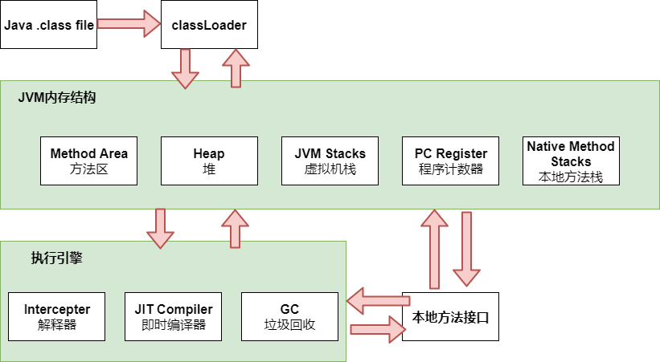
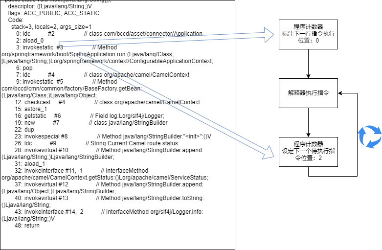
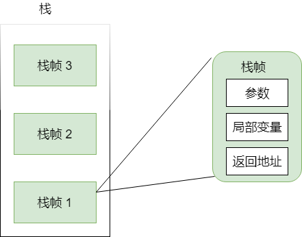
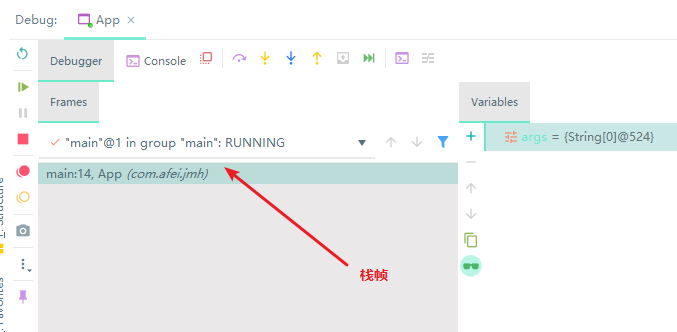
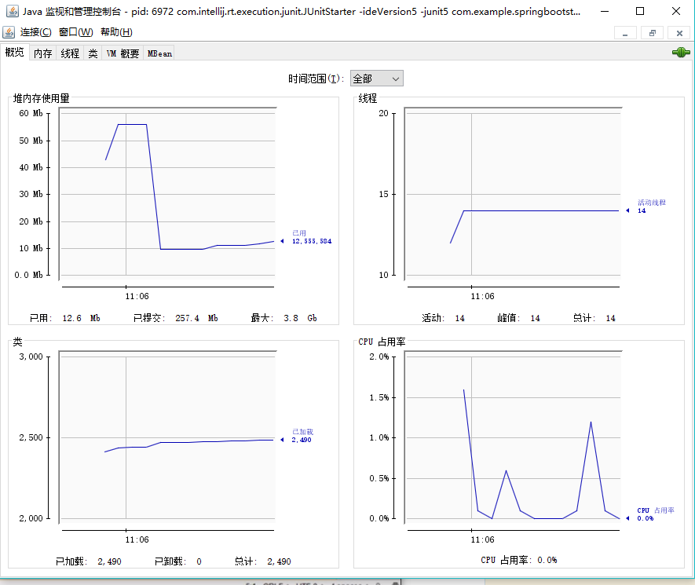
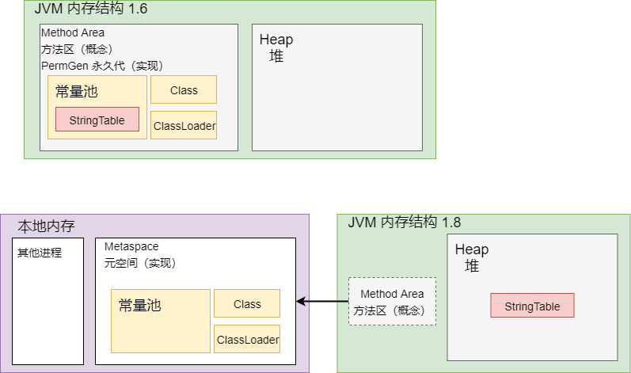
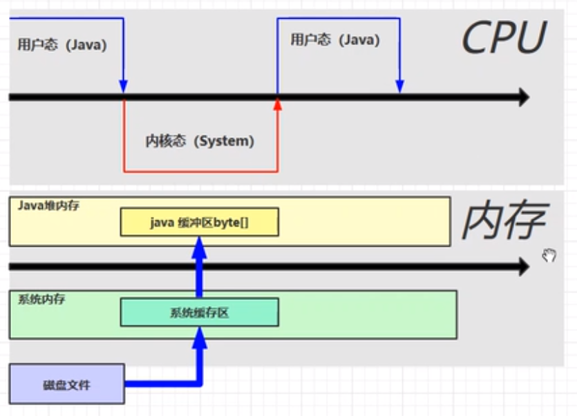
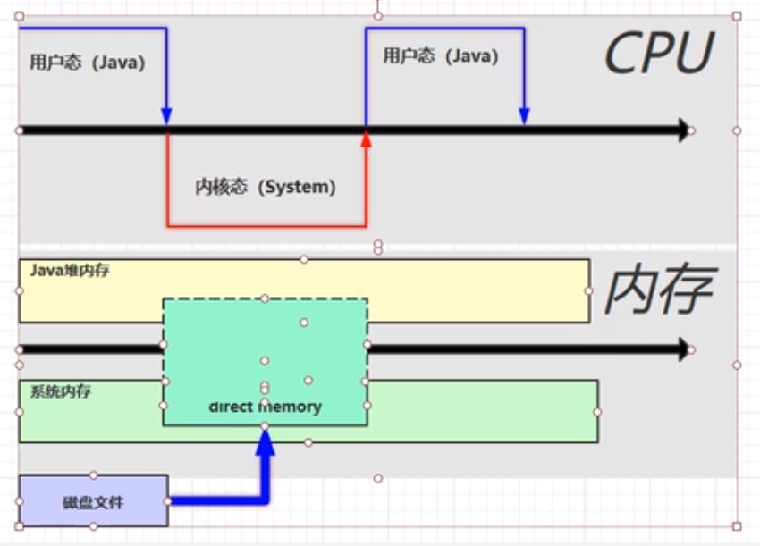
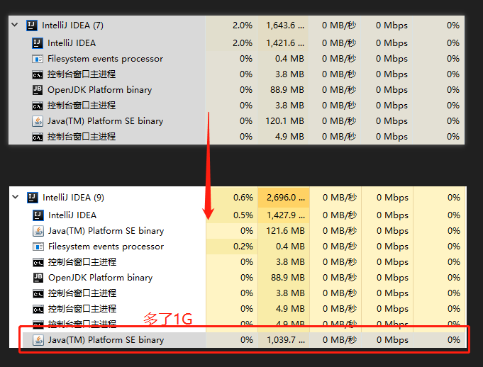

<!--more-->
# 程序计数器
作用：记录下一条jvm指令的执行地址



首先，程序计数器会读取第一条待执行指令的地址。

然后，程序会将从程序计数器上读取这个地址，拿到第一条指令给到解释器，让解释器解释成机器码，最终将机器码给CPU去执行，与此同时，会更新程序计数器，为下一条待执行指令的地址。

通过**寄存器**来实现程序计数器。是CPU里读取速度最快的单元，因为Java中用于读取程序指令地址的操作相当频繁，所以，物理上，JVM将寄存器作为程序计数器。

特点：
* 线程私有：Java支持多线程，那如果多个线程同时执行某个方法，那么，会怎么样呢？ 会通过CPU时间片交替给时间片各个线程，去让每个线程继续执行它的下一个指令。那么，就需要每个线程专属的程序计数器去进行计数。所以，每个线程都有自己私有的程序计数器。
* JVM中唯一不存在内存溢出的区域。

# 虚拟机栈
Java Virtual Machine Stacks


* 虚拟机栈：每个线程运行需要的内存空间。
* 栈帧：
  * 是每一个栈由多个栈帧（Frame）组成；
  * 对应一次方法的调用。在程序运行时，每个方法运行是需要的内存，就是一个栈帧。
* 每个线程只能有一个活动栈帧，对应着正在执行的那个方法。
* 每一个方法在被调用完毕后，其栈帧会出栈，从而释放掉其占用的内存。



## 相关问题
1. 垃圾回收是否涉及栈内存？
   > 不涉及。因为方法执行完毕后，会自动出栈，并被自动内存回收，所以，垃圾回收不需要管栈内存。
2. 栈内存是否越大越好？
   > 不是。
   >
   > 首先，栈内存越大，对应的可使用线程数，就越少。因为物理内存的大小是一定的。如：一共有500MB内存，如果给栈内存设置1MB，那么，就是每个线程拥有1MB的栈内存空间，所以，最多可以同时启动500个线程。
3. 方法内的局部变量是否是线程安全的？
   > 可能是。如果这个局部变量既不是入参传入的，也不是最终会返回出去的（换句话说，就是局部变量没有逃离方法的作用范围），那么，它就是线程私有的。
   >
   > 方法每次被调用，都会生成一个栈帧，那么，方法内的局部变量，都会在这个栈帧中初始化，所以，无论N个线程调用N次同一个方法，方法局部变量都会被重新创建被暂存在线程栈帧中，所以，不会有线程安全问题。

## 栈内存溢出
### 异常
```
java.lang.StackOverflowError
```

### 例子
1. 栈帧过多（方法不断递归调用，栈帧不断只增不减，入栈，挤爆了栈）
2. 栈帧过大（方法内部的局部变量、参数、返回值等过大，一个栈帧就将栈内存挤爆了）

### 如何设定栈内存
```
xXss256k
```
可以在IDEA的运行配置上，设置：


## 线程运行诊断
### 案例1：CPU占用很高
定位：
* 用 `top`命令 定位哪个进程对cpu的占用过高
* `ps H -eo pid,tid,%cpu | grep进程id` (用 `ps -fe | grep java`命令进一步定位是哪个线程引起的cpu占用过高)
* `jstack 进程id`：列出这个Java进程背后，所有正在JVM后台运行的线程信息。
   > 注意： 我们cmd 打印的进程中的线程编号是十进制，但是用 jstack 得到的线程编号是十六进制，所以，要定位哪个线程出了问题，要先进行进制转换。

nohup 命令： 将程序以忽略挂起信号的方式运行起来，如：`nohup java com.example.demo.App &`


### 案例2：程序运行很长时间没有结果
定位问题的步骤：
1. `ps -fe | grep java`
2. `nohup java com.example.demo.App &`
3. `jstack 进程id`
4. 看到发生死锁
5. 看代码


# 本地方法栈
不是由java 代码编写的方法。带有`native`的方法，去调用到底层的操作系统相关操作的logic。

本地方法栈：为本地方法运行提供所需的内存空间。


# 堆
* 通过 `new` 关键字 创建的对象都会使用堆内存；
* 线程共享的，堆中的对象都需要考虑线程安全的问题；
* 有垃圾回收机制

## 堆内存溢出问题
相关异常：
```
java.lang.OutOfMemoryError: Java heap space
```

小心 `while(true)` 不断new 对象

相关配置参数：堆内存最大值
```
-Xmx1024m
```

## 堆内存诊断
1. jps工具：查看当前系统中有哪些java进程
2. jmap工具：查看堆内存占用情况
3. jconsole工具：图形界面、多功能的监测工具，可以连续监测

### 使用jps + jmap
例子：
```
/**
* 命令一：jps
* 命令二：jmap -heap java进程iD
*/
@Test
void name01() throws InterruptedException {
   System.out.println("1...");
   Thread.sleep(10000L);
   byte[] arr = new byte[1024*1024*10]; // 申请 10 MB heap内存空间
   System.out.println("2...");
   Thread.sleep(10000L);
   arr = null;
   System.gc();
   System.out.println("3...");
   Thread.sleep(1000000L);
}
```
依次在三个时刻打印堆内存信息（执行三次以下命令）：
```
jps
jmap -heap java进程iD
```
得到如下输出：
```
Heap Usage:                                   
PS Young Generation                           
Eden Space:                                   
   capacity = 67108864 (64.0MB)               
   used     = 28216432 (26.909286499023438MB) ------- 26MB
   free     = 38892432 (37.09071350097656MB)  
   42.04576015472412% used                    

Heap Usage:
PS Young Generation
Eden Space:
   capacity = 67108864 (64.0MB)
   used     = 38702208 (36.9093017578125MB)  ------- 36MB
   free     = 28406656 (27.0906982421875MB)
   57.67078399658203% used


Heap Usage:
PS Young Generation
Eden Space:
   capacity = 67108864 (64.0MB)
   used     = 1919704 (1.8307723999023438MB)  ------- 1MB
   free     = 65189160 (62.169227600097656MB)
   2.860581874847412% used
```

### 使用jconsole

或者，我们通过以下命令，就可以图形化监测heap的使用情况了：
```
jconsole
```


### 使用 jvisualvm
命令
```
jvisualvm
```
同样是打开一个UI工具，不过更强大的是，此工具可以查看哪些内存占用较大的对象。

# 方法区
作用：
* 存储类相关的信息，包括：方法、类构造器
* 存储运行时常量池

方法区在虚拟机启动时被创建，逻辑上，是堆的组成部分(当然，是不是堆里的一部分，是得看不同版本的JVM上的实现方式，比如：Oracle hotspot JVM，在JDK8以前，方法区的实现叫做“永久代”，这个永久代就是heap的一部分， 而到了JDK8，没有了“永久代”，取而代之的是“元空间”，这个“元空间”用的就不是堆的内存了，而是用的本地内存（操作系统内存）)。

以下，是HotSpot JVM在1.6 和 1.8 的内存结构差别图：


## 方法区内存溢出
> * 1.8 以前会导致永久代内存溢出
> * 1.8 之后会导致元空间内存溢出

下面看一个例子：
```
public class Demo1_8 extends ClassLoader {
    public static void main(String[] args) {
        int j = 0;
        try {
            Demo1_8 test = new Demo1_8();
            for (int i = 0; i < 10000; i++,j++) {
                // ClassWriter 作用： 生成 类的二进制字节码
                ClassWriter cw = new ClassWriter(0);
                // 这个这个ClassWriter的版本号，public，类名，包名，父类，接口
                cw.visit(Opcodes.V1_8, Opcodes.ACC_PUBLIC, "Class" + i, null, "java/lang/Object", null);
                // 返回 byte[] （类的二进制字节码）
                byte[] code =cw.toByteArray();
                // 执行 类的加载
                test.defineClass("Class" + i, code, 0, code.length);
            }
        } finally {
            System.out.println(j);
        }
    }
}
```
这是一个类加载器的子类，于是他拥有一个功能：可以用来加载类的二进制字节码。

那么，如何去调整我们元空间的大小呢？

jdk 1.8:
```
-XX:MaxMetaspaceSize=8m
```
jdk 1.6:
```
-XX:MaxPermSize=8m
```


相关异常：

jdk 1.8:
```
java.lang.OutOfMemoryError: Metaspace
```
jdk 1.6:
```
java.lang.OutOfMemoryError: PermGen space
```


ClassWriter 和 cglib 里头的 $ClassWriter 都是师出同门，继承自 ClassVisitor，而像Spring以及一些ORM框架如：Mybatis，则是重度使用 cglib。所以，都可能出现元空间溢出问题。

另一方面，又说明了 cglib 原理都是通过反射技术，在运行时动态生成类的二进制字节码，然后执行类的加载。


## 方法区中的运行时常量池

### 什么是常量池？
```
public class HelloWorld {
   public static void main(Strings[] args) {
      System.out.println("hello world");
   }
}
```
看到以上一个非常简单的helloworld 代码，它在编译后，得到的二进制字节码，里头包含很多信息，例如：
* 类基本信息
* 常量池
* 类方法定义
* 虚拟机指令

我们用以下两条java命令，将.java 编译为 .class文件，然后再反编译打印详细信息：
```
javac HelloWorld.java
javap -v HelloWorld.java
```
得到的反编译结果：
```
Classfile /E:/Projects/IdeaProjects/spring-boot-starter-demo/src/main/java/com/example/springbootstarterdemo/Hell
oWorld.class
  Last modified 2019-11-9; size 459 bytes
  MD5 checksum db5798a632075406452ebaee3bad134e
  Compiled from "HelloWorld.java"
public class com.example.springbootstarterdemo.HelloWorld
  minor version: 0
  major version: 52
  flags: ACC_PUBLIC, ACC_SUPER
Constant pool:
   #1 = Methodref          #6.#15         // java/lang/Object."<init>":()V
   #2 = Fieldref           #16.#17        // java/lang/System.out:Ljava/io/PrintStream;
   #3 = String             #18            // hello world
   #4 = Methodref          #19.#20        // java/io/PrintStream.println:(Ljava/lang/String;)V
   #5 = Class              #21            // com/example/springbootstarterdemo/HelloWorld
   #6 = Class              #22            // java/lang/Object
   #7 = Utf8               <init>
   #8 = Utf8               ()V
   #9 = Utf8               Code
  #10 = Utf8               LineNumberTable
  #11 = Utf8               main
  #12 = Utf8               ([Ljava/lang/String;)V
  #13 = Utf8               SourceFile
  #14 = Utf8               HelloWorld.java
  #15 = NameAndType        #7:#8          // "<init>":()V
  #16 = Class              #23            // java/lang/System
  #17 = NameAndType        #24:#25        // out:Ljava/io/PrintStream;
  #18 = Utf8               hello world
  #19 = Class              #26            // java/io/PrintStream
  #20 = NameAndType        #27:#28        // println:(Ljava/lang/String;)V
  #21 = Utf8               com/example/springbootstarterdemo/HelloWorld
  #22 = Utf8               java/lang/Object
  #23 = Utf8               java/lang/System
  #24 = Utf8               out
  #25 = Utf8               Ljava/io/PrintStream;
  #26 = Utf8               java/io/PrintStream
  #27 = Utf8               println
  #28 = Utf8               (Ljava/lang/String;)V
{
  public com.example.springbootstarterdemo.HelloWorld();
    descriptor: ()V
    flags: ACC_PUBLIC
    Code:
      stack=1, locals=1, args_size=1
         0: aload_0
         1: invokespecial #1                  // Method java/lang/Object."<init>":()V
         4: return
      LineNumberTable:
        line 7: 0

  public static void main(java.lang.String[]);
    descriptor: ([Ljava/lang/String;)V
    flags: ACC_PUBLIC, ACC_STATIC
    Code:
      stack=2, locals=1, args_size=1
         0: getstatic     #2                  // Field java/lang/System.out:Ljava/io/PrintStream;
         3: ldc           #3                  // String hello world
         5: invokevirtual #4                  // Method java/io/PrintStream.println:(Ljava/lang/String;)V
         8: return
      LineNumberTable:
        line 9: 0
        line 10: 8
}
SourceFile: "HelloWorld.java"
```
其中的`Constant pool` 就是常量池。而JVM只能看到这几行指令：
```
0: getstatic     #2
3: ldc           #3
5: invokevirtual #4
8: return
```
然后，会根据这个`#2`、`#3`、`#4` 去找常量池中的常量来做进一步的地址锁定。


## StringTable
StringTable（字符串常量池），是运行时常量池中的一部分。

常量池中的信息，都会被加载到运行时常量池中，这时，`a,b,ab` 都是常量池中的符号，还没有变成java字符串对象。

只有当代码真的执行到那一条指令了，要去get这个`a`了，才会将 `a`符号变成 `"a"`字符串，然后，把`"a"`作为key，去一个名为`StringTable`的 `String[]`数组中，去查找，如果发现里头没有，则将其放入。

所以，`StringTable`就是我们的常量池。而且这个常量池是动态加值的，并不是代码编译完毕，就有值的，一开始它只是一个 空数组。

注意：StringTable是一个类似HashTable的实现，是数组+链表的结构。


对于 `String.intern()`方法：
* 作用：主动将串池中还没有的字符串对象放入串池。
* JDK1.8：将这个字符串对象尝试放入串池，如果有则不放入，如果没有则放入串池，会把串池中的对象返回。
  > 此时，`String s2 = s1.intern();`，s2 == s1。
* JDK1.6：将这个字符串对象尝试放入串池，如果有则不放入，如果没有则将此对象复制一份，再放入串池，并把串池中的对象返回。
  > 此时，`String s2 = s1.intern();`，s2 != s1。

我们先看看以下面试题：
```
public static void main(String[] args) {
   String s1 = "a";
   String s2 = "b";
   String s3 = "a" + "b";   // ab
   String s4 = s1 + s2;     // new String("ab")
   String s5 = "ab";
   String s6 = s4.intern();

   System.out.println(s3 == s4);  // false
   System.out.println(s3 == s5);  // true
   System.out.println(s3 == s6);  // true
   String x2 = new String("c") + new String("d"); // new String("cd") 
   String x1 =  "cd";       // cd ----------------------------- A
   x2.intern();             // 池中已经有了cd，所以没能入池 ------ B

   // 如果将最后两行(A 和 B) 交换呢？
   // -- 答：那么， x2.intern()会先入池，并且引用串池中对象，那么，jdk1.8中， x1 == x2 返回 true
   // 如果 jdk 1.6 呢？
   // -- 答：x1 == x2 返回 false
   System.out.println(x1 == x2); // false
}
```

#### 为什么1.8之后，会将StringTable从永久代里头转移到堆内存中呢？
因为 永久代内存中的对象，是只会在full GC时，才会被进行垃圾回收，而这个full GC的触发，又需要老年代的空间不足时，才会触发，所以触发时机晚。而这个StringTable又各种被频繁使用，所以应该是需要更频繁地垃圾回收的。所以挪到堆中，触发GC的时机更容易。


### 如何控制 StringTable 能用的内存空间
如果是 jdk6 ，直接设置永久代最大可用空间即可：
```
-XX:MaxPermSize=10m
```


如果是 jdk8，那么通过设置 heap的最大内存：
```
-Xmx10m
```
那么，在不断往 StringTable里塞值的过程中：
```
public static void main(String[] args) {
   ArrayList<String> list = new ArrayList<>();
   int count = 0;
   try {
      for (int j = 0; j < 300000; j++) {
            list.add(String.valueOf(j).intern());
            count++;
      }
   } catch (Throwable e) {
      e.printStackTrace();
   } finally {
      System.out.println(count);
   }
}
```
如果出现堆内存溢出，一般情况抛以下error：
```
java.lang.OutOfMemoryError: Java heap space
```
但也可能会抛出以下error：
```
java.lang.OutOfMemory Error: GC overhead limit exceeded
```
原因：当JVM用超过98%的时间，却只回收了不到2%的堆内存，此时就会报这个错，告诉说目前heap内存已经濒临崩塌了。

我们可以把报这个错的开关关掉：
```
-Xmx10m -XX:-UseGCOverheadLimit
```


### StringTable 垃圾回收
我们运行一段代码，并且设置运行时的参数，让其打印StringTable的统计信息，以及一旦出现gc，则打印gc相关信息：
```
-Xmx10m -XX:+PrintStringTableStatistics -XX:+PrintGCDetails -verbose:gc
```
```
public static void main(String[] args) {
   int count = 0;
   try {
      // 疯狂入池
      for (int j = 0; j < 300000; j++) {
            String.valueOf(j).intern();
            count++;
      }
   } catch (Throwable e) {
      e.printStackTrace();
   } finally {
      System.out.println(count);
   }
}
```
可以看到，最终打印的log中，出现了gc的字眼，并且最终 StringTable的当前元素个数也没有30w+这么多。说明，是StringTable可以被垃圾回收的。
```
[GC (Allocation Failure) ..............
```
```
StringTable statistics:
Number of buckets       :     60013 =    480104 bytes, avg   8.000
Number of entries       :      3495 =     83880 bytes, avg  24.000 ------------元素个数
Number of literals      :      3495 =    255336 bytes, avg  73.058
```

### StringTable 性能调优
方式一：调整相关JVM参数
* `-XX:StringTableSize=200000`：StringTable bucket(桶)数量设置（类似于将HashTable的数组长度设置为20w，然后每个数组元素，都是一个链表）；调整这个参数可以加快String的并发入池。
  * 最小不能小于：1009

方式二：考虑字符串对象是否入池

到我们可能会在多个位置使用同一个字符串时，可以考虑将它入池。这样就会减小重复创建String对象，更好地释放heap内存。


# 直接内存
定义：Direct Memory，操作系统的内存

*  常用于NIO操作时，用于数据缓冲区（如：NIO里头的`ByteBuffer`，使用的就是系统内存进行缓存）
* 分配回收成本较高，但读写性能高
* 不受JVM内存回收管理


## 对比一下用与不用direct memory的性能差别
我们先看看用BIO 和 NIO，读取大文件的速度差异很大：
```
@Warmup(iterations = 5, time = 1, timeUnit = TimeUnit.SECONDS)
@Measurement(iterations = 5, time = 1, timeUnit = TimeUnit.SECONDS)
@Fork(1)
@BenchmarkMode(Mode.AverageTime)
@OutputTimeUnit(TimeUnit.NANOSECONDS)
public class Demo1_9 {
    public static final String FROM = "E:\\电影\\阿拉丁.BD.720p.中英双字幕.mkv";
    public static final String TO = "E:\\阿拉丁.BD.720p.中英双字幕.mkv";
    public static final int _1Mb = 1024*1024;

    public static void main(String[] args) throws RunnerException {
        Options opt = new OptionsBuilder()
                .include(Demo1_9.class.getSimpleName())
                .forks(1)
                .build();

        new Runner(opt).run();
    }

    @Benchmark
    public void nio() {
        // 使用ByteBuffer，背后使用的是Direct Memory
        try(FileChannel from = new FileInputStream(FROM).getChannel();
            FileChannel to = new FileOutputStream(TO).getChannel();
        ) {
            ByteBuffer bb = ByteBuffer.allocateDirect(_1Mb);
            while(true) {
                int len = from.read(bb);
                if (len == -1) {
                    break;
                }
                bb.flip();
                to.write(bb);
                bb.clear();
            }
        } catch (IOException e) {
            e.printStackTrace();
        }
    }

    @Benchmark
    public void bio() {
        try (
                FileInputStream from  =new FileInputStream(FROM);
                FileOutputStream to  =new FileOutputStream(TO);
                ) {
            byte[] buf = new byte[_1Mb];
            while(true) {
                int len = from.read(buf);
                if (len == -1) {
                    break;
                }
                to.write(buf , 0, len);
            }
        } catch (FileNotFoundException e) {

        } catch (IOException e) {
            e.printStackTrace();
        }
    }

    @Benchmark
    public void bioWithBuffered() {
        try (
                BufferedInputStream from  =new BufferedInputStream(new FileInputStream(FROM));
                BufferedOutputStream to  =new BufferedOutputStream(new FileOutputStream(TO));
                ) {
            byte[] buf = new byte[_1Mb];
            while(true) {
                int len = from.read(buf);
                if (len == -1) {
                    break;
                }
                to.write(buf , 0, len);
            }
        } catch (FileNotFoundException e) {

        } catch (IOException e) {
            e.printStackTrace();
        }
    }
}
```
运行得到结果如下：
```
Benchmark                Mode  Cnt           Score            Error  Units
Demo1_9.bio              avgt    5  7474042415.000 ± 3053551905.514  ns/op
Demo1_9.bioWithBuffered  avgt    5  6771286182.400 ± 1184873933.869  ns/op
Demo1_9.nio              avgt    5  6083767360.800 ± 1461697630.892  ns/op
```
事实证明，用Direct Memory的确会比单纯用Java内存做缓存要快一些。





## 直接内存溢出问题
我们运行以下的代码，制造内存溢出的情况：
```
static int _100Mb = 1024*1024*100;
public static void main(String[] args) {
   list<ByteBuffer> list = new ArrayList<ByteBuffer>();
   int i = 0;
   try {
      while(true) {
            // 每次直接申请一个100MB的 Direct Memory
            ByteBuffer byteBuffer = ByteBuffer.allocateDirect(_100Mb);
            // 让对象持有它，使其不被gc
            list.add(byteBuffer);
            i++;
      }
   } finally {
      System.out.println(i);
   }
}
```
得到error如下：
```
Exception in thread "main" java.lang.OutOfMemoryError: Direct buffer memory
```

## 分配与释放原理
```
public class Demo1_26 {
    static int _1Gb = 1024* 1024*1024;
    public static void main(String[] args) throws IOException {
        ByteBuffer byteBuffer = ByteBuffer.allocateDirect(_1Gb);
        System.out.println("分配完毕。。。");
        System.in.read();
        System.out.println("开始释放。。。");
        byteBuffer = null;
        System.gc();
        System.in.read();
    }
}
```
当分配完毕，打开任务管理器，发现多了一个Java进程，并多了1G的内存占用：

之后，当回车，释放内存之后，这个1G的内存随之释放了。为什么呢？不是说系统内存的释放不受JVM的GC行为影响吗？


下面，我们继续探讨，发现，ByteBuffer背后实际会调用 `Unsafe`对象，这个对象的申请和释放内存，就是系统内存释放的关键：
```
public class Demo1_27 {
    static int _1Gb = 1024* 1024*1024;
    public static void main(String[] args) throws IOException {
        Unsafe unsafe = getUnsafe();
        long base = unsafe.allocateMemory(_1Gb);
        unsafe.setMemory(base, _1Gb, (byte)0);
        System.out.println("分配完毕。。。");
        System.in.read();
        System.out.println("开始释放。。。");
        unsafe.freeMemory(base);
        System.in.read();
    }

    private static Unsafe getUnsafe() {
        try {
            Field f = Unsafe.class.getDeclaredField("theUnsafe");
            f.setAccessible(true);
            Unsafe unsafe = (Unsafe) f.get(null);
            return unsafe;
        } catch (NoSuchFieldException | IllegalAccessException e) {
            throw new RuntimeException(e);
        }
    }
}
```