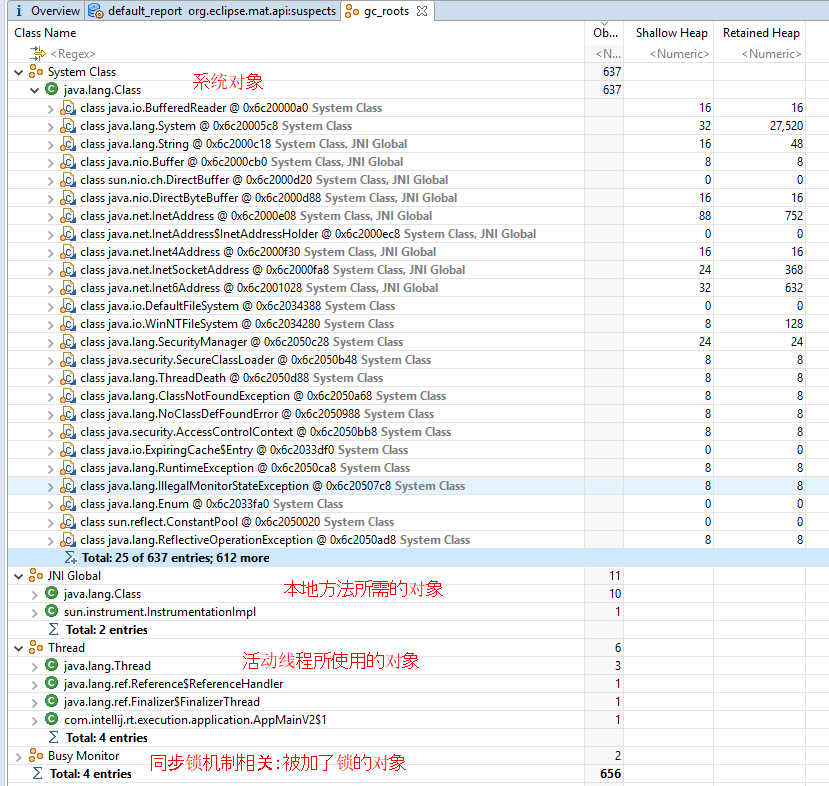

<!--more-->

# 1. 如果判断对象可以回收

## 1.1. 引用计数法
早期的Python虚拟机的GC，用的就是这个算法。

如果对象被其他对象所引用，那么，它的引用数大于0，此时，对象无法进行GC。

缺点：遇到循环引用，凉凉！！


## 1.2. 可达性分析算法
JVM的垃圾回收器，采用的就是这个“可达性分析”来探索所有存活的对象。

如果一个对象，没有给根对象引用，那么，就可以进行GC。

扫描堆中的对象，看是否能在 以 GC Root对象 为起点的引用链 找到该对象，找不到，表示可以回收。


### 哪些对象可以作为GC Root？

这里有个内存分析工具：MAT [官网](http://www.eclipse.org/mat/)

下面看个代码例子：
```
public static void main(String[] args) throws IOException {
    List<String> list = new ArrayList<>();
    list.add("A");
    list.add("B");
    System.out.println(1); // status: 1
    System.in.read();
    list = null;
    System.out.println(2); // status: 2
    System.in.read();
    System.out.println("end");
}
```
然后，通过以下命令，生成代码调用栈信息到.bin文件中：
```sh
// 查看已启动的Java进程
jps

// 导出运行时栈信息，将其转成格式是"b"即二进制、且"live"即只显示还没被回收掉的对象（存活对象），文件名为 "1.bin"
jmap -dump:format=b,live,file=1.bin <Java进程ID>
```


然后，将这几个.bin文件，于 MAT工具中打开，就可以查看此时刻所有的CG Root对象：


好，那么，线程运行时，每次方法调用，都会生成一个栈帧，也就是说，每个栈帧内生成的局部变量所引用的对象，都可以成为一个CG Root对象。（注意：不是指 这个局部变量，因为它只是一个引用，而指的是这个变量所引用的堆中的对象）

## 五种引用类型

* 强引用：平常用的对象间引用，都是强引用；沿着GC Root链，能够找到它，它那就是强引用，如：A1。只有当所有链都断开了，A1对象才能被回收。
* 软引用（SoftReference）：当B对象和A2对象之间断开，那么，满足以下全部条件，A2对象 是能够被回收的：
  * 没有Root对象对其强引用
  * 正在进行GC
  * 回收完发现还是内存不足时
* 弱引用（WeakReference）： 和软引用的回收条件，唯一区别：弱引用是无论内存是否足够，一定会被回收。
  > 
  > 当软引用或者弱引用的对象被GC后，因为它们本身也是对象，也需要占内存，所以，会随后进入 引用队列中，等待进一步的操作，如：引用队列遍历进行GC。
* 虚引用（PhantomReference）：
  * 必须配合引用队列使用。
  * 内部生成Cleaner对象，并记录直接内存地址，为了是在其引用的`ByteBuffer`对象被GC后，能够通过入队，并遍历看是否有新的Cleaner，来达到进一步回收“直接内存”的目的。
* 终结器引用（FinalReference）：
  * 必须配合引用队列使用
  * 对象回收过程：
    1. 当A4对象继承Object并重写了`finallize()`方法时，并且又没有Root对象强引用它时；
    2. 此时，A4对象不会立即被回收，JVM会将终结器引用对象入队；
    3. 然后，入队后的终结器引用依然连着A4对象；
    4. 随后，再由一个名为“finallize”的、优先级很低的线程，去查看这个引用队列中，是否存在终结器引用，如果发现，就会通过这个终结器引用，找到A4对象，调用其`finallize()`方法；
    5. 完了之后，在下一次GC触发时，A4对象才会被最终释放内存。
  * 不推荐用它来释放资源。

# 2. 垃圾回收算法

# 3. 分代垃圾回收

# 4. 垃圾回收器

# 5. 垃圾回收调优